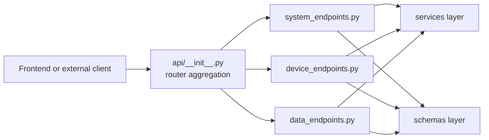

# API Module Architecture Analysis

## Scope

- Snapshot basis: 4 files and 287 lines in `Backend/src/api`
- Included structure: `__init__.py`, `system_endpoints.py`, `device_endpoints.py` and `data_endpoints.py`

## Metric View

| Slice | Files | Lines | Reading |
| --- | ---: | ---: | --- |
| Full API module | 4 | 287 | Compact flat HTTP layer |
| Domain endpoint modules | 3 | 270 | Actual request-handling logic |
| Largest endpoint | 1 | 159 | `system_endpoints.py` owns config, gesture and system routes |

### Endpoint Inventory

| Endpoint module | Lines | Status |
| --- | ---: | --- |
| `system_endpoints.py` | 159 | Real layout, system, gesture config and gesture runtime control |
| `device_endpoints.py` | 60 | Real LED and voice control surface |
| `data_endpoints.py` | 51 | Real weather access plus placeholder calendar and smart-home routes |
| `__init__.py` | 17 | Router aggregation and public API export |

## Structure And Logic

The API module is intentionally thin and now easier to navigate. `api/__init__.py` aggregates routers into one FastAPI `APIRouter`, while the endpoint files group routes by concern: system/configuration, devices and data domains. The design stays aligned with the target modular monolith: contracts live in `schemas`, orchestration lives in `services`, and persistence or provider access lives in `repositories`.

The strongest verticals at the API level remain configuration, gestures and weather. LED, voice and system status are real but smaller. Calendar and smart-home are still placeholders, now grouped more honestly with the other data-facing routes instead of pretending to be fully mature standalone modules.

## Critical Assessment

- The layer boundary is healthy: the API still avoids deep business logic.
- Removing the `api_v1` filesystem nesting improved discoverability without changing the public `/api/v1` prefix configured in `settings.API_V1_STR`.
- `system_endpoints.py` is now the main concentration point. That is acceptable for the current size, but it could split again if configuration and gesture concerns grow independently.
- The module still advertises more completed domains than the implementation really supports because placeholder calendar and smart-home routes remain visible.
- There is still no auth dependency, permission check or role-aware routing.

## Intended But Missing Elements

- auth and authorization dependencies on sensitive routes
- real calendar and smart-home integrations behind the placeholder shells
- clearer distinction between productive and placeholder domains in response semantics or documentation
- shared request-validation or error-mapping helpers if the API grows again

## Diagram

## Navigation

- Parent: `../backendArch.md`
