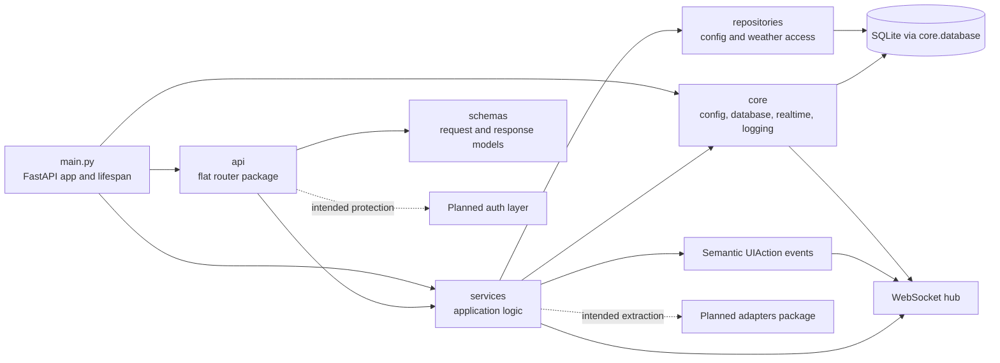

# Backend Src Architecture Analysis

## Scope And Metric Basis

- Snapshot date: 2026-04-28
- Metrics cover productive Python code in `Backend/src` after the API flattening, gesture-service split and semantic action extension.
- `Backend/tests` is shown separately because productive code and tests were requested as distinct views.

## Backend Metrics

| Scope | Files | Lines | Notes |
| --- | ---: | ---: | --- |
| `main.py` | 1 | 99 | App bootstrap, lifespan and WebSocket entry point |
| `api/` | 4 | 340 | Flat router package with three domain-grouped endpoint files |
| `core/` | 4 | 200 | Config, DB bootstrap, logging and realtime hub |
| `db/` | 1 | 1 | Placeholder package only |
| `repositories/` | 3 | 371 | Config, gesture-action and weather data access |
| `schemas/` | 8 | 382 | Pydantic request and response contracts including semantic interaction types |
| `services/` | 7 | 2017 | Business logic center, still dominated by the gesture slice |
| Backend tests | 7 | 1336 | Stable backend verification layer |

### Concentration Signals

- `services/` still carries more than half of the backend source volume.
- The gesture slice is no longer a single file, but it still spans 1282 lines across `gestures.py`, `gestures_tracking.py` and `gestures_detection.py`.
- `api/` is now easier to navigate because filesystem version nesting has been removed while the `/api/v1` route prefix remains stable.
- `db/` still exists structurally, but the real database logic remains in `core/database.py`.

## Root Structure Reading

| Element | Current responsibility | Assessment |
| --- | --- | --- |
| `main.py` | Builds the FastAPI app, binds lifecycle and exposes `/ws` | Clean single entry point with sensible lifecycle ownership |
| `api/` | Flat HTTP router package grouped by system, device and data concerns | More discoverable than before, now with explicit gesture-action configuration endpoints |
| `core/` | Cross-cutting infrastructure | Useful concentration, though some hardware/provider concerns still want a future adapter boundary |
| `db/` | Reserved package namespace | Still architecturally misleading because it suggests a DB layer that is not actually implemented there |
| `repositories/` | SQLite and external data access | Real repository behavior exists for config, gesture-action mapping and weather |
| `schemas/` | API contracts | Clear and compact, now expanded with placement and interaction schemas |
| `services/` | Application logic and hardware-facing behavior | Valuable layering, now clearer internally, but still uneven in maturity across domains |

## Current Logic Model

The backend is still a modular monolith, now with less internal friction. `main.py` owns startup and shutdown, `api/` groups routes by concern, `services/` orchestrate behavior, `repositories/` handle persistence or provider access, `schemas/` stabilize contracts, and `core/` provides infrastructure. The WebSocket path remains integrated through `core/realtime.py` and the `/ws` endpoint in `main.py`.

The most important improvement is not just a clearer file split, but a more explicit event model. The backend now separates raw gesture recognition from semantic UI intent. `GestureDetected` continues to expose low-level recognition, while `UIActionRequested` provides modality-neutral actions that the frontend can bind to focus navigation, shop control and ArrangeMode interactions.

## Missing Intended Elements

- explicit `adapters/` package as described in the target architecture
- production-grade auth and role handling
- real calendar and smart-home implementations behind the placeholder endpoints
- migration strategy and operational health metrics around the SQLite layer
- richer repository coverage once more domains become real

## Critical Assessment

The backend structure is good enough for another project phase and materially better than before, but its growth limits are still visible.

- The API flattening improved maintainability without changing external routes. That is a net simplification with low behavioral risk.
- The gesture refactor removed the worst local monolith, but the gesture domain is still the backend's dominant complexity cluster.
- `db/` remains a structural false friend. New contributors will still expect persistence concerns there, not in `core/database.py`.
- Repository coverage is still narrow. Weather, layout and gesture-action configuration are real; the rest of the intended integration landscape is still mostly signaled rather than implemented.

## Architecture Diagram

## Navigation

- Parent analysis: `../../repoArch.md`
- API module: `api/apiArch.md`
- Core module: `core/coreArch.md`
- DB module: `db/dbArch.md`
- Repository module: `repositories/repoArch.md`
- Schema module: `schemas/schemaArch.md`
- Service module: `services/serviceArch.md`
