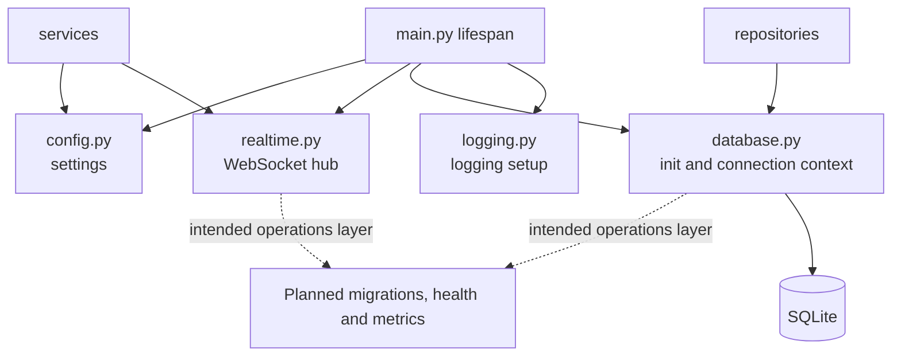

# Core Module Architecture Analysis

## Scope

- Snapshot basis: 4 files and 189 lines in `Backend/src/core`
- Files: `config.py`, `database.py`, `logging.py`, `realtime.py`

## Metric View

| File | Lines | Responsibility |
| --- | ---: | --- |
| `config.py` | 84 | Central settings and runtime parameters |
| `realtime.py` | 48 | WebSocket client registry and broadcast hub |
| `database.py` | 47 | SQLite bootstrap and connection context |
| `logging.py` | 10 | Logging setup |

## Structure And Logic

`core/` is the backend infrastructure spine. `main.py` uses it during lifespan startup and shutdown. `config.py` centralizes environment-driven behavior. `database.py` bootstraps the SQLite schema and exposes a context manager for per-operation connections. `realtime.py` holds the shared WebSocket hub and is the bridge between async FastAPI handling and event emission from services. `logging.py` keeps initialization simple and centralized.

The current module succeeds because it is small and direct. The backend can start, initialize persistence, bind the event loop and broadcast realtime events without needing a larger dependency injection framework.

## Critical Assessment

- The module has a healthy size and high leverage. It is small but central.
- `database.py` currently hosts both connection handling and schema initialization, which is fine for SQLite but is also the reason `db/` is effectively empty.
- `config.py` already carries a broad set of concerns. As more domains arrive, the settings surface can become noisy unless grouped more explicitly.
- `logging.py` is operationally minimal. It is enough for development but not for structured logs, metrics correlation or production incident analysis.
- `realtime.py` is a strong foundation, but there is no slow-consumer or backpressure strategy yet.

## Intended But Missing Elements

- migration support as a first-class concept instead of schema creation in startup only
- health and metrics support around database and realtime behavior
- clearer grouping or typed subsections inside configuration
- stronger operational logging structure

## Diagram

## Navigation

- Parent: `../backendArch.md`
