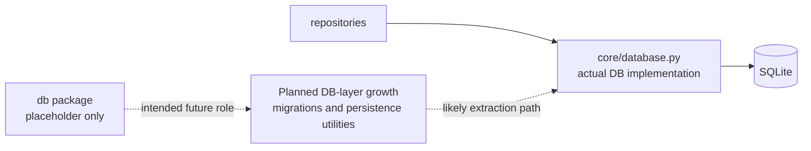

# DB Module Architecture Analysis

## Scope

- Snapshot basis: 1 file and 1 line in `Backend/src/db`
- Current content: only `__init__.py`

## Reading The Module

`db/` is currently a structural placeholder, not an implemented database layer. The actual database logic lives in `core/database.py`, and both repositories use that path instead of anything inside `db/`.

This means the folder is important architecturally, but not because of what it contains today. It is important because it signals an intended future separation that has not yet happened.

## Critical Assessment

- The package is too empty to be a useful abstraction today.
- Its presence can mislead contributors into looking for schema or persistence code in the wrong place.
- At the same time, deleting it would also remove a useful hint about the likely next extraction step.

## Intended But Missing Elements

- migration or schema versioning logic
- explicit persistence utilities if the project outgrows the tiny SQLite bootstrap in `core/database.py`
- a clearer ownership split between infrastructure bootstrap and durable data concerns

## Diagram

## Navigation

- Parent: `../backendArch.md`
