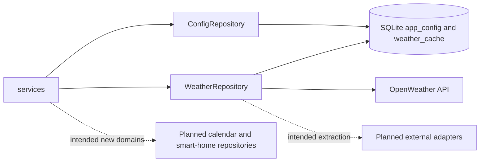

# Repository Module Architecture Analysis

## Scope

- Snapshot basis: 3 files and 339 lines in `Backend/src/repositories`
- Real repository modules: `config.py` and `weather.py`

## Metric View

| File | Lines | Responsibility |
| --- | ---: | --- |
| `weather.py` | 206 | External weather access plus SQLite cache and fallback logic |
| `config.py` | 132 | Persistent storage for layout, system and gesture configuration |
| `__init__.py` | 1 | Package marker |

## Structure And Logic

The repository layer is one of the strongest parts of the backend because it does real separation work instead of being a nominal abstraction. `ConfigRepository` persists structured configuration slices in `app_config` through stable keys, while `WeatherRepository` combines external API access, caching and stale fallback logic.

The tradeoff is visible as well: the layer is narrow. It proves the pattern for two domains, but the target architecture still expects more repositories or adapters for calendar, smart-home and possibly hardware-related persistence.

## Critical Assessment

- The module demonstrates the repository pattern convincingly in the areas that matter today.
- `WeatherRepository` mixes external API access and cache coordination inside one file. That is practical now, but it is the likely extraction point for a dedicated adapter layer later.
- `ConfigRepository` is a good fit for the current SQLite key-value style, but it will need stronger evolution rules if configuration breadth grows significantly.
- The layer has good current value, but limited domain coverage. It does not yet represent the full target integration landscape.

## Intended But Missing Elements

- calendar repository or adapter with cache and timeout behavior
- smart-home repository or adapter for MQTT or device state integration
- clearer adapter boundary for external weather provider access
- possible migration from pure key-based config persistence toward richer persistence models if configuration becomes relational

## Diagram

## Navigation

- Parent: `../backendArch.md`
