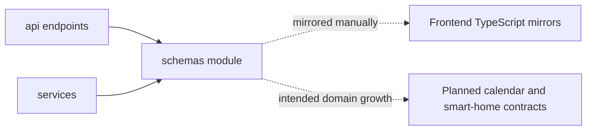

# Schema Module Architecture Analysis

## Scope

- Snapshot basis: 7 files and 201 lines in `Backend/src/schemas`
- Domain schema files: configuration, gestures, led, system, voice and weather

## Metric View

| File | Lines | Responsibility |
| --- | ---: | --- |
| `gestures.py` | 73 | Gesture events, status and related payload shapes |
| `configuration.py` | 39 | Layout and system configuration contracts |
| `weather.py` | 36 | Weather response contracts |
| `led.py` | 23 | LED state and control contracts |
| `voice.py` | 20 | Voice status and control contracts |
| `system.py` | 9 | Backend system metadata contracts |

## Structure And Logic

The schema module is compact and effective. It gives the API layer stable request and response models without leaking service implementation details. It also shows which domains are already materially supported by the backend: gestures, configuration, weather, LED, voice and system metadata.

Because the schema layer is so small, it also exposes the gaps very clearly. There are no calendar or smart-home schemas of substance yet, and there is no shared contract generation path to the TypeScript frontend.

## Critical Assessment

- The schema layer is clean and proportionate to the current backend size.
- Gesture schemas are already richer than several other domains, which matches the high complexity in the gesture service.
- The module currently relies on disciplined manual synchronization with frontend TypeScript types. That is acceptable now but increases contract drift risk later.
- There is no stronger versioning story for contracts beyond the configured `/api/v1` route prefix and disciplined schema evolution.

## Intended But Missing Elements

- calendar and smart-home contracts once those verticals are real
- a clearer strategy for shared backend and frontend contract evolution
- possible common envelope patterns if the API surface grows more varied

## Diagram

## Navigation

- Parent: `../backendArch.md`
