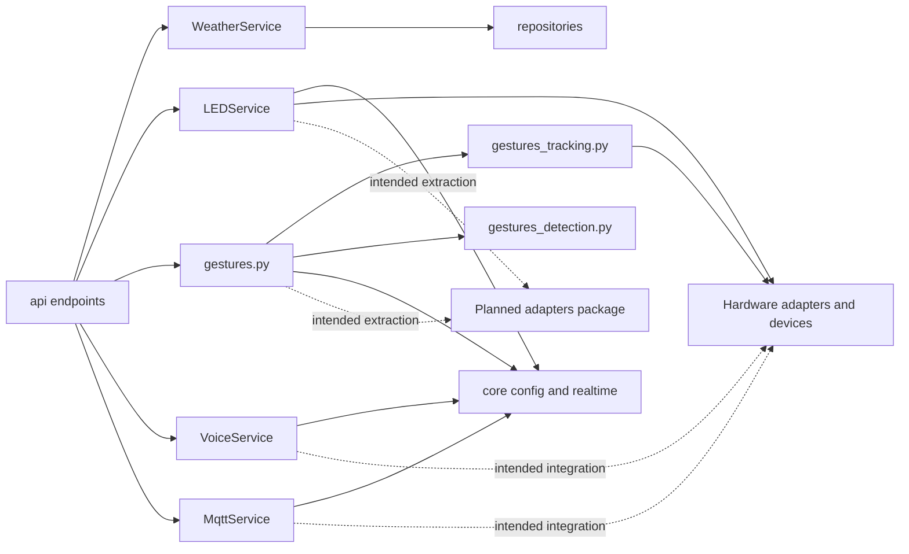

# Service Module Architecture Analysis

## Scope

- Snapshot basis: 7 files and 1314 lines in `Backend/src/services`
- Service inventory: gesture facade plus tracking and detection helpers, led, mqtt, voice and weather

## Metric View

| File | Lines | Reading |
| --- | ---: | --- |
| `gestures.py` | 416 | Gesture runtime facade, lifecycle and realtime orchestration |
| `gestures_tracking.py` | 296 | MediaPipe tracking, hand landmarks and preview extraction |
| `gestures_detection.py` | 247 | Gesture feature extraction, candidate generation and confidence scoring |
| `led.py` | 206 | Hardware-facing service with adapter pattern and state transitions |
| `voice.py` | 72 | Minimal service shell |
| `mqtt.py` | 55 | Early integration scaffold |
| `weather.py` | 22 | Thin facade over repository logic |

## Structure And Logic

The service layer is where the backend becomes an application instead of a collection of endpoints. `WeatherService` stays intentionally thin and delegates almost everything to `WeatherRepository`. `LEDService` manages state, adapter application and event publication. The gesture domain now has three explicit responsibilities: runtime orchestration in `gestures.py`, hand tracking and MediaPipe interaction in `gestures_tracking.py`, and normalized detection logic in `gestures_detection.py`. `voice.py` and `mqtt.py` still reserve the intended architecture boundary for later integrations.

This remains the strongest architectural layer and also the layer with the clearest imbalance, just in a more understandable shape than before.

## Critical Assessment

- The service layer does real work and is not just an anemic wrapper around repositories.
- The gesture slice is still dominant, but it is no longer a single opaque hotspot. That is a meaningful maintainability improvement.
- `weather.py` remains intentionally thin, which is fine today and keeps weather logic close to the repository boundary.
- `voice.py` and `mqtt.py` still communicate target intent more than delivered integration depth.
- There is still no dedicated `adapters/` package even though LED and gestures already behave as if such a boundary conceptually exists.

## Intended But Missing Elements

- mature voice integration instead of status-shell behavior
- real MQTT-backed smart-home behavior
- explicit extraction of adapter-facing concerns from service modules
- broader operational telemetry and health reporting around long-running gesture and hardware services

## Diagram

## Navigation

- Parent: `../backendArch.md`
