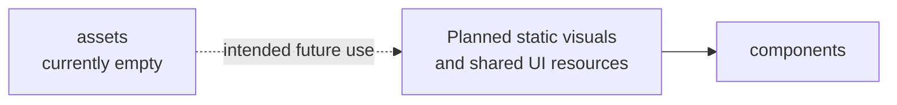

# Assets Module Architecture Analysis

## Scope

- Snapshot basis: 0 code files and 0 code lines in `src/assets`
- This analysis documents the empty module as an architectural gap and reserved extension point.

## Reading The Module

`assets/` is currently unused in the productive code snapshot. That means the frontend has no explicit in-source asset strategy yet for icons, local images, widget visuals or static UI resources.

This is not a problem for the present implementation because the UI can still work with CSS and component markup alone. It does show that the project has not yet reached a point where visual resources are managed as a first-class part of the frontend architecture.

## Critical Assessment

- The empty directory is harmless now, but it is not yet evidence of real modularization.
- Once the UI grows beyond text and simple layout styling, this folder will likely become active quickly.
- Without a clear asset strategy, future widgets may start importing static files ad hoc from inconsistent places.

## Intended But Missing Elements

- icons, illustrations or widget-local static resources if the UI becomes richer
- a naming and placement convention for reusable visual assets

## Diagram

## Navigation

- Parent: `../frontendArch.md`
