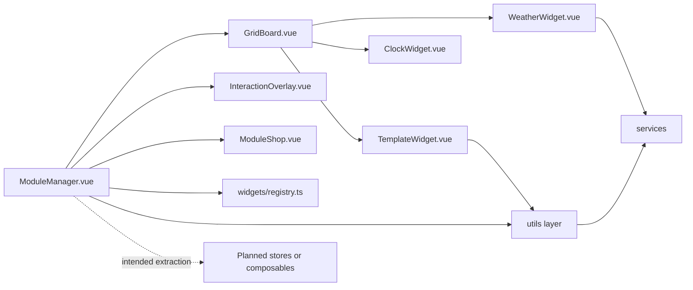

# Components Module Architecture Analysis

## Scope

- Snapshot basis: 7 files and 1498 lines in `src/components`
- Subtrees: `manager/` and `widgets/`

## Metric View

| Slice | Files | Lines | Reading |
| --- | ---: | ---: | --- |
| `manager/` | 4 | 1040 | Layout orchestration, interaction feedback, board rendering and widget selection |
| `widgets/` | 3 | 458 | Domain-facing widget UI |

### Largest Component Hotspots

| Component | Lines | Why it matters |
| --- | ---: | --- |
| `ModuleManager.vue` | 465 | Central interaction controller for focus, shop and ArrangeMode |
| `ModuleShop.vue` | 279 | Widget insertion flow, now targeted at the focused placement |
| `TemplateWidget.vue` | 212 | Hardware and system UI surface, now backed by extracted helper logic |
| `GridBoard.vue` | 195 | Placement-based board rendering with selection and focus feedback |

## Structure And Logic

The components layer still contains the main application flow, but not as monolithically as before. `ModuleManager.vue` owns layout state, focus state, loading and persistence. `GridBoard.vue` renders the 4x4 board with row and column spans plus focus highlighting. `ModuleShop.vue` handles widget selection against the current focus target. `InteractionOverlay.vue` exposes the current raw input, semantic action, selected widget and ArrangeMode state. The widget components render the concrete weather, clock and hardware experiences.

The key change is that helper-heavy logic is no longer forced to live inline. Layout transformation, focus movement, placement validation and rendered-widget assembly were moved into `utils/layout.ts`, module-shop mechanics into `utils/moduleShop.ts`, and hardware-widget integration logic into `utils/hardwareWidget.ts`.

## Critical Assessment

- The state-driven rendering model remains the right structural base.
- `manager/` still does more than presentation. It mixes application state, persistence choreography and UI control flow.
- `widgets/` provides good feature isolation, but the hardware widget still consumes service behavior directly through its helper layer instead of a shared state layer.
- The biggest remaining pressure point is now `ModuleManager.vue`, followed by broader frontend state ownership rather than raw component size alone.

## Intended But Missing Elements

- composables or stores to move layout and widget state above `ModuleManager.vue`
- clearer split between presentation components and feature orchestration
- automated component tests

## Diagram

## Navigation

- Parent: `../frontendArch.md`
