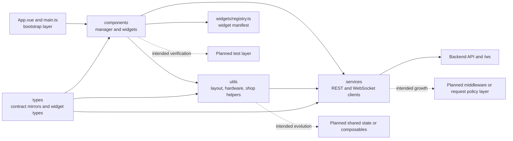

# Frontend Src Architecture Analysis

## Scope And Metric Basis

- Snapshot date: 2026-04-14
- Metrics cover productive frontend files in `Frontend/nimrag-frontend/src` after the helper and type extraction.
- Frontend tests are shown separately; the current snapshot still contains no actual test code.

## Frontend Metrics

| Scope | Files | Lines | Notes |
| --- | ---: | ---: | --- |
| `App.vue` | 1 | 7 | Minimal root shell |
| `main.ts` | 1 | 5 | Vue bootstrap |
| `components/` | 6 | 1249 | UI and remaining orchestration hotspots |
| `services/` | 3 | 218 | REST and WebSocket clients |
| `types/` | 4 | 142 | Backend contract mirrors plus widget-facing types |
| `utils/` | 3 | 414 | Extracted layout, hardware-widget and module-shop helpers |
| `widgets/` | 1 | 63 | Widget registry and defaults |
| `assets/` | 0 | 0 | Reserved but unused |
| `middleware/` | 0 | 0 | Reserved but unused |
| `tests/` | 0 | 0 | Reserved but unused |

### Concentration Signals

- `components/` still holds most frontend complexity, but no longer all of it.
- `ModuleShop.vue`, `TemplateWidget.vue` and `ModuleManager.vue` remain the main UI hotspots, just with less inline orchestration than before.
- `utils/` is now an active layer, which reduces pressure on large components and makes the folder tree closer to the actual architecture.

## Root Structure Reading

| Element | Current responsibility | Assessment |
| --- | --- | --- |
| `App.vue` and `main.ts` | App bootstrap and shell handoff | Clean and intentionally thin |
| `components/` | Rendering, layout orchestration and widget interaction | Still the primary UI layer, but no longer forced to carry every helper inline |
| `services/` | Typed HTTP client plus WebSocket client | Good basis, and the realtime path is now actively used by the hardware widget |
| `types/` | Local TypeScript mirrors of backend contracts and widget wiring types | Improves safety, but still creates manual synchronization risk |
| `utils/` | Extracted layout, hardware and selection helpers | First real frontend support layer and an important modularity improvement |
| `widgets/` | Registry and widget defaults | Strong design choice that supports extensibility |
| `assets/`, `middleware/`, `tests/` | Reserved extension points | Still mostly intent markers rather than delivered layers |

## Reading The Frontend Beyond Folders

The more useful reading is now by layer rather than by folder names alone:

- bootstrap layer: `App.vue`, `main.ts`, `style.css`, `shims-vue.d.ts`
- orchestration and presentation: `components/manager/*`
- feature widgets: `components/widgets/*`
- helper layer: `utils/layout.ts`, `utils/hardwareWidget.ts`, `utils/moduleShop.ts`
- client layer: `services/api.ts`, `services/realtime.ts`
- contract layer: `types/*`
- extension registry: `widgets/registry.ts`
- planned but not yet implemented support layers: `assets/`, `middleware/`, `tests/`

This layered view matches the current code more honestly than the previous all-in-components reading.

## Missing Intended Elements

- a shared frontend state or composable layer above low-level clients and helpers
- automated tests
- middleware or request orchestration for future auth and cross-cutting concerns
- richer widget editing and configuration flows beyond the current direct component state paths

## Critical Assessment

The frontend has materially improved since the first architecture snapshot.

- Widgets are still rendered from state and a registry, which remains the most important structural correction.
- The new `utils/` layer is a real improvement because it moves layout and hardware orchestration out of the biggest components.
- The services layer is still intentionally low-level. There is still no stable application state layer between UI and clients.
- WebSocket consumption exists now, but only in the hardware widget. The frontend is no longer REST-only, yet it is not broadly realtime-driven either.

## Architecture Diagram

## Navigation

- Parent analysis: `../../../repoArch.md`
- Components module: `components/componentArch.md`
- Services module: `services/serviceArch.md`
- Types module: `types/typeArch.md`
- Widgets module: `widgets/widgetArch.md`
- Assets module: `assets/assetArch.md`
- Middleware module: `middleware/middlewareArch.md`
- Utils module: `utils/utilArch.md`
- Tests module: `tests/testArch.md`
