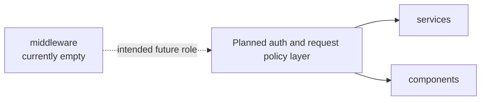

# Middleware Module Architecture Analysis

## Scope

- Snapshot basis: 0 code files and 0 code lines in `src/middleware`
- This analysis treats the folder as a planned cross-cutting layer, not an implemented one.

## Reading The Module

`middleware/` is empty in the current snapshot. In a Vue project without routing or auth this is not immediately harmful, but it also means there is no explicit home yet for request interception, auth orchestration or other cross-cutting frontend policy.

The folder therefore represents intended architecture rather than delivered architecture.

## Critical Assessment

- The empty state is acceptable at prototype scale.
- If authentication, request policy or richer navigation are added later, the lack of a prepared cross-cutting layer will become visible very quickly.
- The main risk is not the missing code itself, but future logic ending up scattered across components and services because this layer is still unused.

## Intended But Missing Elements

- auth-related request handling once backend auth exists
- route or navigation guards if a richer application shell appears
- shared request policy such as retries, refresh behavior or access control checks

## Diagram

## Navigation

- Parent: `../frontendArch.md`
