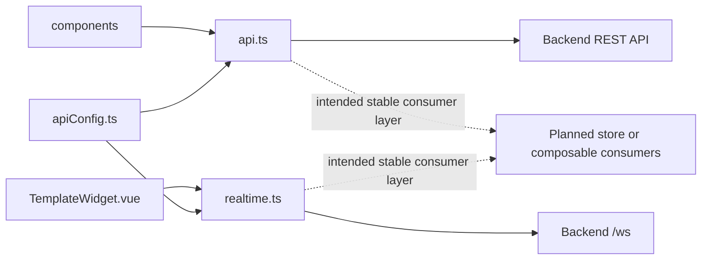

# Services Module Architecture Analysis

## Scope

- Snapshot basis: 3 files and 218 lines in `src/services`
- Files: `api.ts`, `apiConfig.ts`, `realtime.ts`

## Metric View

| File | Lines | Responsibility |
| --- | ---: | --- |
| `api.ts` | 134 | Typed REST client for configuration, weather and hardware-style endpoints |
| `realtime.ts` | 70 | WebSocket client with subscribe and reconnect behavior |
| `apiConfig.ts` | 14 | Base URL construction |

## Structure And Logic

The frontend services module is intentionally thin. `apiConfig.ts` provides the backend base URL, `api.ts` centralizes REST access and typed error behavior, and `realtime.ts` exposes a shared WebSocket client with listener registration and reconnect logic.

This layer is already correctly placed between the UI and the backend. The missing piece is not a different client design, but the stateful application layer above it that would consume these services consistently across more than one widget or screen.

## Critical Assessment

- The module is clean, small and already reusable.
- REST usage is in a good state for the current project size because there is one clear typed client instead of many ad hoc fetch calls.
- The WebSocket client is now consumed by the hardware widget, which validates the path technically but still leaves broader realtime state management open.
- There is no auth handling, request policy abstraction, caching layer or stale-while-revalidate behavior yet.

## Intended But Missing Elements

- shared state consumers that subscribe to `realtime.ts`
- auth-aware request handling if backend auth becomes real
- caching or request deduplication for repeated config and weather access
- optional domain-level service wrappers or composables above the low-level client

## Diagram

## Navigation

- Parent: `../frontendArch.md`
