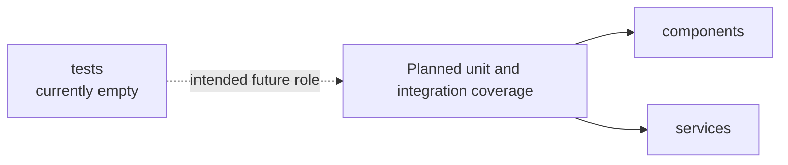

# Tests Module Architecture Analysis

## Scope

- Snapshot basis: 0 test files and 0 test lines in `src/tests`
- This analysis records the absence of frontend tests as an architecture finding, not merely a file-system fact.

## Reading The Module

`src/tests` exists, but it is empty. The frontend therefore has a named place for tests without any implemented verification strategy in the code snapshot. In contrast, the backend already carries a meaningful automated test base.

This asymmetry is one of the clearest architecture risks in the repository.

## Critical Assessment

- The empty folder makes the gap visible, which is better than hiding it.
- The absence of tests increases the risk around the exact areas where the frontend is already complex: layout management, widget persistence and hardware-oriented UI behavior.
- Because the frontend still lacks stores or composables, even basic unit testing will stay harder than it needs to be until state logic is extracted from large components.

## Intended But Missing Elements

- component tests for `ModuleManager`, `GridBoard` and the larger widget components
- client tests for `api.ts` and `realtime.ts`
- integration tests for layout persistence and weather loading

## Diagram

## Navigation

- Parent: `../frontendArch.md`
