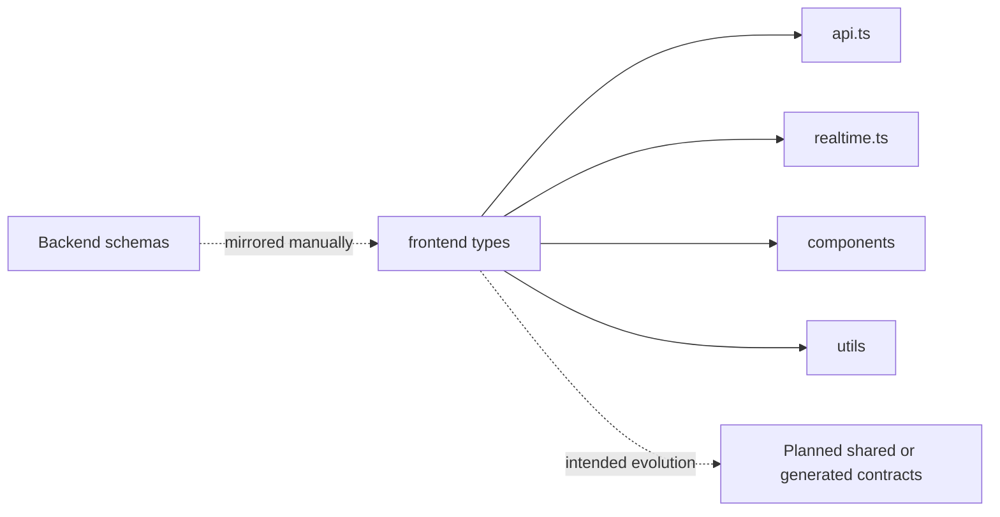

# Types Module Architecture Analysis

## Scope

- Snapshot basis: 4 files and 142 lines in `src/types`
- Files: `config.ts`, `hardware.ts`, `weather.ts`, `widgets.ts`

## Metric View

| File | Lines | Responsibility |
| --- | ---: | --- |
| `hardware.ts` | 57 | Realtime and hardware-oriented event or status types |
| `config.ts` | 51 | Layout and system configuration contracts |
| `widgets.ts` | 19 | Frontend widget-rendering and shop-exposure types |
| `weather.ts` | 15 | Weather response types |

## Structure And Logic

The types module is still the frontend contract mirror of the backend, but it now also stabilizes frontend-specific widget wiring. `api.ts`, `realtime.ts`, the widget components and the extracted helper layer all depend on these local TypeScript models.

This keeps the frontend typed without a generated shared schema package. It also creates an explicit maintenance obligation: backend contract changes still need to be mirrored manually here.

## Critical Assessment

- Type coverage is strong relative to the size of the frontend.
- Adding `widgets.ts` was a useful separation because widget-rendering types no longer have to hide inside components.
- Manual synchronization with backend Pydantic schemas remains the main architectural risk.
- As more domains arrive, the lack of generated or shared contracts will become more expensive.

## Intended But Missing Elements

- generated or shared contracts across backend and frontend
- additional domain types once calendar and smart-home flows become real in the UI
- stronger separation between transport types and richer frontend view models if UI logic grows further

## Diagram

## Navigation

- Parent: `../frontendArch.md`
