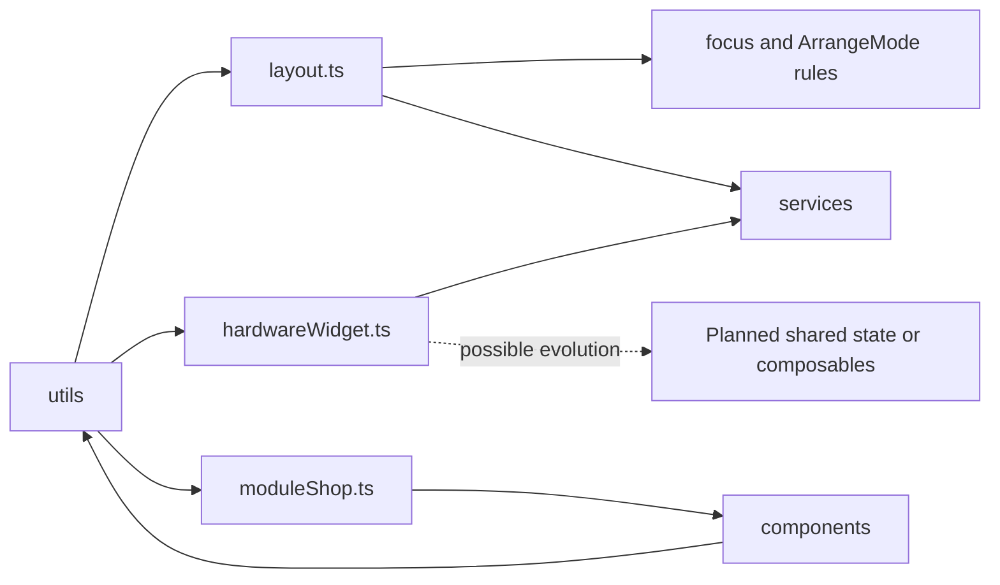

# Utils Module Architecture Analysis

## Scope

- Snapshot basis: 3 code files and 648 code lines in `src/utils`
- Files: `layout.ts`, `hardwareWidget.ts`, `moduleShop.ts`

## Metric View

| File | Lines | Responsibility |
| --- | ---: | --- |
| `layout.ts` | 363 | Placement normalization, focus movement, collision rules, payload building and rendered-widget assembly |
| `hardwareWidget.ts` | 233 | Hardware-widget integration logic, realtime handling and control helpers |
| `moduleShop.ts` | 52 | Module list, selection and carousel helper logic |

## Reading The Module

`utils/` is now the first real frontend helper layer instead of a reserved folder. The extracted files are all tied to one concrete goal: reduce the amount of orchestration logic living inline in `ModuleManager.vue`, `TemplateWidget.vue` and `ModuleShop.vue`.

The largest evolution is `layout.ts`. It no longer only normalizes persisted layout. It now defines the placement vocabulary of the UI: widget spans, cell occupancy, focus state, move and resize rules, migration from legacy `cell_id`, and transformation back into API payloads. This is a pragmatic intermediate step. It does not replace a future shared state or composable layer, but it gives repeated logic a stable home and makes the component layer easier to read.

## Critical Assessment

- The new helper layer is small but immediately valuable.
- `layout.ts` and `moduleShop.ts` are pure enough to be good future test targets.
- `hardwareWidget.ts` is a useful extraction, but it already behaves like a composable-style integration layer and may want a more explicit frontend-state home later.
- The module now reduces architecture debt instead of merely signaling it.

## Intended But Missing Elements

- formatting helpers for display values and timestamps once UI richness grows
- test coverage for the extracted pure helpers
- possible evolution from helper modules to shared composables or domain state modules

## Diagram

## Navigation

- Parent: `../frontendArch.md`
