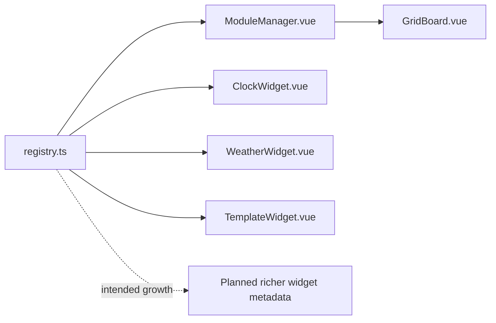

# Widgets Registry Architecture Analysis

## Scope

- Snapshot basis: 1 file and 63 lines in `src/widgets`
- Current content: `registry.ts`

## Metric View

| File | Lines | Responsibility |
| --- | ---: | --- |
| `registry.ts` | 63 | Widget manifest, lookup and default settings |

## Structure And Logic

`registry.ts` is a small file with disproportionately high architectural value. It defines the known widget types, connects them to concrete Vue components and exposes helper functions for lookup and default settings. This lets the UI assemble widgets from data instead of hardcoding component imports at every use site.

For the current frontend, this is one of the clearest signs of a scalable design direction.

## Critical Assessment

- The registry pattern is the frontend's strongest extensibility mechanism.
- It keeps widget composition declarative and reduces conditional rendering logic elsewhere.
- The current metadata set is intentionally minimal. As widgets grow, the registry may need richer capabilities such as configuration metadata, categories or lazy-loading hints.
- The module is healthy, but its value depends on the rest of the frontend continuing to treat widgets as data-driven entities.

## Intended But Missing Elements

- richer widget metadata for editors, previews or permissions
- optional lazy loading if widget count grows
- more formal separation between widget manifest data and component implementation imports

## Diagram

## Navigation

- Parent: `../frontendArch.md`
