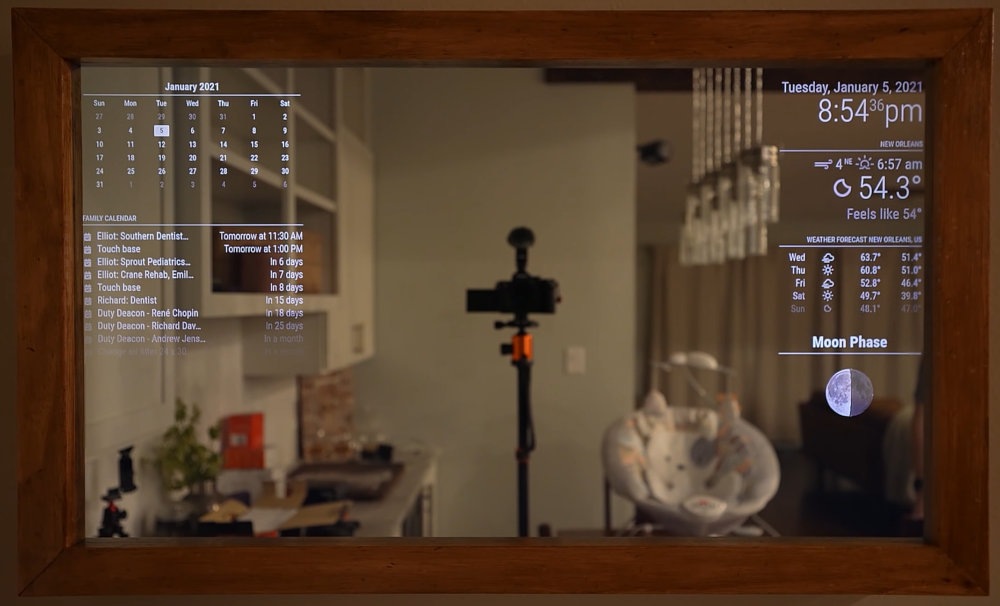

# Smart Mirror Project "Nimrag"

Ein intelligenter Spiegel mit modularer Software-Architektur, entwickelt für Raspberry Pi Hardware mit LED-Beleuchtung und webbasierter Benutzeroberfläche.



## Quick Start

### Einfachste Installation (alle Betriebssysteme):
```bash
node setup.js
```

Das war's! Das Skript installiert automatisch alle Dependencies und startet das Frontend.

## Systemanforderungen

### Hardware:
- **Raspberry Pi** (Modell 2, 3, 4 oder 5)
- **Monitor/TV** mit HDMI-Eingang
- **Zwei-Wege-Spiegel** (siehe [Hardware-Liste](#hardware-einkaufsliste))
- **LED-Strip** für Hintergrundbeleuchtung (optional)

### Software:
- **Node.js** (Version 16+) - [Download](https://nodejs.org/)
- **Python** (für Backend) - [Download](https://python.org/)
- **Git** - [Download](https://git-scm.com/)

## Installation & Setup

### Option 1: Automatisches Setup (Empfohlen)
```bash
# Universell für Windows, Linux, macOS
node setup.js

# Oder mit NPM
npm run setup
```

### Option 2: Manuell
```bash
# Frontend Dependencies
cd Frontend/nimrag-frontend
npm install

# Backend Dependencies (optional)
cd Backend
pip install -r requirements.txt
```

## Entwicklung starten

### Frontend Development Server:
```bash
# Automatisch
node setup.js --dev

# Oder manuell
cd Frontend/nimrag-frontend
npm run dev
```

### Backend starten:
```bash
cd Backend/src
python main.py
```

## Projekt-Struktur

```
Smart-Mirror-Project/
├── Frontend/
│   └── nimrag-frontend/        # React/Vue Frontend
│       ├── src/
│       ├── package.json
│       └── ...
├── Backend/                    # Python Backend
│    ├── src/
│       ├── main.py
│       └── ...
│   ├── requirements.txt
│   └── ...
├── pics/                      # Bilder & Mockups
├── docs/                      # Dokumentation
├── setup.js                  # Universal Setup Script
├── setup.bat                 # Windows Batch Script
├── setup.sh                  # Linux/macOS Shell Script
├── package.json              # NPM Scripts
└── README.md                 # Diese Datei
```

## Hardware-Einkaufsliste

### Grundausstattung (€102.67):
- **Spiegel**: [Supreme Tech Acryl See-Through](https://www.amazon.de/Supreme-Tech-x18-Acryl-See-Through-Spiegel/dp/B07XTRCTQL) - **€50.48**
- **HDMI-Kabel**: [Micro HDMI zu HDMI](https://www.amazon.de/dp/B0BP29QTJ6) - **€9.79**
- **LED-Strip**: [TP-Link Tapo LED-Streifen](https://www.amazon.de/TP-Link-Tapo-schneidbar-kompatibel-energiesparend/dp/B098FJ6LXB) - **€14.99**

### Elektronik-Komponenten:
- **N-Channel MOSFET**: [Amazon US](https://www.amazon.com/gp/product/B07CTF1JVD) - **€6.43**
- **Smart Switch**: [Sonoff Basic R2](https://www.amazon.com/gp/product/B07KP8THFG) - **€11.79**
- **Breadboard Set**: [Steckplatine + Kabel](https://www.amazon.com/dp/B08Y59P6D1) - **€9.19**

## Verfügbare Scripts

```bash
# Setup & Installation
node setup.js              # Vollständiges Setup
npm run setup              # Alternative mit NPM

# Development
node setup.js --dev        # Frontend Dev Server starten
npm run dev                # Alternative mit NPM

# Platform-specific
.\setup.bat                # Windows Batch
./setup.sh                 # Linux/macOS Shell
```

## Software-Architektur

### Frontend:
- **Framework**: React/Vue.js
- **Styling**: CSS/SCSS
- **Build Tool**: Vite/Webpack
- **Module System**: ES6 Modules

### Backend:
- **Framework**: Python Flask/FastAPI
- **Hardware Interface**: GPIO für LED-Steuerung
- **API**: RESTful Endpoints

### Module:
- **Kalender** - Termine und Events
- **Wetter** - Aktuelle Bedingungen & Vorhersage
- **Uhrzeit** - Digitale Zeitanzeige
- **Nachrichten** - RSS Feeds
- **Musik** - Wiedergabesteuerung
- **Smart Home** - Gerätesteuerung
- **Sensoren** - Temperatur/Luftfeuchtigkeit

## Hardware-Integration

### LED-Steuerung:
```
Raspberry Pi GPIO → N-Channel MOSFET → LED Strip
```

### Stromversorgung:
- Raspberry Pi (USB-C)
- LED-Beleuchtung (12V)
- Smart Switch für Gesamtsteuerung

## Troubleshooting

### Node.js nicht gefunden:
```bash
# Windows: Download von nodejs.org
# Ubuntu/Debian: sudo apt install nodejs npm
# macOS: brew install node
```

### Frontend startet nicht:
```bash
cd Frontend/nimrag-frontend
rm -rf node_modules package-lock.json
npm install
npm run dev
```

### Backend-Probleme:
```bash
cd Backend
pip install --upgrade pip
pip install -r requirements.txt
python main.py
```

### Raspberry Pi GPIO:
- Stellen Sie sicher, dass GPIO aktiviert ist
- Verwenden Sie `sudo` für Hardware-Zugriff
- Überprüfen Sie Verkabelung und Spannungen

## Entwicklung & Beitrag

### Git Workflow:
```bash
git clone https://github.com/SebastianRieger/Software-Engineering.git
cd Software-Engineering
node setup.js
```

### Branches:
- `main` - Stabile Version
- `autosetup` - Aktuelle Entwicklung
- `feature/*` - Neue Features

## Weitere Dokumentation

- [Projektbeschreibung](projektbeschreibung.md) - Detaillierte Hardware & Software Specs
- [Frontend Dokumentation](Frontend/README.md)
- [Backend API Dokumentation](Backend/README.md)

## Features (Geplant)

- [x] Automatisches Setup-System
- [x] Cross-Platform Kompatibilität
- [ ] LED-Hardware Integration
- [ ] Smartphone App Steuerung
- [ ] Sprachsteuerung (Alexa/Google)
- [ ] Gesichtserkennung
- [ ] Personalisierte Profile
- [ ] Cloud-Synchronisation

## Lizenz

MIT License - Siehe [LICENSE](LICENSE) für Details.

---

**Quelle der Bilder**: https://www.youtube.com/watch?v=OYlloiaBINo