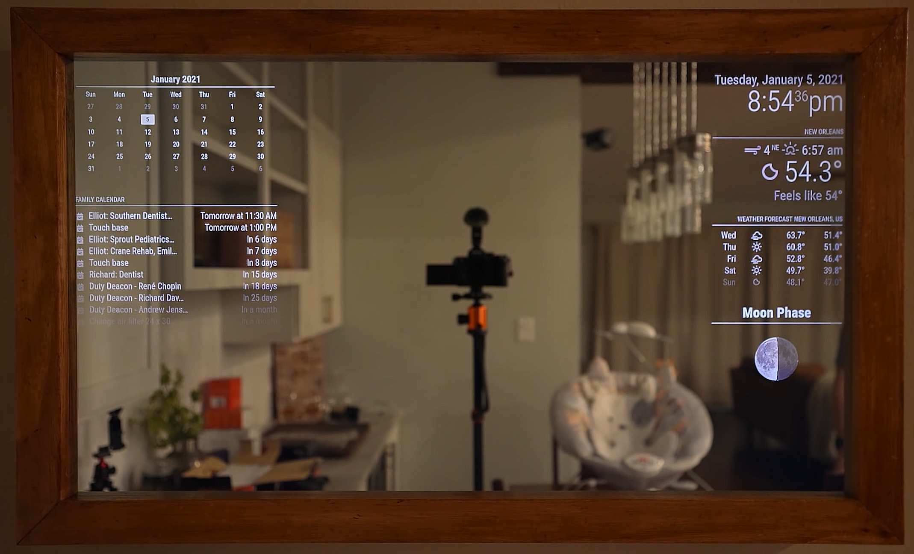
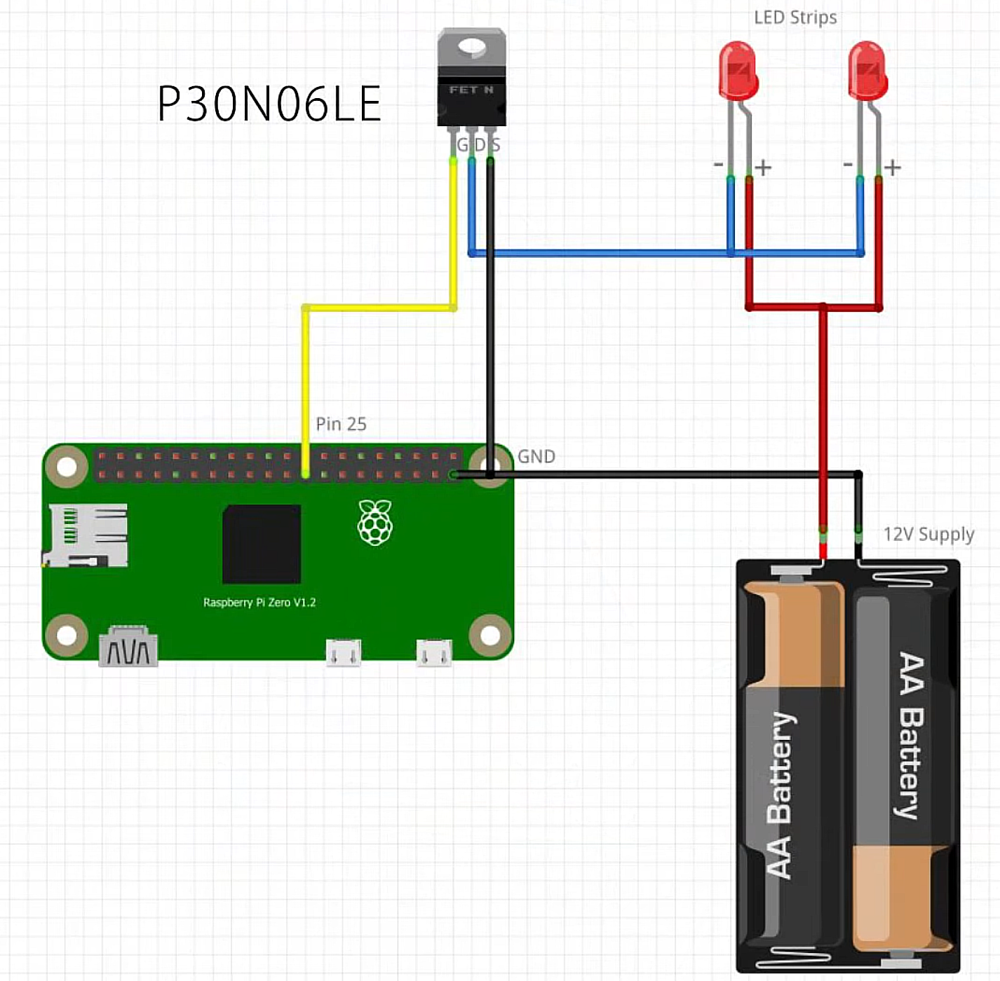

# Nimrag – Smart Mirror

> Ein modularer Smart Mirror auf Raspberry-Pi-Basis mit Vue 3 Frontend, FastAPI Backend, Gestensteuerung, Sprachsteuerung und MQTT-Integration.



**Live-Demo (GitHub Pages):** https://sebastianrieger.github.io/Software-Engineering/

---

## Dokumentation

| Dokument | Inhalt |
|---|---|
| [docs/README.md](docs/README.md) | Dokumentations-Übersicht (Einstiegspunkt) |
| [docs/project/GETTING_STARTED.md](docs/project/GETTING_STARTED.md) | Detaillierte Setup-Anleitung inkl. aller Widget-API-Keys |
| [docs/SRS/SRS Nimrag.md](docs/SRS/SRS%20Nimrag.md) | Software Requirements Specification (v1.2) |
| [docs/architecture/SAD.md](docs/architecture/SAD.md) | Software Architecture Document (v3.0) |
| [docs/doku/README.md](docs/doku/README.md) | Widget-Dokumentation (alle 11 Widgets) |
| [docs/doku/configdocu.md](docs/doku/configdocu.md) | Konfigurationsreferenz (.env & app_config.json) |
| [docs/quality/Qualitaetsbericht.md](docs/quality/Qualitaetsbericht.md) | Qualitätsbericht (Tests, CI/CD, Metriken) |
| [docs/quality/CICD-Setup.md](docs/quality/CICD-Setup.md) | GitHub Actions Pipeline (6 Jobs) |
| [docs/diagram-docs/Mermaid_Diagramme_Index.md](docs/diagram-docs/Mermaid_Diagramme_Index.md) | Index aller 16 UML-Diagramme |
| [docs/project/Projektretrospektive.md](docs/project/Projektretrospektive.md) | Projektretrospektive |
| [docs/project/RMMM.md](docs/project/RMMM.md) | Risk Management (12 Risiken) |

---

## Schnellstart

### Voraussetzungen

- **Node.js** 16+
- **Python 3.11–3.13** (3.12 empfohlen, inkl. Python Launcher `py` unter Windows)
- **Git**

### Installation

```bash
git clone https://github.com/SebastianRieger/Software-Engineering.git
cd Software-Engineering
node setup.js
```

Das Skript installiert die Frontend-Dependencies und legt automatisch `Backend/.venv` mit einem passenden Python-Interpreter an.

### Backend `.env` anlegen

```bash
cp Backend/.env.example Backend/.env
# Dann Backend/.env mit API-Keys befüllen (siehe Widget-Konfiguration)
```

### Starten

```bash
# Terminal 1 – Backend
npm run dev:backend

# Terminal 2 – Frontend
npm run dev
```

- Frontend: `http://localhost:5173`
- Backend API: `http://localhost:8000`
- API Docs (Swagger): `http://localhost:8000/api/v1/openapi.json`

---

## Projekt-Struktur

```
Software-Engineering/
├── Frontend/
│   └── nimrag-frontend/        # Vue 3 + TypeScript Frontend
│       └── src/
│           ├── components/
│           │   ├── manager/    # GridBoard, ModuleManager, ModuleShop, Gestensteuerung-HUD
│           │   └── widgets/    # Alle Widget-Komponenten (11 Widgets)
│           └── ...
├── Backend/                    # Python / FastAPI Backend
│   └── src/
│       ├── api/                # REST-Endpunkte (v1)
│       ├── core/               # Config, Logging, Realtime-Hub (WebSocket)
│       ├── services/           # Geschäftslogik: LED, Gesten, Sprache, Wetter, …
│       ├── repositories/       # Datenzugriff & externe API-Clients
│       ├── schemas/            # Pydantic-Schemas
│       └── main.py             # FastAPI-App, WebSocket-Endpoint, Lifespan
├── docs/                       # Gesamte Projektdokumentation
│   ├── SRS/                    # Software Requirements Specification
│   ├── architecture/           # SAD, ASR, Architekturentscheidungen
│   ├── quality/                # Testberichte, CI/CD, Metriken, Refactoring
│   ├── doku/                   # Widget-Doku & Konfigurationsreferenz
│   ├── diagram-docs/           # UML-Diagramme (Mermaid)
│   └── Diagramme/              # Diagramm-Bild-Dateien (PNG)
├── pics/                       # Mockups, Screenshots, Schaltplan
├── setup.js                    # Universelles Setup-Skript
└── package.json                # NPM-Scripts
```

---

## Widgets

Der Widget-Shop wird im Browser über die Taste `E` geöffnet. Widgets können per Drag & Drop in das Grid gezogen, in der Größe angepasst und entfernt werden. Der Zustand wird per LocalStorage gespeichert.

| Widget | API-Key nötig | Beschreibung |
|---|---|---|
| Uhr (analog/digital) | Nein | Umschaltbare Uhrmodi |
| Wetter | `WEATHER_API_KEY` | Aktuelle Bedingungen & Vorhersage (OpenWeatherMap) |
| News (Tagesschau) | Nein | Nachrichten nach Ressort & Region |
| Markt (Aktien/Crypto) | `TWELVE_DATA_API_KEY` | Kurse für konfigurierte Symbole |
| Spotify | OAuth (Spotify Dev App) | Aktuelle Wiedergabe & Steuerung |
| NINA-Warnungen | Nein (ARS-Code) | Amtliche Katastrophenschutzmeldungen |
| Kamera | Nein | Live-Webcam-Preview |
| Zufälliges Meme | Nein | Zufälliges Bild aus dem Meme-Pool |
| Nutzlose Fakten | Nein | Täglicher Fun-Fact |
| Frage des Tages | Nein | Tägliche Trivia-Frage |
| Corporate Bullshit | Nein | Stündlich generierter Corporate-Satz |

Vollständige Widget-Doku: [docs/doku/README.md](docs/doku/README.md)

---

## Architektur

### Tech-Stack

| Schicht | Technologie |
|---|---|
| Frontend | Vue 3, TypeScript, Vite |
| Backend | Python 3.12, FastAPI, uvicorn |
| Realtime | WebSocket (`/ws`), Event-Driven Architecture |
| Smart Home | MQTT |
| Datenbank | SQLite (via SQLAlchemy) |
| Gestensteuerung | MediaPipe Hand Landmarker (Offline-Modell) |
| Sprachsteuerung | Whisper / Audio-Service |
| LED-Steuerung | Raspberry Pi GPIO → N-Channel MOSFET → LED-Strip |
| CI/CD | GitHub Actions (6 Jobs: Lint, Test Backend, Test Frontend, Quality Gates, Build, Deploy) |

### Kommunikationsfluss

```
Browser (Vue 3)
    │  REST /api/v1/...     (Polling & One-shot)
    │  WebSocket /ws        (Realtime-Events: Gesten, LED, Wetter-Push)
    ▼
FastAPI Backend
    ├── Externe APIs        (OpenWeatherMap, Twelve Data, Tagesschau, NINA, Spotify)
    ├── Gestenservice       (MediaPipe, Sequenzanalyse)
    ├── Sprachservice       (Whisper)
    ├── LED-Service         (GPIO / PWM)
    └── MQTT-Broker         (Smart Home)
```

Detaillierte Architektur-Docs: [docs/architecture/SAD.md](docs/architecture/SAD.md) · [docs/Event-driven architecture/](docs/Event-driven%20architecture/)

---

## Hardware

### Stückliste (ca. €102)

| Komponente | Link | Preis |
|---|---|---|
| Acryl-Zwei-Wege-Spiegel | [Amazon](https://www.amazon.de/Supreme-Tech-x18-Acryl-See-Through-Spiegel/dp/B07XTRCTQL) | €50.48 |
| Micro-HDMI zu HDMI | [Amazon](https://www.amazon.de/dp/B0BP29QTJ6) | €9.79 |
| LED-Strip (schneidbar) | [Amazon](https://www.amazon.de/TP-Link-Tapo-schneidbar-kompatibel-energiesparend/dp/B098FJ6LXB) | €14.99 |
| N-Channel MOSFET | [Amazon](https://www.amazon.com/gp/product/B07CTF1JVD) | €6.43 |
| Sonoff Smart Switch | [Amazon](https://www.amazon.com/gp/product/B07KP8THFG) | €11.79 |
| Breadboard + Kabel | [Amazon](https://www.amazon.com/dp/B08Y59P6D1) | €9.19 |

**Schaltplan:** 

```
Raspberry Pi GPIO → N-Channel MOSFET → LED-Strip (12 V)
```

---

## Verfügbare NPM-Scripts

```bash
node setup.js              # Vollständiges Setup (Frontend + Backend-Venv)
npm run setup              # Alias für node setup.js
npm run setup:backend      # Nur Backend-Venv + Python-Dependencies
npm run dev                # Frontend Dev Server (http://localhost:5173)
npm run dev:backend        # Backend starten (http://localhost:8000)
```

---

## Qualitätssicherung

- **53 Testdateien** insgesamt: 16 Backend (pytest), 37 Frontend (Vitest)
- **Backend:** Wetter, News, Gesten, LED, Kalibrierung, Voice, externe API-Health
- **Frontend:** 14 Composables, 10 Widget-/Manager-Komponenten, 13 Service-Module
- **CI/CD:** GitHub Actions mit Lint (black, flake8), Tests, Quality Gates und GitHub-Pages-Deploy

Vollständige Details: [docs/quality/Qualitaetsbericht.md](docs/quality/Qualitaetsbericht.md)

---

## Troubleshooting

**Python nicht erkannt (Windows):**
```powershell
py -3.12 --version
# Falls nicht vorhanden: Python 3.12 von python.org installieren
$env:SMART_MIRROR_PYTHON="C:\...\python.exe"
npm run setup:backend
```

**Backend startet nicht:**
```bash
npm run setup:backend -- --force
npm run dev:backend
```

**Frontend startet nicht:**
```bash
cd Frontend/nimrag-frontend
rm -rf node_modules package-lock.json
npm install
npm run dev
```

**Raspberry Pi GPIO:** GPIO in `raspi-config` aktivieren und Backend mit `sudo` starten.

Ausführlicheres Troubleshooting: [docs/project/GETTING_STARTED.md](docs/project/GETTING_STARTED.md)

---

## Team

Sebastian Rieger · Jannik · Jan · Louis  
TINF24B5 – DHBW Karlsruhe · Softwaretechnik-Projekt 2025/2026

## Lizenz

MIT – siehe [docs/License/License.md](docs/License/License.md)
