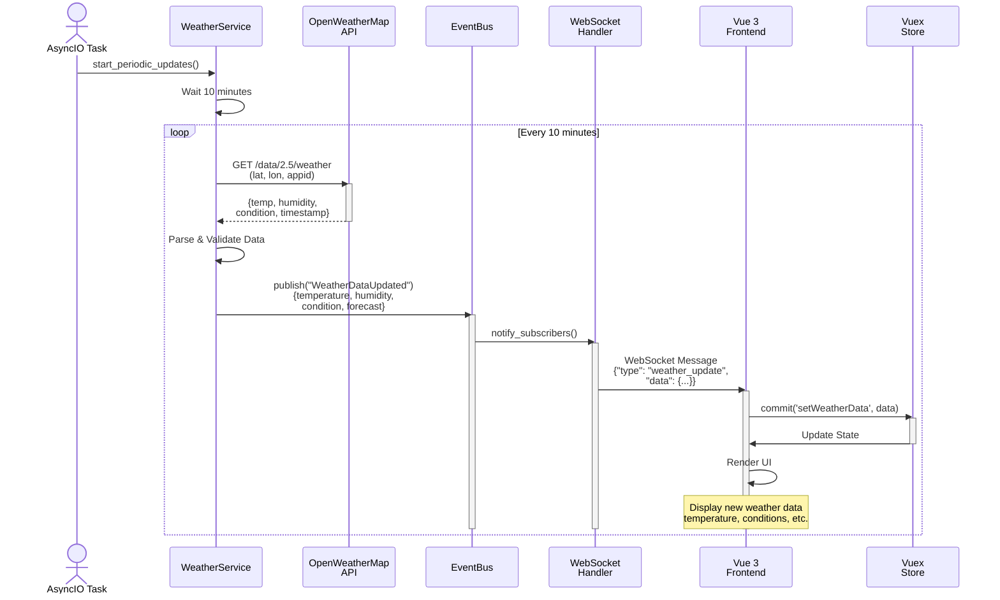
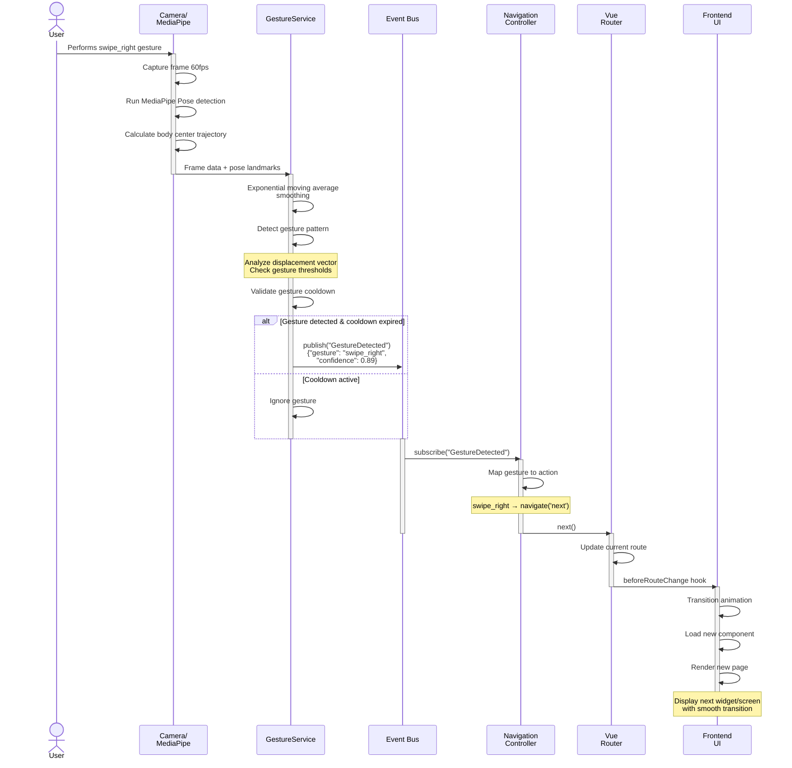
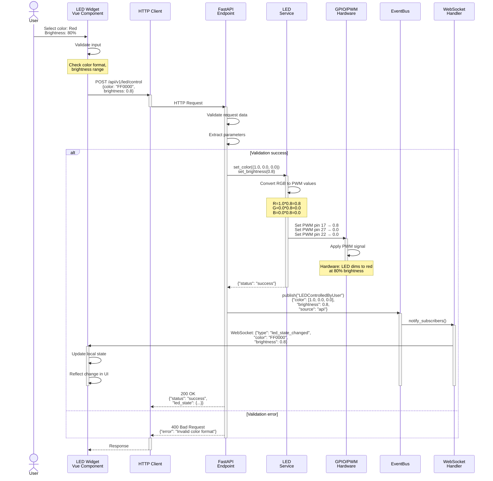
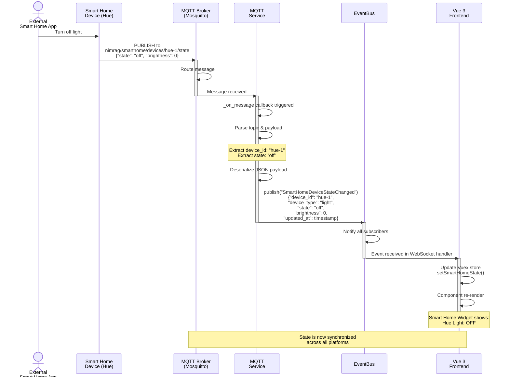
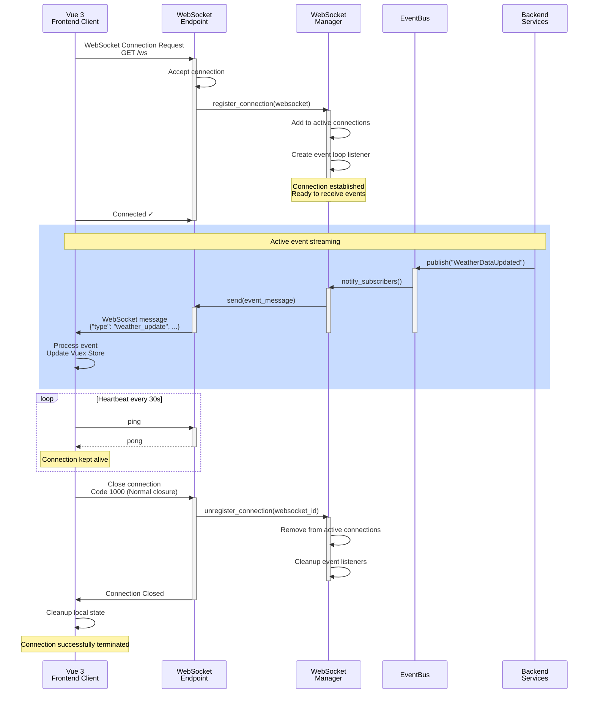

# Abschnitt 6: Sequenzdiagramme auf Komponentenebene

## 6.1 Überblick

Die Sequenzdiagramme beschreiben die Interaktionen zwischen den Komponenten des Nimrag Smart Mirror Systems auf Komponentenebene. Sie zeigen die zeitliche Abfolge von Nachrichten und Operationen bei kritischen Geschäftsprozessen.

---

## 6.2 Sequenzdiagramm: Wetter-Update-Workflow

### Beschreibung

Der Wetter-Update-Workflow beschreibt den periodischen Abruf von Wetterdaten von der OpenWeatherMap API, deren Verarbeitung im Backend und die Verteilung an alle verbundenen Frontend-Clients über WebSocket.

**Beteiligte Komponenten:**
- **WeatherService**: Periodischer Service zur Wetterdatenbeschaffung
- **EventBus**: Zentrale Nachrichtenvermittlung
- **WebSocket Handler**: Verteilung an Frontend-Clients
- **Frontend (Vue 3)**: Anzeige der Wetterdaten

**Szenario:** Alle 10 Minuten wird der WeatherService aktiviert, ruft neue Wetterdaten ab und benachrichtigt alle Subscriber.

**Wichtige Aspekte:**
- **Asynchrone Verarbeitung**: Der Weather Service läuft als Background Task und blockiert nicht
- **Event-Driven**: Über EventBus können mehrere Subscriber informiert werden (z.B. auch LED Service)
- **Real-time Updates**: WebSocket ermöglicht sofortige UI-Updates ohne Polling
- **Error Handling**: API-Fehler werden abgefangen und geloggt

---

## 6.3 Sequenzdiagramm: Gestenerkennung und UI-Navigation

### Beschreibung

Der Gestenerkennung-Workflow beschreibt die Erfassung von Handgesten über die Kamera, deren Analyse durch MediaPipe und die daraus resultierende Navigation im Frontend.

**Beteiligte Komponenten:**
- **GestureService**: Video-Capture und Pose-Detection
- **EventBus**: Event-Verteilung
- **Navigation Controller**: Verarbeitung von Gesten-Commands
- **Frontend Router**: Navigation zwischen Seiten/Screens

**Szenario:** Benutzer macht eine Wisch-Geste nach rechts → GestureService erkennt die Geste → Event wird publiziert → Frontend navigiert zur nächsten Seite.

**Wichtige Aspekte:**
- **Echtzeit-Verarbeitung**: Video-Stream wird kontinuierlich mit 60fps verarbeitet
- **Gesture Debouncing**: Cooldown-Mechanismus verhindert mehrfache Erkennung
- **Konfidenz-Scores**: Nur Gesten mit ausreichender Konfidenz werden akzeptiert
- **Responsive Navigation**: UI-Updates sind smooth und nicht blockierend

---

## 6.4 Sequenzdiagramm: LED-Steuerung über REST API

### Beschreibung

Der LED-Steuerung-Workflow zeigt die Interaktion zwischen Frontend-Widget, FastAPI REST Endpoint und LED Service.

**Beteiligte Komponenten:**
- **Frontend (LED Widget)**: Benutzer-Interface für LED-Kontrolle
- **FastAPI Endpoint**: `/api/v1/led/control`
- **LEDService**: Hardware-Steuerung (GPIO/PWM)
- **EventBus**: Event-Broadcasting an andere Services

**Szenario:** Benutzer ändert die LED-Farbe über das Frontend-Widget → HTTP POST Request → LED-Steuerung → Event-Broadcast.

**Wichtige Aspekte:**
- **Validierung**: Request-Daten werden vor Verarbeitung validiert
- **Event Broadcasting**: LED-Steuerung wird als Event publiziert für Konsistenz
- **Bidirektionale Feedback**: WebSocket bestätigt die Änderung im Frontend
- **Error Handling**: Fehler werden mit aussagekräftigen Fehlermeldungen zurückgegeben

---

## 6.5 Sequenzdiagramm: MQTT Smart Home Integration

### Beschreibung

Der Smart Home Integration-Workflow zeigt die MQTT-basierte Kommunikation mit externen IoT-Geräten.

**Beteiligte Komponenten:**
- **MQTT Broker**: Mosquitto oder ähnlich
- **MQTTService**: Verbindung zum Broker
- **Smart Home Devices**: Externe Geräte (z.B. Philips Hue)
- **EventBus**: Konvertierung zu internen Events
- **Frontend**: Anzeige von Smart Home Status

**Szenario:** Externe Smart Home Lampe wird von anderer App aus gesteuert → MQTT Message → Backend aktualisiert intern → Frontend-Anzeige aktualisiert.

**Wichtige Aspekte:**
- **Asynchrone Kommunikation**: MQTT ist asynchron, nicht blockierend
- **Topic-basierte Routing**: MQTT-Topics organisieren Gerätekommunikation
- **State Synchronization**: Backend synchronisiert External State mit Internal State
- **Bidirektional**: Backend kann auch an MQTT-Topics publizieren für Gerätesteuerung

---

## 6.6 Sequenzdiagramm: WebSocket-Verbindungsmanagement

### Beschreibung

Der WebSocket-Verbindungsmanagement-Workflow zeigt wie WebSocket-Verbindungen aufgebaut, verwaltet und beendet werden.

**Beteiligte Komponenten:**
- **Frontend**: Vue 3 Client
- **FastAPI WebSocket Endpoint**: `/ws`
- **WebSocket Manager**: Verwaltung aller Verbindungen
- **EventBus**: Broadcasting von Events an Clients

**Szenario:** Frontend verbindet sich mit WebSocket, empfängt Events, und terminiert Verbindung.

**Wichtige Aspekte:**
- **Connection Lifecycle**: Etablierung, Erhalt, Beendigung
- **Heartbeat-Mechanismus**: Verhindert Timeout-Probleme
- **Event Streaming**: Kontinuierliche Übertragung von Server-Events
- **Graceful Shutdown**: Ordnungsgemäße Cleanup bei Beendigung

---

## 6.7 Zusammenfassung: Interaktionsmuster

### Wichtigste Erkenntnisse

1. **Event-Driven Patterns**: Das System basiert auf asynchronen Events für lose Kopplung
2. **Bidirektionale Kommunikation**: WebSocket ermöglicht Server-zu-Client Push
3. **Komponentenisolation**: Jeder Service ist unabhängig und kann einzeln getestet werden
4. **Fehlertoleranz**: Timeouts und Fehler werden elegant behandelt
5. **Real-time Responsiveness**: Alle Updates erfolgen in Echtzeit ohne Verzögerung

### Kommunikationskanäle

| Kanal | Richtung | Latenz | Verwendung |
|-------|----------|--------|------------|
| **REST API** | Request-Response | ~50ms | Synchrone Operationen |
| **WebSocket** | Bidirektional | <10ms | Real-time Updates |
| **MQTT** | Publish-Subscribe | ~100ms | IoT-Integration |
| **EventBus** | Publish-Subscribe | <1ms | Interne Backend-Komm. |
| **AsyncIO** | Asynchron | Variabel | Hintergrund-Tasks |

---

## 6.8 Best Practices

### Timeout-Verwaltung
- REST API: 30 Sekunden Timeout
- WebSocket: 60 Sekunden Heartbeat-Interval
- MQTT: QoS 1 für zuverlässige Zustellung

### Error Handling
- Alle Fehler werden mit strukturierten Logs erfasst
- User-Facing Fehler werden im Frontend angezeigt
- Kritische Fehler triggern Benachrichtigungen

### Performance-Optimierungen
- Event-Batching für häufige Updates
- Caching von API-Responses (Weather, Calendar)
- Exponential Backoff bei Retries

