# Abschnitt 8: Komponentendiagramme und Paketdiagramme

## 8.1 Überblick

Dieses Kapitel präsentiert die Komponenten- und Paketdiagramme des Nimrag Smart Mirror Systems. Diese Diagramme zeigen die logische und physische Struktur der Anwendung sowie die Abhängigkeiten zwischen den verschiedenen Komponenten.

### Struktur dieses Kapitels

- **8.2**: Gesamtkomponentendiagramm der Anwendung
- **8.3**: Backend-Komponenten detailliert
- **8.4**: Frontend-Komponenten detailliert
- **8.5**: Paketdiagramm der Backend-Architektur
- **8.6**: Paketdiagramm der Frontend-Architektur
- **8.7**: Dependency Matrix

---

## 8.2 Gesamtkomponentendiagramm

### Beschreibung

Das Gesamtkomponentendiagramm zeigt alle Hauptkomponenten des Nimrag Smart Mirror Systems und deren Beziehungen zueinander auf höchster Ebene.

**Komponenten auf dieser Ebene:**
- **Frontend Layer**: Vue 3 + TypeScript Anwendung
- **API Layer**: FastAPI REST & WebSocket Server
- **Service Layer**: Backend Business Logic
- **Hardware Layer**: GPIO, Camera, Microphone
- **External Systems**: APIs, MQTT Broker

```mermaid
graph TB
    subgraph Frontend["📱 Frontend Layer"]
        direction LR
        VUE3["<b>Vue 3 Application</b><br/>index.html<br/>TypeScript<br/>Vite Build"]
        
        subgraph WIDGETS["Widget System"]
            WW["Weather<br/>Widget"]
            CW["Calendar<br/>Widget"]
            LW["LED Control<br/>Widget"]
            SHW["Smart Home<br/>Widget"]
            MW["Music<br/>Widget"]
        end
        
        STORE["<b>Vuex Store</b><br/>Global State<br/>Management"]
        ROUTER["<b>Vue Router</b><br/>Navigation<br/>& Routes"]
        
        VUE3 --> WIDGETS
        VUE3 --> STORE
        VUE3 --> ROUTER
    end
    
    subgraph API["🔌 API & Communication Layer"]
        direction LR
        FASTAPI["<b>FastAPI Server</b><br/>REST API<br/>WebSocket Server<br/>Port 8000"]
        
        subgraph ENDPOINTS["API Endpoints"]
            WE["GET /api/v1/weather"]
            CE["GET /api/v1/calendar"]
            LE["POST /api/v1/led/control"]
            SHE["GET /api/v1/smart-home"]
            ME["GET /api/v1/music"]
        end
        
        FASTAPI --> ENDPOINTS
        
        WSE["<b>WebSocket Endpoint</b><br/>GET /ws<br/>Real-time Events"]
        
        FASTAPI --> WSE
    end
    
    subgraph SERVICES["🔧 Service Layer"]
        direction LR
        EB["<b>Event Bus</b><br/>Observer Pattern<br/>AsyncIO"]
        
        WS["<b>WeatherService</b><br/>OpenWeatherMap API<br/>Periodic Updates"]
        CS["<b>CalendarService</b><br/>Google Calendar API<br/>Event Sync"]
        LS["<b>LEDService</b><br/>GPIO/PWM Control<br/>RGB LEDs"]
        MQTT["<b>MQTTService</b><br/>Mosquitto Broker<br/>IoT Devices"]
        GS["<b>GestureService</b><br/>MediaPipe<br/>Pose Detection"]
        VS["<b>VoiceService</b><br/>Vosk ASR<br/>Voice Commands"]
        MS["<b>MusicService</b><br/>Spotify API<br/>Playback Info"]
        
        EB -.event publications.-> WS
        EB -.event publications.-> CS
        EB -.event publications.-> LS
        EB -.event publications.-> MQTT
        EB -.event publications.-> GS
        EB -.event publications.-> VS
        EB -.event publications.-> MS
    end
    
    subgraph HARDWARE["⚙️ Hardware Layer"]
        direction LR
        CAM["<b>Camera</b><br/>USB/CSI<br/>Video Stream"]
        MIC["<b>Microphone</b><br/>USB/Audio Jack<br/>Audio Input"]
        GPIO["<b>GPIO Controller</b><br/>PWM Output<br/>LED Pins"]
        DISPLAY["<b>Display/Mirror</b><br/>HDMI Output<br/>Resolution Control"]
    end
    
    subgraph EXTERNAL["🌐 External Systems"]
        direction LR
        WEATHER["<b>OpenWeatherMap API</b><br/>Weather Data<br/>REST HTTP"]
        CALENDAR["<b>Google Calendar API</b><br/>Events & Scheduling<br/>REST HTTP"]
        SPOTIFY["<b>Spotify Web API</b><br/>Music Info<br/>REST HTTP"]
        MQTT_BROKER["<b>MQTT Broker</b><br/>Mosquitto<br/>IoT Protocol"]
    end
    
    %% Connections
    Frontend -->|HTTP/WebSocket| API
    API -->|Dependency Injection| SERVICES
    
    SERVICES -->|Control & Read| HARDWARE
    
    WS -->|HTTP Requests| WEATHER
    CS -->|HTTP Requests| CALENDAR
    MS -->|HTTP Requests| SPOTIFY
    MQTT -->|MQTT Protocol| MQTT_BROKER
    
    GS -->|Read Frames| CAM
    VS -->|Read Audio| MIC
    DISPLAY -->|Display Output| Frontend
    
    class Frontend frontend
    class API api
    class SERVICES services
    class HARDWARE hardware
    class EXTERNAL external
    
    style Frontend fill:#E3F2FD
    style API fill:#FFF3E0
    style SERVICES fill:#F3E5F5
    style HARDWARE fill:#E8F5E9
    style EXTERNAL fill:#FCE4EC
```



**Wichtige Beziehungen:**

| Von | Zu | Typ | Protokoll | Beschreibung |
|-----|----|----|-----------|-------------|
| Frontend | API | Synchron | HTTP/WebSocket | REST Calls & Real-time Events |
| API | Services | Asynchron | Dependency Injection | Event Publishing & Service Calls |
| Services | Hardware | Direkt | GPIO/USB | Hardware Control & Data Read |
| Services | External | Asynchron | REST/MQTT | API Calls & IoT Communication |

---

## 8.3 Detaillierte Backend-Komponenten

### Beschreibung

Dieses Diagramm zeigt die internen Komponenten des Backend auf detaillierter Ebene, einschließlich aller Service-Abhängigkeiten und der Event-Flow-Architektur.


**Wichtige Komponenten-Beziehungen:**

1. **FastAPI Application**: Zentrale Entry Point, orchestriert alle Components
2. **Event Bus**: Herzstück der Architektur, verbindet alle Services
3. **Services**: Spezialisierte Business-Logic, unabhängig und testbar
4. **WebSocket Manager**: Verwaltet Echtzeit-Kommunikation mit Clients

---

## 8.4 Detaillierte Frontend-Komponenten

### Beschreibung

Dieses Diagramm zeigt die Vue 3 Frontend-Architektur mit Components, State Management und Kommunikation.


**Frontend-Architektur-Highlights:**

1. **Component-Based**: Modulare, wiederverwendbare Vue Components
2. **State Management**: Zentrale Vuex Store für globalen State
3. **Composables**: Wiederverwendbare Logik (Vue 3 Composition API)
4. **Real-time Communication**: WebSocket für Live-Updates
5. **Responsive UI**: Tailwind CSS für moderne Styling

---

## 8.5 Backend-Paketdiagramm

### Beschreibung

Das Backend-Paketdiagramm zeigt die logische Packageorganisation des Python-Backend und deren Abhängigkeiten.


**Package-Struktur Erklärung:**

| Package | Beschreibung | Abhängigkeiten |
|---------|-------------|-----------------|
| **core/** | Configuration & Settings | - |
| **api/** | REST API & WebSocket Endpoints | core/, services/, models/ |
| **services/** | Business Logic & External Integration | core/, models/, event_bus/ |
| **models/** | Data Models (ORM, Pydantic) | core/ |
| **utils/** | Helper Functions & Decorators | core/ |
| **middleware/** | Request/Response Processing | utils/ |

---

## 8.6 Frontend-Paketdiagramm

### Beschreibung

Das Frontend-Paketdiagramm zeigt die Vue 3 Projekt-Struktur und deren logische Organisation.


**Frontend-Paket-Struktur:**

| Verzeichnis | Zweck | Abhängigkeiten |
|-------------|-------|-----------------|
| **views/** | Page-Level Components | components/, store/ |
| **components/** | Reusable UI Components | types/, utils/, services/ |
| **store/** | Vuex State Management | types/, services/ |
| **composables/** | Vue 3 Composition Logic | services/, store/ |
| **services/** | API Communication | types/ |
| **types/** | TypeScript Interfaces | - |
| **router/** | Vue Router Configuration | views/ |

---

## 8.7 Dependency Matrix

### Beschreibung

Eine Dependency Matrix zeigt alle Komponenten und ihre gegenseitigen Abhängigkeiten in tabellarischer Form.

```
Backend Dependency Matrix:
━━━━━━━━━━━━━━━━━━━━━━━━━━━━━━━━━━━━━━━━━━━━━━━━━━━━━━━━━━━━━━━━

                 | core | api | services | models | utils | middleware
─────────────────┼──────┼─────┼──────────┼────────┼───────┼───────────
core             │  -   │  ↑  │    ↑     │   ↑    │   ↑   │     ↑
api              │  →   │  -  │    →     │   →    │   →   │     ↓
services         │  →   │  ↑  │    -     │   →    │   →   │     -
models           │  →   │  -  │    -     │   -    │   -   │     -
utils            │  -   │  -  │    -     │   -    │   -   │     →
middleware       │  →   │  -  │    -     │   -    │   →   │     -

→ = Abhängigkeit (depends on)
↑ = Wird verwendet von (used by)
↓ = Bidirektionale Abhängigkeit (circular)
- = Keine Abhängigkeit
```

### Frontend Dependency Matrix:

```
Vue 3 Frontend Dependency Matrix:
━━━━━━━━━━━━━━━━━━━━━━━━━━━━━━━━━━━━━━━━━━━━━━━━━━━━━━

           | views | components | store | composables | services | types
───────────┼───────┼────────────┼───────┼─────────────┼──────────┼───────
views      │  -    │      →     │  →    │      →      │    →     │   →
components │  -    │      -     │  →    │      →      │    →     │   →
store      │  -    │      ↑     │  -    │      →      │    →     │   →
composables│  -    │      -     │  →    │      -      │    →     │   →
services   │  -    │      -     │  -    │      -      │    -     │   →
types      │  -    │      -     │  -    │      -      │    -     │   -
```

---

## 8.8 Kritische Abhängigkeiten und Risiken

### Backend kritische Abhängigkeiten

1. **EventBus (Single Point of Failure)**
   - Status: KRITISCH
   - Risiko: Wenn EventBus ausfällt, funktioniert die gesamte Kommunikation nicht
   - Mitigation: In-Memory Fallback, strukturiertes Logging

2. **FastAPI Application**
   - Status: KRITISCH
   - Risiko: Crash beendet alle Services
   - Mitigation: Process Supervisor (systemd, docker), Health Checks

3. **MQTT Broker Verbindung**
   - Status: HOCH
   - Risiko: IoT-Geräte können nicht gesteuert werden
   - Mitigation: Reconnect-Logik, Connection Pooling

### Frontend kritische Abhängigkeiten

1. **Vuex Store**
   - Status: KRITISCH
   - Risiko: State-Korruption beeinträchtigt UI
   - Mitigation: State Validation, DevTools Logging

2. **WebSocket Connection**
   - Status: HOCH
   - Risiko: Keine Real-time Updates
   - Mitigation: Reconnection Strategy, Fallback zu Polling

---

## 8.9 Zusammenfassung: Architektur-Highlights

### Stärken

✅ **Modulare Struktur**: Klare Trennung von Concerns  
✅ **Loose Coupling**: Services sind unabhängig  
✅ **Event-Driven**: Asynchrone, nicht-blockierende Kommunikation  
✅ **Scalability**: Services können horizontal skaliert werden  
✅ **Testability**: Jede Komponente kann isoliert getestet werden  

### Designmuster verwendet

| Pattern | Komponente | Zweck |
|---------|-----------|--------|
| **Observer** | EventBus | Publish-Subscribe Communication |
| **Singleton** | EventBus, Config | Single Instance per Lifecycle |
| **Dependency Injection** | FastAPI DI | Loose Coupling |
| **Strategy** | Service Layer | Pluggable Implementations |
| **Facade** | API Endpoints | Simplified Interface |
| **Factory** | Service Creation | Object Creation Abstraction |

### Performance-Charakteristiken

| Operation | Latenz | Durchsatz | Skalierbar |
|-----------|--------|-----------|-----------|
| REST API Call | ~50ms | 100-500 req/s | ✓ |
| WebSocket Message | <10ms | 1000+ msgs/s | ✓ |
| Event Bus Publishing | <1ms | 10,000+ events/s | ✓ |
| MQTT Message | ~100ms | 100+ msgs/s | ✓ |
| Database Query | ~20ms | 500+ queries/s | ✓ |

