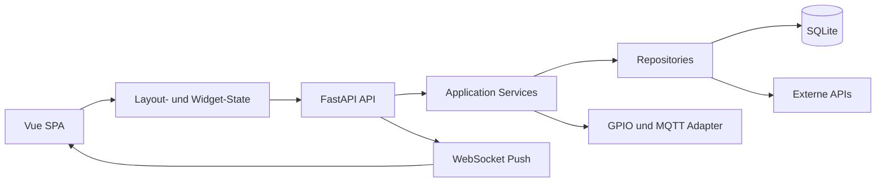

# Zielarchitektur

## Architekturentscheidung

Die realistische Zielarchitektur fuer Nimrag ist kein verteiltes Event-System und keine Microservice-Landschaft.
Fuer ein kleines Team und den aktuellen Stand ist ein **modularer Monolith** die richtige Zielstruktur:

- ein Vue-Frontend
- ein FastAPI-Backend
- eine SQLite-Datenbasis fuer Konfiguration und Cache
- optionale Hardware- und MQTT-Adapter
- WebSocket nur fuer echte Push-Faelle

## Leitprinzipien

- State statt DOM-Manipulation im Frontend
- klare API-Contracts zwischen Frontend und Backend
- externe APIs nur ueber Adapter und Repository-Schicht
- Fallback und Cache fuer wetter- und kalendernahe Daten
- Hardware und IoT nur ueber austauschbare Schnittstellen
- einfache Architektur vor theoretischer Vollstaendigkeit
- handzentrierte Gestenerkennung vor vollstaendiger Koerpererkennung

## Zielbild im Ueberblick

## Frontend

### Zielstruktur

- `app/` fuer App-Shell, Routing und globale Initialisierung
- `widgets/` fuer fachliche Widget-Komponenten
- `features/layout/` fuer Board, Platzierung und Konfiguration
- `services/api/` oder schlanke API-Module fuer REST-Zugriffe
- `services/ws/` fuer WebSocket
- `stores/` oder klarer lokaler State fuer Layout- und Widget-Daten

### Zielverhalten

- Zellen und Widgets werden ueber Datenmodelle beschrieben, nicht ueber direkt manipuliertes HTML
- Widget-Instanzen haben IDs, Typen, Positionen und Einstellungen
- Widget-Registrierung laeuft ueber ein klares Registry-/Manifest-Konzept
- Konfigurationsaenderungen koennen lokal angezeigt und serverseitig gespeichert werden

### Erster umgesetzter Schnitt

- Layout- und Widget-Zuordnung werden im Frontend bereits ueber lokalen Vue-State und ein Widget-Registry-Modul abgebildet
- Ein kleiner API-Client kapselt Wetter- und Konfigurationszugriffe ohne zusaetzliche Client-Bibliothek
- Das Frontend nutzt zuerst genau zwei Backend-Domaenen: Konfiguration und Wetter

## Backend

### Zielstruktur

- `api/` fuer HTTP- und WebSocket-Endpunkte
- `schemas/` fuer Request- und Response-Modelle
- `services/` fuer Fachlogik
- `repositories/` fuer Cache, Persistenz und externe Datenquellen
- `adapters/` fuer OpenWeather, Kalender, GPIO und MQTT
- `core/` fuer Konfiguration, Logging und Lifespan

### Zielverhalten

- REST bleibt der Standard fuer Lesen, Schreiben und Konfiguration
- WebSocket pusht nur relevante Statusaenderungen
- Wetter und Kalender laufen ueber Repositories mit Timeout, Retry und Cache
- optionale Features wie Gesten haengen sich als Adapter und fachliche Events an den gemeinsamen Backend-Kanal
- FastAPI-Lifespan initialisiert optionale Hintergrundjobs sauber

### Gestenarchitektur

- der primäre Erkennungspfad basiert auf MediaPipe Hands und einer handzentrierten Repräsentation statt auf allgemeiner Body- oder Pose-Erkennung
- Tracking und Klassifikation trennen Rohlandmarks, abgeleitete Bewegungsmerkmale, Kandidatenerzeugung und fachliche Gestenentscheidungen
- Hand, Handgelenk und palmnahe Punkte bilden den Standardpfad; Ellenbogen- oder Armkontext bleibt optional fuer spaetere Erweiterungen
- Gestenparameter sollen als persistierbare Backend-Konfiguration gepflegt werden und nicht nur als starre ENV-Werte existieren
- Gestenereignisse und Statusantworten sollen neben dem Gestentyp auch Confidence und Tracking-Herkunft transportieren koennen

### Konfigurationsdomänen

- `layout` bleibt profilspezifisch und beschreibt Widget-Typ, Position und widgetbezogene Settings
- `system` beschreibt allgemeine Systemeinstellungen wie Ort, Koordinaten, Einheiten, Theme und Refresh-Intervall
- beide Domaenen nutzen denselben Router unter `/api/v1/config`, aber getrennte Schemas und getrennte Persistenzkeys

## Persistenz

SQLite ist fuer die naechsten Projektphasen ausreichend und sinnvoll:

- Layout-Konfigurationen
- Widget-Instanzen und Settings
- Wetter- und Kalender-Cache
- spaeter einfache System- und Health-Informationen

## Realtime und Events

Eine schlanke Event-Strategie ist sinnvoll, aber nur intern:

- interne Python-Events oder einfache Service-Callbacks fuer lose Kopplung
- WebSocket fuer UI-Push
- MQTT nur fuer echte Geraete- und Smart-Home-Kommunikation

Nicht Ziel der naechsten Architekturphase:

- Redis Pub/Sub
- Event Sourcing
- CQRS in voller Auspraegung
- universelles Broker-zentriertes System

## Hardware und Smart Home

Hardware wird als austauschbare Adapter modelliert:

- `LedAdapter`
- `MqttAdapter`
- spaeter `VoiceAdapter`
- `GestureAdapter` als optionaler Computer-Vision-Randadapter mit handzentrierter Landmark-Erkennung

Solange keine stabile Hardwareintegration existiert, muessen Mock- oder Null-Adapter verfuegbar sein.

## Fachliche Kernfluesse

### Wetter

1. Frontend fordert Wetterdaten an
2. Backend prueft Cache
3. Falls noetig: externer API-Request mit Timeout
4. Backend liefert normiertes Wettermodell zurueck
5. WebSocket pusht spaetere Aktualisierungen optional an das Frontend

### Konfiguration

1. Nutzer aendert Layout oder Widget-Einstellung
2. Frontend aktualisiert lokalen State
3. Backend speichert Konfiguration in SQLite
4. Frontend laedt Konfiguration beim Start wieder ein

### Wetter mit Systemkonfiguration

1. Frontend laedt die Systemkonfiguration
2. Frontend fordert Wetterdaten mit den konfigurierten Koordinaten an
3. Backend prueft Cache und faellt bei Bedarf kontrolliert auf gecachte Daten zurueck
4. Frontend zeigt Loading-, Fehler- oder Live/Cache-Zustand je nach Rueckgabe

## Qualitaetsziele in realistischer Prioritaet

1. Stabilitaet und klare Contracts
2. Erweiterbarkeit von Widgets
3. Cache/Fallback fuer externe APIs
4. Raspberry-Pi-taugliche Performance
5. erst danach Voice, Gesture und komplexe Smart-Home-Flows
