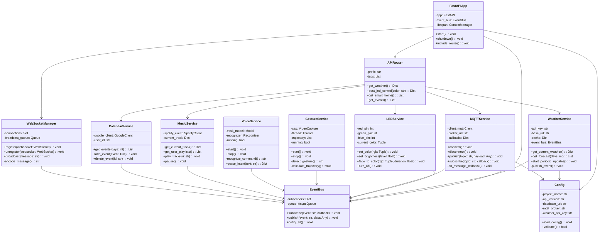
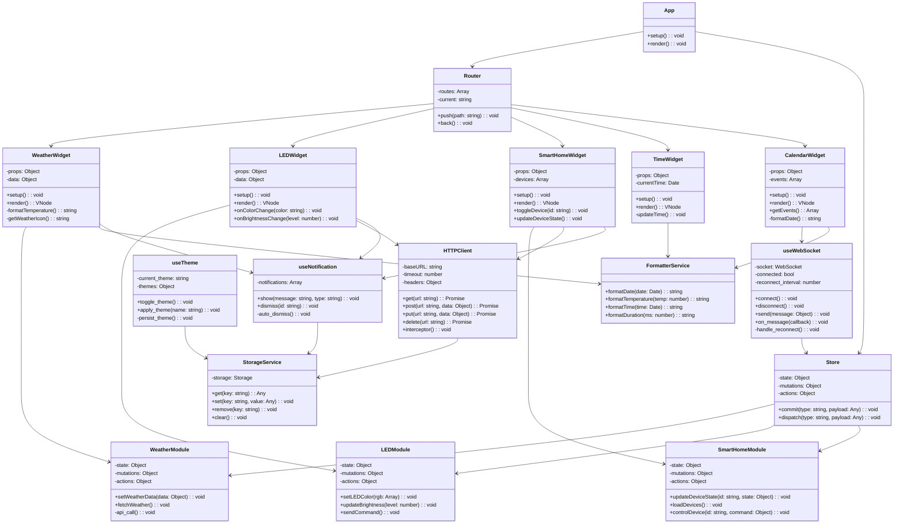
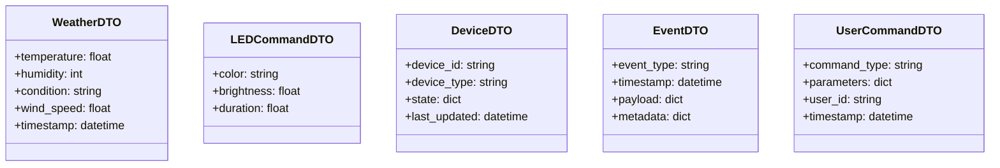
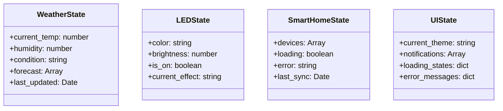
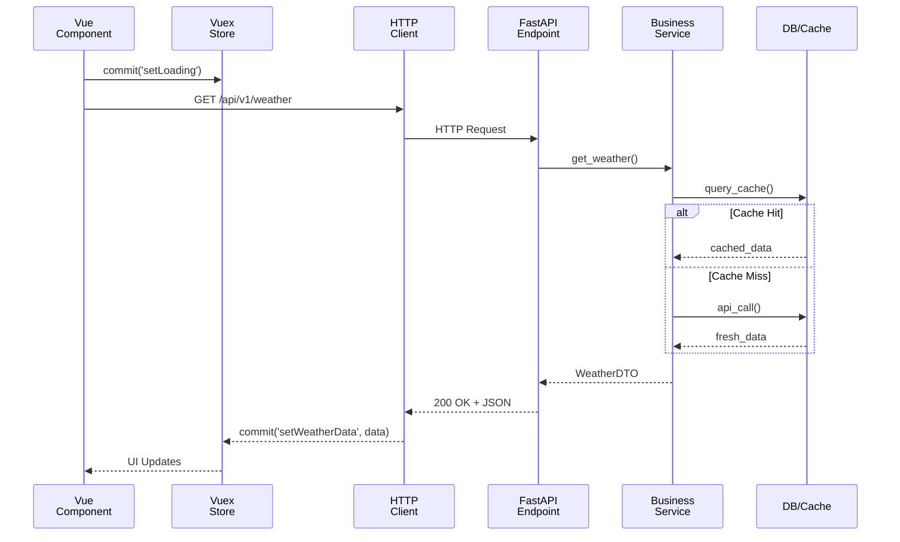

# UML Klassendiagramme: Backend & Frontend Struktur

## 1. Backend UML Klassendiagramm

### Beschreibung
Detailliertes UML-Klassendiagramm der Backend-Services mit Attributen und Methoden (kompakt).



### Komponenten-Details

**FastAPIApp**
```
- Zentrale Anwendung
- Lifecycle Management
- Router-Integration
```

**EventBus**
```
- Pub/Sub Pattern
- Event-Verwaltung
- Async Queue
```

**Services (7 Stück)**
```
- WeatherService: OpenWeatherMap Integration
- LEDService: GPIO/PWM Control
- MQTTService: IoT Device Communication
- GestureService: MediaPipe Tracking
- VoiceService: Vosk ASR
- MusicService: Spotify API
- CalendarService: Google Calendar
```

**WebSocketManager**
```
- Connection Management
- Message Broadcasting
- Event Distribution
```

---

## 2. Frontend UML Klassendiagramm

### Beschreibung
UML-Klassendiagramm der Vue 3 Frontend-Struktur (kompakt).



### Komponenten-Details

**App & Router**
```
- Root Component
- Navigation Management
```

**Store (Vuex)**
```
- Global State Management
- 3 Modules (Weather, LED, SmartHome)
```

**Widgets (5 Stück)**
```
- WeatherWidget: Temperature, Forecast
- LEDWidget: Color, Brightness Control
- SmartHomeWidget: Device Control
- TimeWidget: Current Time Display
- CalendarWidget: Upcoming Events
```

**Composables (3 Stück)**
```
- useWebSocket: Real-time Communication
- useNotification: Alert Management
- useTheme: Theme Switching
```

**Services (3 Stück)**
```
- HTTPClient: API Communication
- StorageService: LocalStorage Wrapper
- FormatterService: Data Formatting
```

---

## 3. Beziehungen zwischen Backend & Frontend

```mermaid
classDiagram
    class "Backend\nFastAPI" {
        +/api/v1/weather: GET
        +/api/v1/led/control: POST
        +/api/v1/smart-home: GET/POST
        +/ws: WebSocket
    }

    class "Frontend\nVue 3" {
        +WeatherWidget
        +LEDWidget
        +SmartHomeWidget
    }

    class HTTPRequest {
        -method: str
        -url: str
        -headers: dict
        -body: dict
    }

    class WebSocketMessage {
        -type: str
        -data: dict
        -timestamp: int
    }

    %% Relationships
    "Frontend\nVue 3" -->|HTTP REST| "Backend\nFastAPI"
    "Frontend\nVue 3" -->|WebSocket Events| "Backend\nFastAPI"
    HTTPRequest -.->|used by| "Frontend\nVue 3"
    WebSocketMessage -.->|used by| "Frontend\nVue 3"
```

---

## 4. Data Models (Wichtige DTOs)

### Backend DTO Models



### Frontend State Models



---

## 5. Sequenz bei API-Aufruf (kompakt)



---

## 6. Übersicht: Klassen nach Schicht

```
BACKEND (Python):
├─ Framework Layer
│  └─ FastAPIApp, APIRouter, Config
├─ Service Layer
│  ├─ WeatherService
│  ├─ LEDService
│  ├─ MQTTService
│  ├─ GestureService
│  ├─ VoiceService
│  ├─ MusicService
│  └─ CalendarService
├─ Event System
│  ├─ EventBus
│  └─ WebSocketManager
└─ Data Models
   └─ DTOs (WeatherDTO, LEDCommandDTO, etc.)

FRONTEND (Vue 3 + TypeScript):
├─ Core
│  ├─ App
│  ├─ Router
│  └─ Store (Vuex)
├─ Components/Widgets
│  ├─ WeatherWidget
│  ├─ LEDWidget
│  ├─ SmartHomeWidget
│  ├─ TimeWidget
│  └─ CalendarWidget
├─ Composables
│  ├─ useWebSocket
│  ├─ useNotification
│  └─ useTheme
├─ Services
│  ├─ HTTPClient
│  ├─ StorageService
│  └─ FormatterService
└─ State Modules
   ├─ WeatherModule
   ├─ LEDModule
   └─ SmartHomeModule
```

---

## 7. Wichtige Methoden Pro Klasse (Quick Reference)

```
WeatherService:
├─ get_current_weather() → Dict
├─ get_forecast(days) → List
├─ start_periodic_updates() → void
└─ publish_event() → void

LEDService:
├─ set_color(rgb) → void
├─ set_brightness(level) → void
├─ fade_to_color(rgb, duration) → void
└─ turn_off() → void

MQTTService:
├─ connect() → void
├─ publish(topic, payload) → void
├─ subscribe(topic, callback) → void
└─ disconnect() → void

GestureService:
├─ start() → void
├─ detect_gesture() → str
├─ calculate_trajectory() → void
└─ stop() → void

EventBus:
├─ subscribe(event, callback) → void
├─ publish(event, data) → void
└─ notify_all() → void

WebSocketManager:
├─ register(websocket) → void
├─ broadcast(message) → void
├─ unregister(websocket) → void
└─ encode_message() → str

─────────────────────────────────

WeatherWidget:
├─ setup() → void
├─ render() → VNode
├─ formatTemperature() → string
└─ getWeatherIcon() → string

LEDWidget:
├─ setup() → void
├─ onColorChange(color) → void
├─ onBrightnessChange(level) → void
└─ render() → VNode

SmartHomeWidget:
├─ toggleDevice(id) → void
├─ updateDeviceState() → void
├─ setup() → void
└─ render() → VNode

useWebSocket:
├─ connect() → void
├─ send(message) → void
├─ on_message(callback) → void
└─ disconnect() → void

HTTPClient:
├─ get(url) → Promise
├─ post(url, data) → Promise
├─ put(url, data) → Promise
├─ delete(url) → Promise
└─ interceptor() → void

Store:
├─ commit(type, payload) → void
├─ dispatch(type, payload) → void
├─ getters → computed
└─ state → reactive
```

---

## 8. Zusammenfassung: Klassen-Struktur

| Layer | Backend | Frontend |
|-------|---------|----------|
| **Framework** | FastAPIApp, APIRouter | App, Router |
| **State** | Config | Store + Modules |
| **Services** | 7 Services | HTTPClient, StorageService |
| **Communication** | EventBus, WebSocketManager | useWebSocket, HTTPClient |
| **UI** | - | 5 Widgets |
| **Utilities** | - | Composables, FormatterService |

---

**Status**: ✅ Kompakte UML-Diagramme ready zum Verwenden  
**Format**: Mermaid Klassendiagramme  
**Detaillierungsgrad**: Kurz & prägnant ohne zu ausführlich

