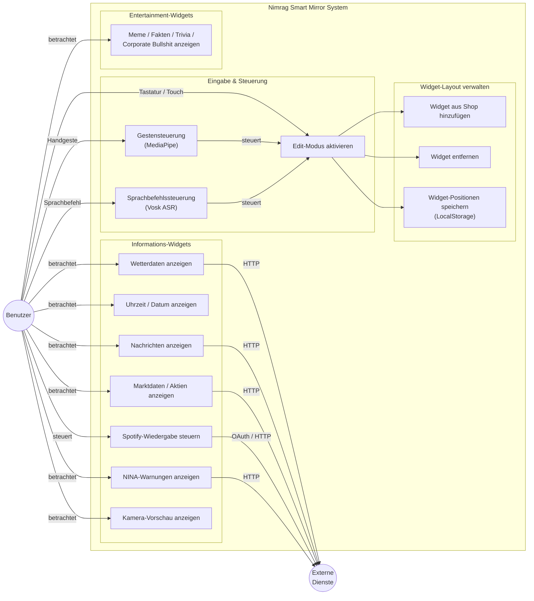

# Nimrag Smart Mirror  
## Software Architecture Document (SAD)  
Version 3.0

---

## Revision History

| Date | Version | Description | Author |
|---|---|---|---|
| 01/Dec/25 | 1.0 | SAD Completion | Nimrag Team (TINF24B5) |
| 17/Nov/25 | 1.1 | Initiales Module-Shop-Widget (Grundstruktur und Animation) | SebastianRieger |
| 19/Nov/25 | 1.2 | GitHub Pages CI/CD-Deploy eingerichtet, TypeScript-Fehler behoben | SebastianRieger |
| 24/Nov/25 | 1.3 | Architekturdokumentation und ASR-Tabelle hinzugefügt | SebastianRieger |
| 01/Dec/25 | 1.4 | Utility Tree ergänzt | LuigisSourceCode |
| 07/Dec/25 | 1.5 | Editor-Modus implementiert | SebastianRieger |
| 22/Dec/25 | 1.6 | Architekt-Diagramme (Woche 9), SRS in main gemergt, SAD-Abschluss dokumentiert | LuigisSourceCode, Dupl0s |
| 21/Apr/26 | 1.7 | Fix: replaceChild statt innerHTML für Drag & Drop (GridBoard) | SebastianRieger |
| 24/Apr/26 | 1.8 | Refactoring ModuleManager (Composable-Architektur) | SebastianRieger |
| 12/May/26 | 1.9 | Widget-Resizing implementiert, Backend-Konsolidierung (externe APIs hinter Backend) | SebastianRieger, LuigisSourceCode |
| 19/May/26 | 2.0 | CI/CD-Pipeline (Backend & Frontend), Unit-Tests hinzugefügt, News-Widget | SebastianRieger |
| 20/May/26 | 2.1 | Drag-and-Drop-Tests verbessert, Widget-Management-Assertions verfeinert | SebastianRieger |
| 22/May/26 | 2.2 | Deklaratives Rendering im GridBoard, Clock-Widget | SebastianRieger, Dupl0s |
| 26/May/26 | 2.3 | LocalStorage-Persistenz für Widget-Zustände und -Größen implementiert | SebastianRieger |
| 27/May/26 | 2.4 | CI/CD stabilisiert (Windows-Test konsolidiert), Vite-Config refaktoriert, README-Link ergänzt | LuigisSourceCode, SebastianRieger |
| 28/May/26 | 2.5 | Kamera-Vorschau hinzugefügt, externe APIs hinter Backend verschoben | LuigisSourceCode |
| 29/May/26 | 2.6 | Homescreen und Shop-Oberfläche überarbeitet | SebastianRieger |
| 31/May/26 | 2.7 | Neue Widgets: NINA, Stock-Market, Weather (jeweils überarbeitet/neu) | SebastianRieger |
| 01/Jun/26 | 2.8 | Kamera-Rework (Edit-Modus), Button-Hover, neue Widgets, Pinch-Drag-Capture stabilisiert | SebastianRieger, LuigisSourceCode |
| 02/Jun/26 | 2.9 | Spotify-Widget hinzugefügt, Imports und Code-Formatierung refaktoriert, Tests ergänzt | Dupl0s, SebastianRieger |
| 29/Jun/26 | 3.0 | Release: Dev in Main gemergt, Präsentation (PDF) hinzugefügt | SebastianRieger, Dupl0s |

---

## Table of Contents

1. Introduction  
   1.1 Purpose  
   1.2 Scope  
   1.3 Definitions, Acronyms and Abbreviations  
   1.4 References  
   1.5 Overview  

2. Architectural Representation  

3. Architectural Goals and Constraints  

4. Use-Case View  

5. Logical View  
   5.1 Overview  
   5.2 Architecturally Significant Design Packages  
   5.3 Use-Case Realizations  

6. Process View  

7. Deployment View  

8. Implementation View  
   8.1 Overview  
   8.2 Layers  

9. Data View (optional)  

10. Size and Performance  

11. Quality  

---

## 1. Introduction

### 1.1 Purpose
Dieses Dokument beschreibt die Softwarearchitektur des **Nimrag Smart Mirror**. Es schafft ein gemeinsames Verständnis über Ziele, Randbedingungen, Qualitätsanforderungen und die gewählte Struktur (Frontend, Backend, Infrastruktur). Es dient als Referenz für Entwickler, Tester und Stakeholder, um Entscheidungen nachzuvollziehen und Änderungen kontrolliert umzusetzen. 

### 1.2 Scope
- **Produktumfang:** Interaktiver Smart Mirror mit modularen Informations-Widgets (Uhr, Wetter, News, Markt, NINA-Warnungen, Spotify, Kamera und Entertainment-Widgets), berührungsloser Gestensteuerung via MediaPipe sowie Sprachbefehlssteuerung via Vosk ASR, betrieben auf ressourcenbegrenzter Hardware (Raspberry Pi).  
- **Funktionaler Rahmen:** Anzeige und Aktualisierung personalisierter Informationen, optionale Hardware-Steuerung (LED/GPIO), Kommunikation mit externen APIs (Wetter, Nachrichten, Marktdaten, Spotify), Event-getriebene UI-Updates via WebSockets/MQTT.  
- **Zielplattformen:** Kiosk-Modus auf Raspberry Pi; moderne Browser für lokale Entwicklung und Administration. GitHub Pages dient ausschließlich als statische UI-Vorschau; eine vollständig funktionsfähige Installation erfordert einen lokal laufenden Backend-Service.  

### 1.3 Definitions, Acronyms and Abbreviations
- **EDA**: Event Driven Architecture – entkopplte, eventbasierte Kommunikation.  
- **MQTT**: Message Queuing Telemetry Transport – leichtgewichtiges Pub/Sub-Protokoll.  
- **WebSocket**: Bidirektionale, zustandsbehaftete Verbindung für Echtzeit-Events.  
- **Widget**: UI-Komponente zur Anzeige/Interaktion (z. B. Wetter-, Uhr-, News- oder Markt-Widget).  
- **Repository Pattern**: Abstraktionsschicht für Datenzugriff auf externe APIs und Persistenz.

### 1.4 References
- Projekt-SRS: [SRS](../SRS/SRS%20Nimrag.md)
- Architekturentscheidungen: [Architekturentscheidungen](./Architekturentscheidungen%20und%20Entwurfsmuster%20%E2%80%93%20Nim.md)
- Sequenz-/Klassendiagramme: Verzeichnis [Diagramme](../Diagramme/)
- Event-Driven-Dokumente: [EDA-Dokumente](../Event-driven%20architecture/)
- CI/CD-Pipeline: [CICD-Setup.md](../quality/CICD-Setup.md)
- Refactoring-Dokumentation: [Refactoring-Zusammenfassung.md](../quality/Refactoring-Zusammenfassung.md)
- Implementierungs-README: Backend/Frontend READMEs in den jeweiligen Ordnern

### 1.5 Overview
Kapitel 2–5 beschreiben Architekturziele, Use-Cases und logische Struktur. Kapitel 6–8 erläutern Prozess-, Deployment- und Implementierungsansichten. Kapitel 9–11 behandeln Datenhaltung, Dimensionierung/Performance sowie Qualitätsanforderungen und Taktiken.

---
## 2. Architectural Representation
Die Nimrag Software verfolgt eine Event Driven Architekture. Folgende Ansichten sind für das architektonische Verständnis notwendig:

[Use-Case-Ansicht](#4-use-case-view): Dokumentiert die wesentlichen Benutzerinteraktionen und Geschäftsprozesse in einem Use-Case-Diagramm
[Logische Ansicht](#5-logical-view): Zeigt die strukturelle Zerlegung des Systems anhand eines gesamten Klassendiagramms
[Prozessansicht](#6-process-view): Beschreibt die dynamischen Abläufe in Aktivitäts- und Sequenzdiagrammen
[Einsatzansicht](#7-deployment-view): Definiert die physische Verteilung auf Hardware. Der gesamte Projekt-Code liegt in einem einzigen GitHub-Repository. GitHub Pages dient ausschließlich als statische UI-Vorschau des kompilierten Frontends – ein Backend ist dort nicht verfügbar. Das vollständig funktionsfähige System wird lokal auf einem Entwicklungsrechner oder einem Raspberry Pi betrieben.
[Datenansicht](#9-data-view-optional): Zeigt die Datenstrukturen der Datenbank und die häufigsten Zugriffe darauf
Jede Ansicht enthält spezifische Modellelemente wie Klassen, Komponenten oder Prozesse, die zusammen ein vollständiges Bild der Systemarchitektur ergeben.

---

## 3. Architectural Goals and Constraints

In diesem Abschnitt sind die zentralen Architekturziele und Randbedingungen des **Nimrag Smart Mirror** zusammengefasst. Die Inhalte basieren auf den bereits erarbeiteten Architekturentscheidungen und Taktiken (u. a. *Architekturentscheidungen-und-Entwurfsmuster-Nim.md* und SRS).

### 3.1 Architekturziele (Goals)

Die Architektur des Nimrag Smart Mirror verfolgt insbesondere folgende Ziele:

1. **Entkopplung & klare Schichtenbildung**  
   - Strikte Trennung von **Frontend (Vue 3 SPA)** und **Backend (FastAPI)** über klar definierte REST- und WebSocket-Schnittstellen.  
   - Ereignisbasierte Kommunikation (Event-Driven Architecture, Pub/Sub via MQTT/WebSockets), um Services voneinander zu entkoppeln.

2. **Erweiterbarkeit (Modifiability)**  
   - Neue Widgets (z. B. Wetter-, Markt-, Musik- oder News-Widget) sollen über ein **Plugin-/Module-Pattern** hinzugefügt werden können, ohne den bestehenden Kern massiv anzupassen.  
   - Layouts und Konfigurationen (z. B. API-Keys, Widget-Positionen) sollen über externe Konfigurationsdateien (JSON/YAML) anpassbar sein.

3. **Zuverlässigkeit & Ausfallsicherheit (Reliability)**  
   - Kritische Funktionen (Spracherkennung, Gestenerkennung, Hardware-Steuerung) laufen als getrennte Services/Prozesse, sodass ein Ausfall eines Dienstes nicht den gesamten Spiegel blockiert.  
   - Nutzung eines **Circuit Breaker** für externe APIs (z. B. Wetteranbieter), um bei Fehlern auf Cache- oder Fallback-Daten zurückzugreifen.

4. **Performance & Effizienz auf eingeschränkter Hardware**  
   - Der Spiegel läuft auf einem **Raspberry Pi** mit limitierten CPU- und RAM-Ressourcen.  
   - Durch **Lazy Loading**, Virtual DOM (Vue 3) und Caching werden nur die wirklich benötigten Komponenten gerendert und Daten so selten wie nötig abgerufen.

5. **Benutzererlebnis & Interaktivität (Usability)**  
   - Reaktive Visualisierung: Änderungen (z. B. neues Wetter, geänderte Lichtzustände) sollen zeitnah und ohne Reload sichtbar sein.  
   - Unterstützung verschiedener Eingabemethoden (Gestensteuerung via MediaPipe, Sprachbefehlssteuerung via Vosk ASR, Touch) via **Strategy Pattern**.

### 3.2 Architekturbestimmende Entscheidungen (Architectural Drivers)

Aus den oben genannten Zielen ergeben sich folgende wesentliche Architekturentscheidungen:

- **Event-Driven Architecture / Pub-Sub**  
  - Nutzung von MQTT und WebSockets, um Zustandsänderungen zu propagieren, ohne dass Komponenten sich direkt kennen müssen.

- **Repository Pattern für Datenzugriff**  
  - Zentraler Zugriff auf externe APIs (Wetter, News, Markt, Spotify, NINA etc.) und lokale Persistenz (SQLite) über Repository-Interfaces.

- **Circuit Breaker und Caching**  
  - Schutz vor langsamen oder fehlerhaften externen Diensten, insbesondere im Hinblick auf Nutzererlebnis und Verfügbarkeit.

- **Asynchrone Verarbeitung (Concurrency)**  
  - Parallele Ausführung von Sprach-/Gestenerkennung und Backend-Logik, damit das UI nicht blockiert.

### 3.3 Randbedingungen und Constraints

Wesentliche Randbedingungen, die die Architektur beeinflussen:

- **Hardware-Constraint**  
  - Raspberry Pi (ARM, begrenzter Speicher, keine dedizierte GPU für schwere KI-Modelle).  
  - Dauerbetrieb im Kiosk-Modus (Display an, geringe Latenz erforderlich).

- **Technologie-Stack**  
  - Frontend: **Vue 3**, TypeScript, Pinia.  
  - Backend: **FastAPI (Python)**, AsyncIO.  
  - Kommunikation: REST (HTTP), WebSockets, MQTT.  
  - Persistenz: SQLite (lokaler Cache für API-Daten und Konfigurationen), Browser-LocalStorage (Widget-Layout).

- **Offline-Fähigkeit**  
  - Teile der Funktionalität (Zeit, Datum, grundlegende UI) müssen ohne Internet funktionieren; netzwerkabhängige Widgets (Wetter, News, Markt) degradieren sinnvoll auf Stale-Cache-Daten.

- **Entwicklungs- und Team-Constraints**  
  - Projekt entsteht im Rahmen einer Lehrveranstaltung (Software Engineering), daher Fokus auf nachvollziehbare Patterns und dokumentierte Architekturentscheidungen.  
  - Nutzung vorhandener Open-Source-Komponenten (z. B. Vosk für Spracherkennung).

---

## 4. Use-Case View

Das Use-Case-Diagramm zeigt alle wesentlichen Interaktionen zwischen Benutzer, System und externen Diensten. Besonders hervorgehoben sind die beiden berührungslosen Steuerungskanäle – **Gestensteuerung** und **Sprachbefehlssteuerung** – die dem Nutzer eine vollständig freihändige Bedienung des Smart Mirrors ermöglichen.

*Hinweis: Das ursprüngliche PNG-Diagramm (`Diagramme/UseCase Diagramm komplette Anwendung.png`) enthält einen früheren Entwurfsstand. Das obenstehende Mermaid-Diagramm ist der aktuelle, maßgebliche Stand und beinhaltet Gestensteuerung, Sprachbefehlssteuerung sowie alle realisierten Widgets.*

---

## 5. Logical View

### 5.1 Overview
- **Gesamtstruktur:** Zweiteilige Lösung mit **Vue 3 SPA** im Frontend und **FastAPI** im Backend; entkoppelt über REST/WebSockets/MQTT.  
- **Frontend-Fokus:** Drag-and-Drop-Layout, Modulshop zum Hinzufügen/Aktivieren von Widgets, Live-Visualisierung über WebSocket-Events, State-Management via Pinia.  
- **Backend-Fokus:** REST-Endpunkte für Wetter, News, Markt, Spotify, NINA und Systemstatus; WebSocket-Push für Events; MQTT-Anbindung für lokale Hardware und Sensoren; Validierung und Normalisierung externer Daten.  
- **Schichtenprinzip:** Klare Trennung von Präsentation, Anwendung (Controller/Endpoints), Domäne (Services/Repositories) und Infrastruktur (MQTT, DB, externe APIs).  
- **Erweiterbarkeit:** Neue Widgets und Services werden über klar definierte Schnittstellen (Events, Repositories) ergänzt, ohne den Kern neu zu koppeln.

### 5.2 Architecturally Significant Design Packages

| Bereich  | Packages |
| -------- | -------- |
| Frontend | `manager` – beinhaltet Orchestrierungskomponenten (GridBoard, ModuleManager, ModuleShop, CellSlot). `widgets` – beinhaltet die Widget-Komponenten (WeatherWidget, ClockWidget, SpotifyWidget, Market, News, NinaWarningsWidget, CameraWidget, …). `composables` – enthält die ausgelagerte Business-Logik als eigenständige, testbare Einheiten (useWidgetManager, useEditMode, useModuleShop, useClockWidgetMode, useAppConfig, useHandTracking, …). `services` – kapselt alle HTTP- und WebSocket-Aufrufe ans Backend (weatherService, newsService, marketService, spotifyService, realtimeService, …). |
| Backend  | `tests` – beinhaltet 16 Unit- und Integrationstestdateien für alle Backend-Bereiche. `api/api_v1/endpoints` – flacher API-Router mit Endpunkten für Wetter, News, Markt, Spotify, NINA, Gesten, System und Konfiguration. `services` – Implementierung der Fachlogik (WeatherService, NewsService, MarketService, SpotifyService, GestureService, VoiceService, …). `repositories` – Datenzugriffsschicht über Repository Pattern (WeatherRepository, AppConfigRepository, …). `schemas` – Pydantic-Modelle für Request/Response-Validierung. `core` – Konfiguration (pydantic_settings), Datenbankverbindung, Realtime-EventBus. |

**Hinweis zur Composable-Architektur (v1.1):**  
Im Zuge des ModuleManager-Refactorings (Branch `ModuleManagerRefactor`) wurde die Business-Logik aus `ModuleManager.vue` (172 Zeilen) vollständig in drei Composables ausgelagert. `ModuleManager.vue` ist seitdem eine reine Orchestrierungskomponente ohne eigene Business-Logik. Dies verbessert Single Responsibility, Testbarkeit und Lesbarkeit. Details: [Refactoring-Zusammenfassung.md](../quality/Refactoring-Zusammenfassung.md)
---

## 6. Process View

Dieser Abschnitt beschreibt, wie der Nimrag Smart Mirror in Prozesse und Threads zerlegt ist und wie diese Prozesse miteinander interagieren. Die Inhalte basieren auf den zuvor erarbeiteten Sequenzdiagrammen **„Sprachsteuerung“** und **„Wetter-Update mit Fallback“**.

### 6.1 Sprachsteuerung (Voice Command Flow)

**Ziel:** Verarbeitung eines Sprachbefehls („Spiegel, Licht an“) vom Mikrofon bis zur Ausführung der Aktion und Aktualisierung der UI.

**Beteiligte Prozesse/Komponenten:**

- **Benutzer / Mikrofon-Hardware** – erzeugt den Audio-Stream  
- **Vosk ASR Service (Python-Prozess)**  
  - Läuft als separater Service, nimmt Audio-Stream entgegen, führt Offline-Spracherkennung durch.  
- **Event Controller (im Backend)**  
  - Empfängt erkannte Befehle als Events.  
- **MQTT Broker**  
  - Verteilt Events an interessierte Hardware-/Backend-Komponenten.  
- **Hardware Controller (GPIO-Prozess)**  
  - Setzt z. B. das Licht über GPIO-Pins.  
- **WebSocket Manager & Vue-Frontend**  
  - Benachrichtigen die UI über Statusänderungen in Echtzeit.

**Ablauf (vereinfacht):**

1. Der Benutzer spricht einen Befehl in das Mikrofon.  
2. Der Mikrofon-Treiber streamt Audiodaten an den **Vosk-Service**.  
3. Vosk führt Spracherkennung durch und mappt den Text auf einen Intent (z. B. `LIGHT_ON`).  
4. Bei erkanntem Befehl sendet Vosk ein Event an den **Event Controller**.  
5. Der Event Controller publiziert das Event auf einem MQTT-Topic (`nimrag/voice/command`) und triggert ggf. eine Aktion im Hardware Controller.  
6. Der Hardware Controller schaltet das entsprechende Gerät (z. B. Licht) und publiziert den neuen Zustand (`nimrag/status/light`).  
7. Über MQTT/WebSockets wird die Statusänderung an das Frontend propagiert; die Vue-Anwendung aktualisiert das entsprechende Widget.

   **Sequenzdiagramm**
   
 

### 6.2 Wetter-Widget Aktualisierung mit Circuit Breaker

**Ziel:**  
Periodische Aktualisierung des Wetter-Widgets mit Fallback über Cache und Circuit Breaker, um externe API-Ausfälle abzufangen.

**Beteiligte Prozesse/Komponenten:**

- **Vue-Frontend (Weather Widget)**  
  - Initiiert regelmäßig Requests (z. B. alle 15 Minuten).

- **FastAPI Endpoint**  
  - Entgegennahme der HTTP-Requests vom Frontend.

- **Weather Repository (im Backend)**  
  - Kapselt Zugriff auf Cache und externe Wetter-API.

- **Lokaler Cache (SQLite/Key-Value-Store)**  
  - Speichert zuletzt erfolgreiche Wetterdaten mit Timestamp.

- **Externe Wetter-API (z. B. OpenWeatherMap)**  
  - Liefert aktuelle Wetterdaten (wenn erreichbar).

- **Circuit Breaker-Mechanismus**  
  - Verhindert wiederholte langsame/fehlerhafte Requests.

**Ablauf (vereinfacht):**

1. Das Wetter-Widget ruft periodisch `GET /api/v1/weather` auf.  
2. Der FastAPI-Endpoint delegiert an das `Weather Repository` (`getWeatherData()`).  
3. Das Repository prüft, ob der Cache noch gültig ist (z. B. Daten jünger als 10–15 Minuten).  
   - **Wenn ja:** Rückgabe der gecachten Daten.  
4. Wenn der Cache abgelaufen ist, prüft das Repository den Zustand des Circuit Breakers:

   - **Closed (Normalfall):**  
     - Anfrage an die externe Wetter-API.  
     - Bei Erfolg: Daten speichern, Cache aktualisieren, Erfolgszähler zurücksetzen.  
     - Bei Fehler/Timeout: Fehlerzähler erhöhen, Circuit Breaker ggf. öffnen, Fallback auf Cache-Daten.

   - **Open (Fehlerzustand):**  
     - Kein externer Request, sofortiger Fallback auf Cache-Daten oder Fehlerstatus.

5. Das Repository gibt ein konsolidiertes Wetter-Modell an den FastAPI-Endpoint zurück.  
6. Der Endpoint liefert eine JSON-Antwort an die Vue-Anwendung, die das Weather Widget aktualisiert.
 
## 7. Deployment View

**Wichtig: GitHub Pages ist keine vollständige Deployment-Umgebung.** Die CI/CD-Pipeline erzeugt bei jedem Push auf `main` ein statisches Vue-SPA-Build und veröffentlicht es auf GitHub Pages – dies dient ausschließlich als visuelle Vorschau der Benutzeroberfläche. Da kein Backend dort läuft, sind alle datengetriebenen Widgets (Wetter, News, Marktdaten, Spotify, NINA etc.) auf GitHub Pages nicht funktionsfähig. Für einen vollständig funktionalen Betrieb muss das Backend lokal gestartet werden.

- **GitHub Pages (UI-Vorschau):** Statisches Build der Vue SPA, automatisch via CI/CD deployed. Rein visuelle Demonstration ohne Backend-Anbindung.
- **Lokaler Betrieb (vollständig funktionsfähig):** Frontend per `npm run dev` (Port 5173), Backend per `npm run dev:backend` (Port 8000) auf demselben Rechner. Der Vite-Proxy leitet alle `/api`-Aufrufe automatisch ans Backend weiter.
- **Raspberry Pi (Produktivbetrieb):** Primäre Zielplattform. Backend und Frontend starten per systemd automatisch; Nginx dient als Reverse Proxy auf Port 80/443 und stellt den Kiosk-Browser bereit.
- **Kommunikation:** Intern WebSockets (Frontend ↔ Backend) und MQTT (Backend ↔ Hardware/Services). Externe Kommunikation über HTTPS zu Wetter-, News- und Markt-APIs.
- **Persistenz:** SQLite-Datenbank lokal auf dem Gerät für gecachte API-Daten und Konfigurationen; Widget-Layout-Persistenz im Browser-LocalStorage.
- **Netzwerk-Topologie:** Einzelknoten (Pi) im LAN; ausgehende Verbindungen zu externen APIs; eingehende Verbindungen primär vom lokalen Browser desselben Netzwerks.

---

## 8. Implementation View

Dieser Abschnitt beschreibt die Struktur des Implementierungsmodells des **Nimrag Smart Mirror**, insbesondere die Layer und Subsysteme. Basis ist die bereits erstellte Komponenten-/Layer-Architektur (Vue 3 Frontend, FastAPI Backend, Infrastruktur-Services).

### 8.1 Overview

Die Implementierung folgt einer klaren Schichtenarchitektur:

#### Presentation Layer (Client)

- **Vue 3 Single Page Application (SPA)** im Kiosk-Modus.  
- **Composable-basiertes State-Management** statt Pinia für Widget-Lifecycle-Logik: `useWidgetManager` (Singleton-Composable mit Modul-Level-State) verwaltet Grid-Belegung und localStorage-Persistenz; `useEditMode` kapselt Keyboard-Handling; `useModuleShop` die Shop-Logik.  
- **LocalStorage-Persistenz:** Widget-Layout wird automatisch gespeichert und nach Reload wiederhergestellt (Try/Catch mit Dev-Logging).  
- **WebSocket-Client** für Echtzeit-Updates von Backend-Events (GestureDetected, SystemStatus).  
- **Automatische Widget-Registry:** `import.meta.glob` registriert `.vue`-Dateien aus `widgets/` automatisch – kein manuelles Eintragen neuer Widgets nötig.

#### Application Layer (Server)

- **FastAPI Gateway**  
  - Stellt REST-API-Endpunkte zur Verfügung (z. B. `/api/v1/weather`, `/api/v1/news`, `/api/v1/market`, `/api/v1/spotify`, `/api/v1/nina`).  
  - Verwaltet WebSocket-Verbindungen.

- **Event Bus / Controller**  
  - Nimmt Events von Sprach-/Gesten-Services entgegen, mappt sie auf Domänenaktionen.

- **WebSocket Manager**  
  - Pusht relevante Events an verbundene Frontends.

#### Domain & Infrastructure Layer

- **Voice Service (Vosk)** – Offline-Spracherkennung.  
- **Gesture Service (z. B. MediaPipe)** – Gestenerkennung (optional).  
- **Hardware Controller (GPIO)** – Ansteuerung von LEDs, Relais, Sensoren.  
- **Data Repository** – kapselt Datenzugriff auf externe APIs und lokale Persistenz (Repository Pattern).

#### Persistence & External

- **SQLite DB / lokaler Cache**  
  - Speichert Wetter-, Markt- und Konfigurationsdaten sowie gecachte API-Antworten.

- **MQTT Broker (z. B. Mosquitto)**  
  - Verteilt Nachrichten zwischen Services (Pub/Sub).

- **Externe APIs (Cloud)**  
  - Wetter (OpenWeatherMap), Nachrichten (Tagesschau), Marktdaten (Twelve Data), Musiksteuerung (Spotify), Katastrophenschutzwarnungen (NINA).

**Komponenten und Layer Übersicht**

 

### 8.2 Layers

#### Presentation Layer

- Enthält die Vue-3-Komponenten, Layout-Logik und Widgets.  
- Kommuniziert ausschließlich über REST/WebSockets mit dem Backend.  
- Nutzt Pinia-Stores als zentrales State-Management.

#### Application Layer

- Implementiert die REST-API und die WebSocket-Endpunkte mit FastAPI.  
- Enthält die Request-Handler, Validierung und Mapping auf Domänenaktionen.

#### Domain & Infrastructure Layer

- Beinhaltet die eigentliche Geschäftslogik, die Repository-Klassen und die Integrationslogik zu Hardware und externen Diensten.  
- Realisiert Performance- und Verfügbarkeits-Taktiken (Caching, Circuit Breaker, Retry-Strategien etc.).

#### Persistence & External Layer

- Zuständig für Speicherung (SQLite) und Kommunikation mit 3rd-Party-Services (z. B. Wetter-API).  
- Implementiert Schnittstellen, die im Repository verwendet werden, sodass konkrete Implementierungen austauschbar sind (z. B. Mock vs. echte API).

---

## 9. Data View (optional)
- **Datenquellen:** Externe APIs (Wetter, Nachrichten, Marktdaten, Spotify, NINA) und lokale Sensor-/Hardware-Events.  
- **Persistenz:** SQLite/Key-Value-Store für gecachte API-Daten, Widget-Konfigurationen (Layout, Aktivierung, API-Keys) und zuletzt bekannte Hardware-States. Widget-Positionen und -Größen werden zusätzlich im Browser-LocalStorage gehalten.  
- **Datenmodelle:** Normalisierte Domänenobjekte (WeatherModel, NewsItem, MarketData, DeviceState) mit Timestamps und TTL für Cache-Gültigkeit.  
- **Zugriffsschicht:** Repository-Pattern kapselt Lese-/Schreibzugriffe; validiert, cached und vereinheitlicht Antworten.  
- **Sicherheitsaspekte:** API-Keys in `.env`-Datei mit restriktiven Dateirechten; keine sensiblen Personendaten gespeichert.  
- **Backup/Recovery:** Fallback auf Stale-Cache-Daten bei Netzwerkausfall; Fallback auf Default-Layout bei leerem LocalStorage.

---

## 10. Size and Performance
- **Zielhardware:** Raspberry Pi (begrenzte CPU/RAM); Design priorisiert geringe Latenz und niedrigen Ressourcenverbrauch.  
- **Frontend-Performance:** Code-Splitting/Lazy Loading der Widgets, sparsame Re-Renders über Virtual DOM und Pinia-Store-Selektoren.  
- **Backend-Performance:** AsyncIO in FastAPI, Caching im Repository, Circuit Breaker für externe APIs, Rate-Limiting für ausgehende Requests.  
- **Datenvolumen:** Geringe Datenmengen (Wetter, Konfiguration), daher kompakte SQLite/Key-Value-DB; Log-Rotation für begrenzten Speicher.  
- **Latenz-Ziele:** UI-Updates in Echtzeit (<200 ms im LAN) über WebSockets; Wetter-Refresh alle 10–15 Minuten mit Cache-Fallback <50 ms.  
- **Skalierung:** Primär Single-Node; horizontale Skalierung nicht vorgesehen, aber Services bleiben entkoppelt (MQTT/REST) für spätere Auslagerungen.
---

## 11. Quality

In diesem Abschnitt wird beschrieben, wie die gewählte Architektur die nicht-funktionalen Qualitätsanforderungen des **Nimrag Smart Mirror** adressiert. Die Inhalte basieren auf den zuvor ausgearbeiteten Architekturtaktiken.

### 11.1 Performance & Effizienz

**Taktik: Control Resource Demand**

- Implementierung über das **Repository Pattern**:  
  - Alle API-Requests (z. B. Wetter, Markt, News) laufen über zentrale Repository-Klassen.  
  - Rate-Limiting: Externe Anfragen werden begrenzt (Zeitfenster, Max-Requests), um API-Limits nicht zu reißen.

**Taktik: Reduce Overhead**

- Das **Vue 3 Virtual DOM** rendert nur geänderte Teile des UI.  
- **Lazy Loading**: Widgets und Module werden erst nach Bedarf geladen (Code-Splitting), um initiale Ladezeit und Speicherverbrauch zu reduzieren.

**Taktik: Introduce Concurrency**

- **FastAPI + AsyncIO** ermöglichen parallele Verarbeitung von Requests und Hintergrundjobs.  
- Sprach- und Gestenerkennung können in separaten Threads/Prozessen laufen, wodurch die UI-Interaktion nicht blockiert wird.

### 11.2 Verfügbarkeit (Availability)

**Taktik: Recover from Faults**

- Verwendung des **Circuit Breaker Patterns** für externe Dienste:  
  - Bei wiederholten Fehlern/Timeouts werden externe Requests temporär unterbunden.  
  - Fallback auf gecachte Daten; das System zeigt weiterhin nutzbare Informationen an (Graceful Degradation).

**Taktik: Detect Faults**

- Health-Checks und einfache Watchdogs für Sensor-/Service-Prozesse (z. B. Voice Service, MQTT-Verbindung).  
- Logging von Fehlerzuständen, um Probleme früh zu erkennen.

### 11.3 Modifiability (Wartbarkeit & Erweiterbarkeit)

**Taktik: Reduce Coupling**

- Ereignisbasierte Kommunikation (Events, MQTT-Topics, WebSocket-Events), statt harter Abhängigkeiten zwischen Komponenten.  
- Widgets kennen nur Datenmodelle und Events, nicht die dahinter liegenden Services oder Hardware.

**Taktik: Defer Binding**

- Konfiguration (z. B. API-Keys, Widget-Layout, Aktivierung einzelner Features) liegt in externen Konfigurationsdateien (JSON/YAML).  
- Änderungen erfordern idealerweise keinen Code-Change, sondern nur Konfigurationsanpassungen.

### 11.4 Testbarkeit

**Taktik: Mocking & Dependency Injection**

- Repositories und Services werden über Schnittstellen abstrahiert, sodass sie in Tests durch Mocks ersetzt werden können (z. B. Fake-Wetterservice via FastAPI Dependency Override).  
- Durch klare Trennung von Frontend/Backend und Infrastruktur lassen sich einzelne Teile isoliert testen.

**Aktueller Teststand (v1.1):**
- **Backend:** 16 Testdateien (pytest) – Wetter, News, Markt, Spotify, Konfiguration, Gesten, Kalibrierung, LED, Voice, Audio, Interaktionen, externer API-Healthcheck
- **Frontend:** 37 Testdateien (Vitest) – alle 14 Composables, 10 Komponenten, 13 Services
- **CI-Integration:** Alle Tests laufen automatisch bei jedem Push auf `main`/`dev` in GitHub Actions

**Taktik: CI/CD als Qualitätsgate**

- GitHub Actions Pipeline erzwingt: Formatierung (black), Linting (flake8), Tests (pytest + Vitest), TypeScript-Build (tsc) und Qualitätsmetriken (radon CC/MI)
- Kein Merge auf `main` ohne grüne Pipeline
- Details: [CICD-Setup.md](../quality/CICD-Setup.md)
