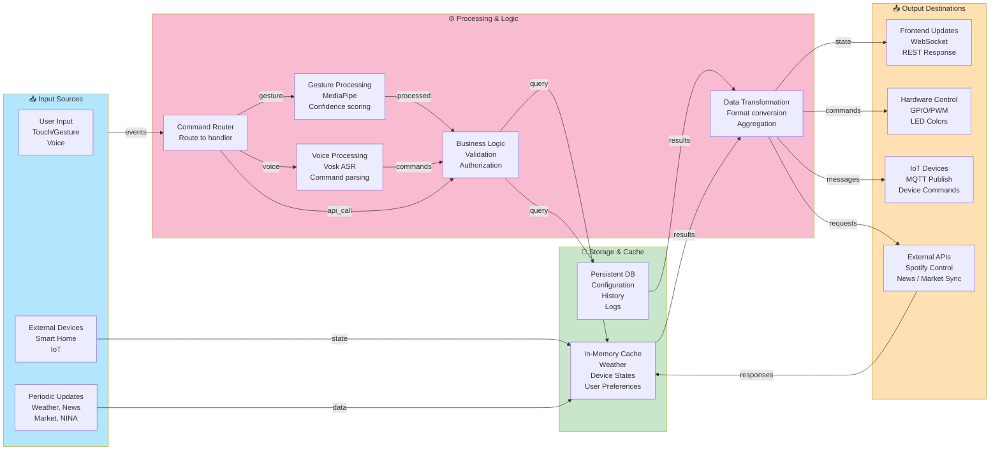
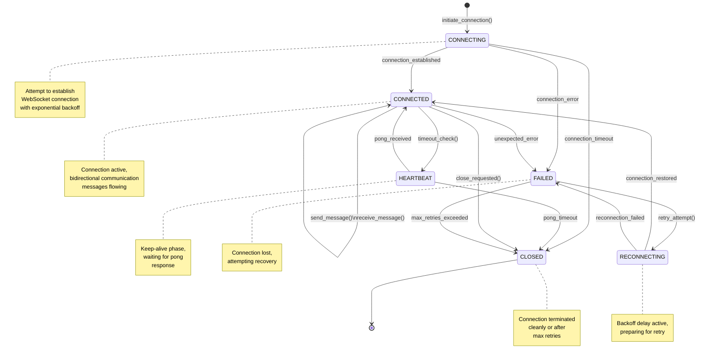
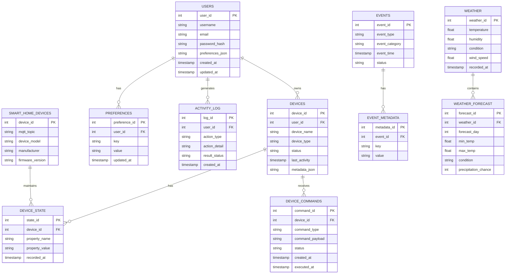
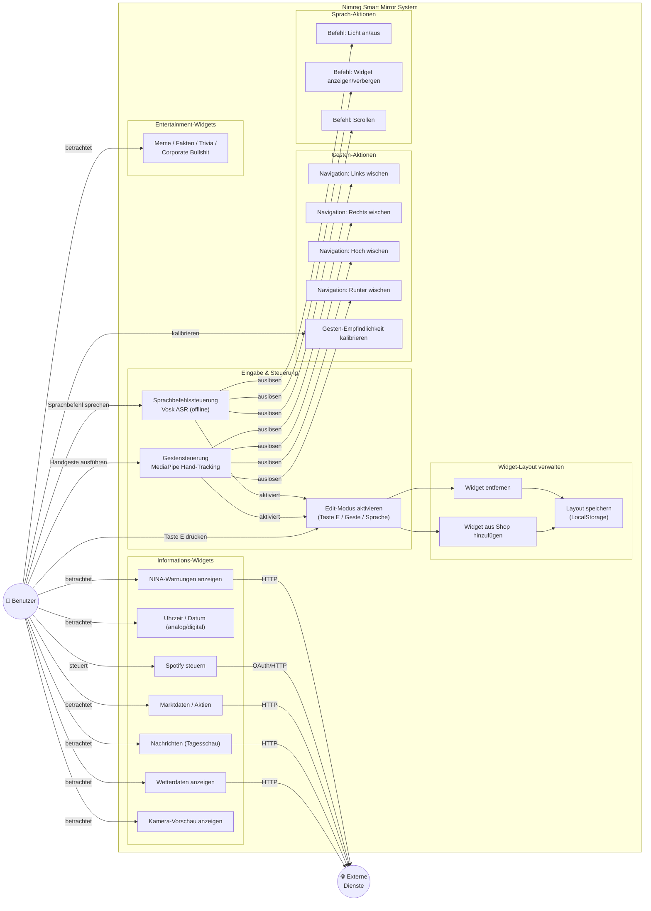
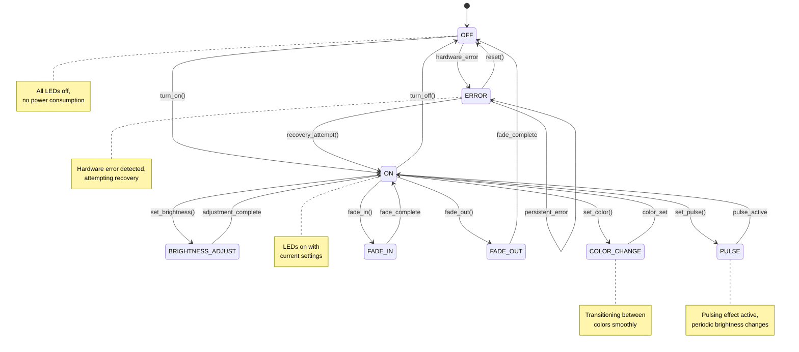
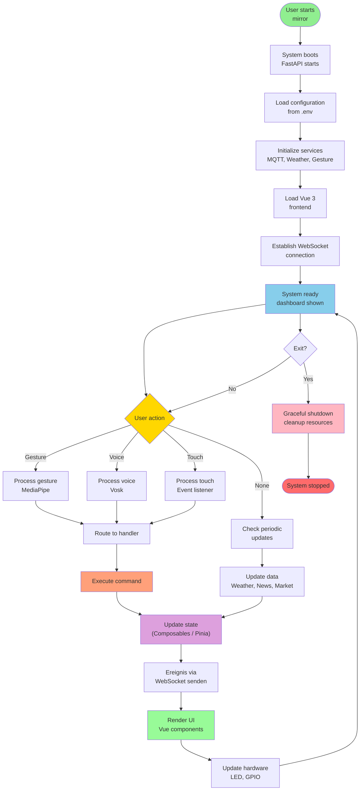

# Zusätzliche Architektur-Diagramme für Nimrag Smart Mirror

## A.1 Deployment-Diagramm

### Beschreibung

Das Deployment-Diagramm zeigt die physische Verteilung der Komponenten auf der Raspberry Pi Hardware und deren Kommunikation mit externen Systemen.

```mermaid
graph TB
    subgraph "Nimrag Smart Mirror Hardware (Raspberry Pi 4)"
        
        subgraph "GPIO Pins"
            LED_PINS["LED Controller Pins<br/>GPIO 17, 27, 22<br/>PWM Output"]
            BUTTON_PINS["Button Input Pins<br/>GPIO 23, 24<br/>Digital Input"]
        end
        
        subgraph "USB Devices"
            CAMERA["USB Camera<br/>/dev/video0<br/>Video Capture"]
            MICROPHONE["USB Microphone<br/>Audio Input<br/>Stereo Recording"]
        end
        
        subgraph "HDMI/Display"
            DISPLAY_OUTPUT["HDMI Output<br/>1920x1080 60fps<br/>Display Control"]
        end
        
        subgraph "Backend Runtime"
            PYTHON["Python 3.12<br/>venv_py312/"]
            
            subgraph SERVICES["Backend Services"]
                FASTAPI_PROC["FastAPI Process<br/>Port 8000<br/>uvicorn"]
                
                WEATHER_PROC["Weather Service<br/>AsyncIO Task<br/>10 min interval"]
                
                GESTURE_PROC["Gesture Service<br/>Threading<br/>60 fps"]
                
                VOICE_PROC["Voice Service<br/>Threading<br/>Audio Processing"]
                
                LED_PROC["LED Service<br/>GPIO Control<br/>On-demand"]
                
                MQTT_PROC["MQTT Service<br/>Background Loop<br/>Always Connected"]
            end
            
            PYTHON --> SERVICES
        end
        
        subgraph "Frontend Runtime"
            NODE["Node.js Runtime<br/>npm/yarn"]
            
            VUE_APP["Vue 3 App<br/>Vite Dev Server<br/>Port 5173 (dev)<br/>Port 3000 (prod)"]
            
            NODE --> VUE_APP
        end
        
        subgraph "System Services"
            NGINX["Nginx Reverse Proxy<br/>Port 80/443<br/>SSL/TLS"]
            
            SYSTEMD["systemd Services<br/>Service Management<br/>Auto-restart"]
            
            DNSMASQ["DNSMasq<br/>Local DNS<br/>mDNS Resolution"]
        end
        
    end
    
    subgraph "Network Infrastructure"
        WIFI["WiFi Module<br/>802.11ac<br/>2.4/5 GHz"]
        ETHERNET["Ethernet Port<br/>Gigabit<br/>Optional"]
    end
    
    subgraph "External Services"
        
        subgraph "Public APIs"
            WEATHER_API["OpenWeatherMap API<br/>REST HTTP<br/>api.openweathermap.org"]
            NEWS_API["Tagesschau API<br/>REST HTTP<br/>api.tagesschau.de"]
            MARKET_API["Twelve Data API<br/>REST HTTP<br/>api.twelvedata.com"]
            SPOTIFY_API["Spotify Web API<br/>REST HTTP<br/>api.spotify.com"]
            NINA_API["NINA API<br/>REST HTTP<br/>warnung.bund.de"]
        end
        
        subgraph "IoT Integration"
            MQTT_BROKER["MQTT Broker<br/>Port 1883<br/>mosquitto.org or local"]
            
            SMART_DEVICES["Smart Home Devices<br/>Philips Hue<br/>Home Assistant<br/>Zigbee Devices"]
        end
        
    end
    
    subgraph "User Devices"
        BROWSER["Web Browser<br/>PC/Tablet/Raspberry Pi<br/>Lokaler Zugriff"]
    end
    
    %% Connections
    LED_PINS -.GPIO.-> LED_PROC
    BUTTON_PINS -.GPIO.-> VOICE_PROC
    
    CAMERA -.USB Video.-> GESTURE_PROC
    MICROPHONE -.USB Audio.-> VOICE_PROC
    
    DISPLAY_OUTPUT -.HDMI.-> VUE_APP
    
    FASTAPI_PROC -->|HTTP| VUE_APP
    FASTAPI_PROC -->|WebSocket| VUE_APP
    
    WEATHER_PROC -->|HTTP| WEATHER_API
    FASTAPI_PROC -->|HTTP| NEWS_API
    FASTAPI_PROC -->|HTTP| MARKET_API
    FASTAPI_PROC -->|HTTP| NINA_API
    LED_PROC -.event.-> WEATHER_PROC
    
    MQTT_PROC -.MQTT Protocol.-> MQTT_BROKER
    MQTT_BROKER -.MQTT.-> SMART_DEVICES
    
    NGINX -->|reverse proxy| FASTAPI_PROC
    NGINX -->|serve| VUE_APP
    
    SYSTEMD -->|manage| FASTAPI_PROC
    SYSTEMD -->|manage| MQTT_PROC
    
    WIFI -.network.-> MQTT_BROKER
    WIFI -.network.-> WEATHER_API
    WIFI -.network.-> NEWS_API
    WIFI -.network.-> MARKET_API
    
    BROWSER -->|HTTP| NGINX
    
    class GPIO gpio
    class USB usb
    class DISPLAY display
    class SERVICES services
    class FRONTEND frontend
    class EXTERNAL external
    
    style "Nimrag Smart Mirror Hardware (Raspberry Pi 4)" fill:#E8F5E9
    style "Network Infrastructure" fill:#FFF3E0
    style "External Services" fill:#FCE4EC
    style "User Devices" fill:#E3F2FD
```

### Deployment-Charakteristiken

**Hardware:**
- Raspberry Pi 4 (4GB RAM, 64GB SD-Card)
- USB-basierte Kameras und Mikrofone
- GPIO-basierte LED-Controller
- HDMI-Display (1080p@60fps)

**Netzwerk:**
- WiFi 802.11ac für externe Kommunikation
- mDNS für lokale Geräteerkennung
- Optional: Ethernet für Stabilität

**Services:**
- Backend läuft in Python venv
- Frontend läuft über Nginx
- Systemd verwaltet Service-Lifecycle

---

## A.2 Datenfluss-Diagramm (DFD)

### Beschreibung

Das Datenfluss-Diagramm zeigt den Fluss von Daten durch das System auf oberster Ebene.



**Datenfluss-Charakteristiken:**

- **Synchrone Pfade**: REST API Calls (< 100ms)
- **Asynchrone Pfade**: WebSocket Events (< 10ms)
- **Periodische Pfade**: Scheduled Updates (10min interval)
- **Event-getriebene Pfade**: Gestures/Voice (< 100ms)

---

## A.3 State-Diagramm: WebSocket Connection Lifecycle

### Beschreibung

Das State-Diagramm zeigt die verschiedenen Zustände einer WebSocket-Verbindung und die Übergänge zwischen ihnen.



**State Transitions:**

| Von | Nach | Auslöser | Aktion |
|-----|------|----------|--------|
| CONNECTING | CONNECTED | connection_established | Start heartbeat timer |
| CONNECTED | HEARTBEAT | timeout_check (30s) | Send ping |
| HEARTBEAT | CONNECTED | pong_received | Reset timer |
| CONNECTED | FAILED | error | Log error, start retry |
| FAILED | RECONNECTING | retry_attempt | Calculate backoff delay |
| RECONNECTING | CONNECTED | success | Resume normal operation |

---

## A.4 Entity-Relationship Diagramm (ERD)

### Beschreibung

Das ERD zeigt die Datenmodelle und deren Beziehungen in der Datenbank.



### Datenmodelle

**USERS (Benutzer)**
- Speichert Benutzerinformationen und Authentifizierung
- Primary Key: user_id
- Beziehung: 1:N zu DEVICES, PREFERENCES, ACTIVITY_LOG

**DEVICES (Geräte)**
- Speichert gekoppelte Geräte (z.B. Smart Home Lampen)
- Primary Key: device_id
- Foreign Key: user_id (USERS)
- Beziehung: 1:N zu DEVICE_STATE, DEVICE_COMMANDS

**DEVICE_STATE (Gerätestatus)**
- Zeitreihen-Daten für Gerätezustände
- Primary Key: state_id
- Foreign Key: device_id (DEVICES)
- Ermöglicht Geschichtsabfragen

**WEATHER (Wetterdaten)**
- Speichert aktuelle Wetterdaten
- Primary Key: weather_id
- Relationship: 1:N zu WEATHER_FORECAST

---

## A.5 Use Case Diagramm: Vollständige Systeminteraktionen

### Beschreibung

Das Use-Case-Diagramm zeigt alle wesentlichen Anwendungsfälle des Nimrag Smart Mirror Systems. Der Fokus liegt auf den zwei berührungslosen Steuerungskanälen – **Gestensteuerung** (MediaPipe) und **Sprachbefehlssteuerung** (Vosk ASR) –, die beide als vollwertige Alternativen zur Touch-/Tastatureingabe dienen.



**Use Case Übersicht:**

| Use Case | Eingabekanal | Beschreibung | Erfolgs-Kriterium |
|----------|-------------|--------------|-------------------|
| Gestensteuerung | Kamera (MediaPipe) | Berührungslose Navigation per Handgeste | Reaktion < 500 ms |
| Sprachbefehlssteuerung | Mikrofon (Vosk ASR) | Offline-Spracherkennung, vordefinierte Befehle | Intent-Erkennung < 500 ms |
| Edit-Modus aktivieren | Tastatur / Geste / Sprache | Wechsel in den Layout-Bearbeitungsmodus | Edit-Overlay erscheint |
| Widget hinzufügen | Edit-Modus | Widget aus Shop in Grid-Zelle ziehen | Widget sichtbar, Layout gespeichert |
| Widget entfernen | Edit-Modus | Widget aus Grid entfernen | Widget verschwindet, Layout gespeichert |
| Navigation Links/Rechts/Hoch/Runter | Geste (Swipe) | Bildschirmnavigation per Handbewegung | Seitenübergang < 500 ms |
| Licht-Befehl | Sprache | GPIO/LED-Steuerung per Sprachbefehl | Hardware-Reaktion < 1 s |
| Widget-Befehl | Sprache | Widget ein-/ausblenden per Sprache | Widget-Zustand ändert sich |
| Gesten kalibrieren | Einstellungen | Empfindlichkeit der Gestenerkennung anpassen | Neuer Threshold gespeichert |
| Wetterdaten anzeigen | automatisch | Aktuelle Bedingungen + Vorhersage | Daten < 15 min alt |
| Marktdaten anzeigen | automatisch | Aktien und Kryptokurse in Echtzeit | Kurse aktuell |
| NINA-Warnungen | automatisch | Katastrophenschutzmeldungen für Landkreis | Warnungen aktuell |
| Spotify steuern | Benutzer | Play, Pause, Skip, aktuelle Wiedergabe | Reaktion < 200 ms |

---

## A.6 Zustandsdiagramm: LED Control States

### Beschreibung

Das Zustandsdiagramm zeigt die verschiedenen LED-Zustände und mögliche Übergänge.



**LED State Machine:**

```
┌─────────────────────────────────┐
│         OFF (Default)           │
│  • All PWM pins = 0             │
│  • No power draw (except GPIO)   │
└─────────────────────────────────┘
         ↑            ↓
         │         turn_on()
         │            ↓
         ↓      ┌─────────────────┐
       OFF      │        ON       │
         ↑      │ • Current color │
         │      │ • Brightness    │
         │      └─────────────────┘
         │          ↓       ↓
         │      adjust    change
         │      brightness color
         │          ↓       ↓
         └──────────┴───────┘
```

---

## A.7 Activity Diagramm: Complete User Journey

### Beschreibung

Das Activity Diagramm zeigt einen typischen Benutzer-Workflow vom Starten der Anwendung bis zur Interaktion.



### Workflow-Schritte

1. **Boot Phase** (< 10 Sekunden)
   - System startet, Services werden initialisiert
   - WebSocket wird verbunden
   - Frontend wird geladen

2. **Ready Phase**
   - Dashboard wird angezeigt
   - Periodische Updates starten

3. **Interaction Loop**
   - Benutzer führt Aktion durch
   - Aktion wird verarbeitet
   - State wird aktualisiert
   - UI wird re-rendered

4. **Shutdown Phase**
   - Graceful Cleanup
   - Alle Connections werden beendet
   - Resources werden freigegeben

---

## A.8 Zusammenfassung: Diagramm-Übersicht

| Diagramm-Typ | Datei | Fokus | Audience |
|-------------|-------|-------|----------|
| **Sequenzdiagramme** | 6_Sequenzdiagramme_Komponentenebene.md | Zeitliche Abläufe | Entwickler |
| **Komponentendiagramme** | 8_Komponenten_und_Paketdiagramme.md | Struktur & Abhängigkeiten | Architekten |
| **Paketdiagramme** | 8_Komponenten_und_Paketdiagramme.md | Logische Organisation | Entwickler |
| **Deployment-Diagramm** | Dieses Dokument | Physische Verteilung | DevOps/Betrieb |
| **Datenfluss-Diagramm** | Dieses Dokument | Daten-Journeys | Alle |
| **State-Diagramme** | Dieses Dokument | Zustandsübergänge | Entwickler |
| **ERD** | Dieses Dokument | Datenmodelle | DBAs |
| **Use Case Diagramm** | Dieses Dokument | Funktionalitäten | Stakeholder |
| **Activity Diagramm** | Dieses Dokument | Prozessabläufe | Business Analyst |

---

## A.9 Mermaid Diagramme Best Practices

### Lesbarkeit

✓ Klare Benennung aller Komponenten  
✓ Konsistente Farbschemas  
✓ Hierarchische Organisation  
✓ Aussagekräftige Beschreibungen  

### Wartbarkeit

✓ Modulare Struktur  
✓ Dokumentation mit Kontext  
✓ Versionskontrolle der Diagramme  
✓ Automatische Validierung  

### Aktualisierung

Die Diagramme sollten aktualisiert werden wenn:
- Neue Services/Components hinzugefügt werden
- Abhängigkeiten sich ändern
- API Endpoints sich ändern
- Deployment-Strategie sich ändert

Empfohlener Update-Zyklus: Quarterly oder bei Major Changes

