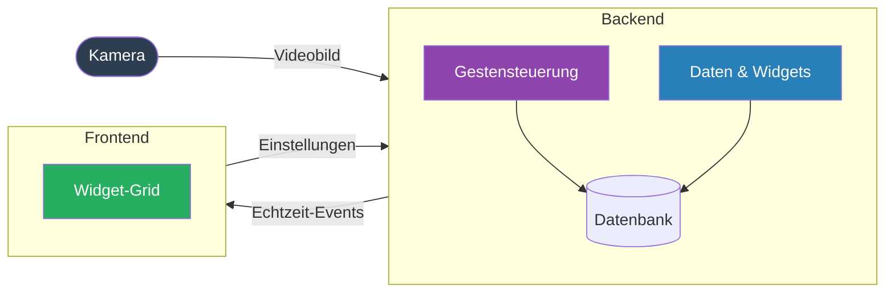
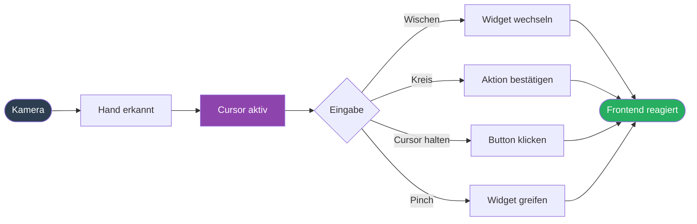
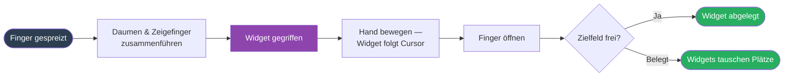
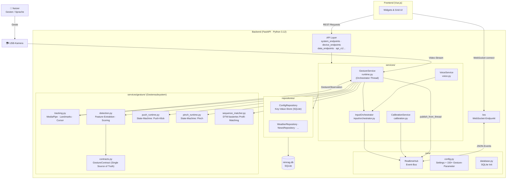
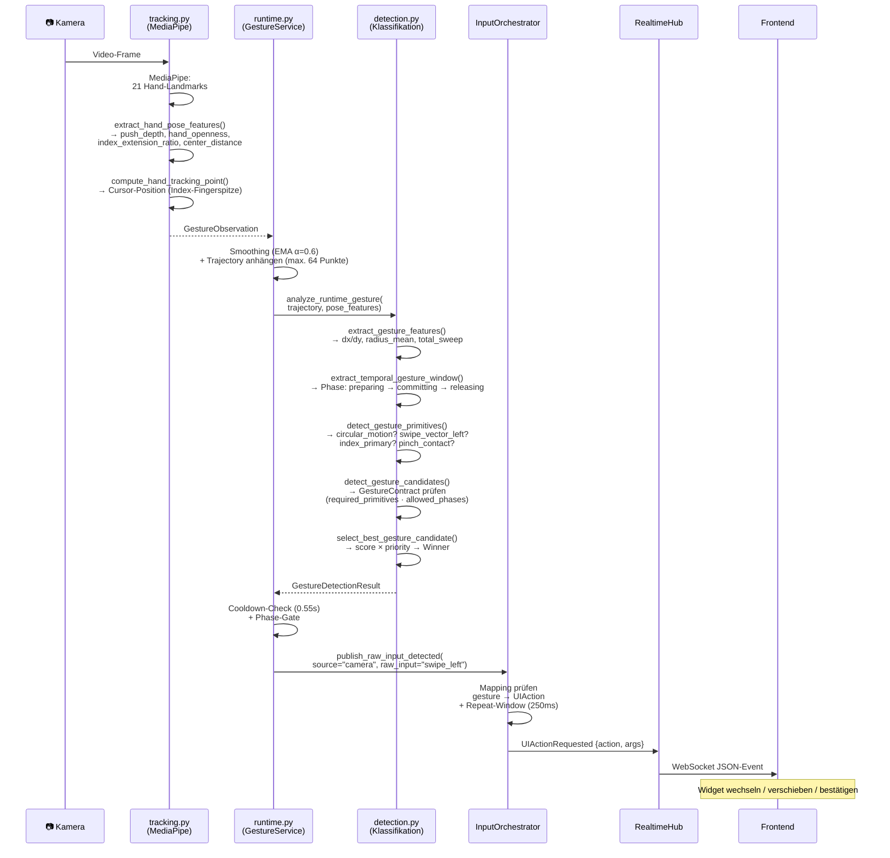
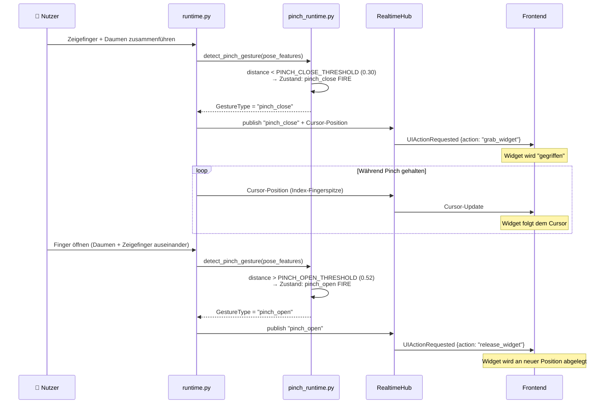
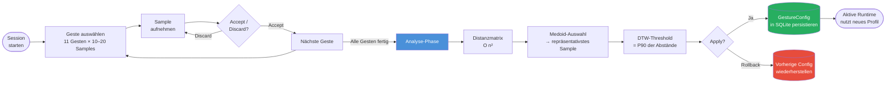
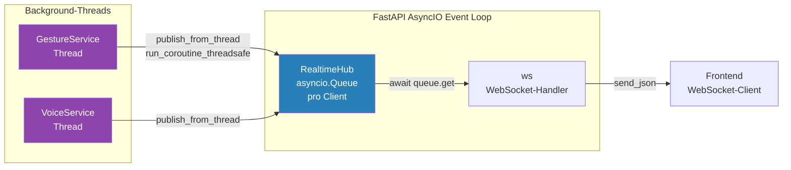
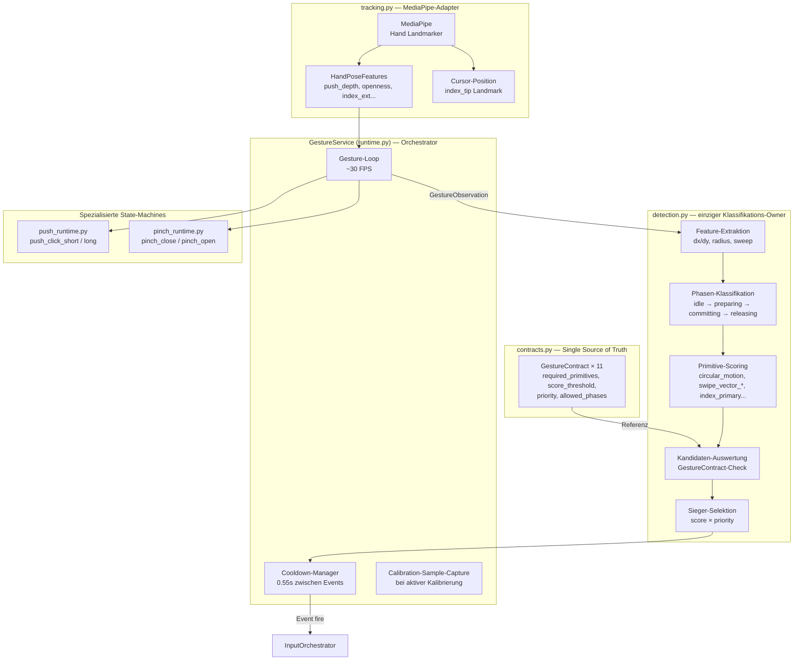
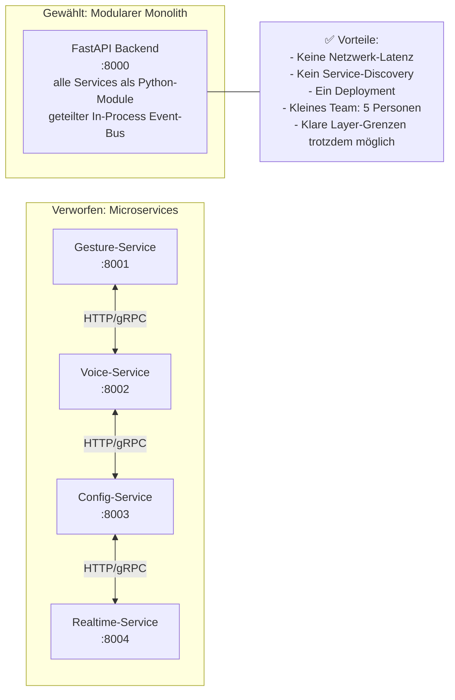

# Nimrag – Präsentation: Backend & Gestensteuerung
## Diagramme & Visualisierungen (Stand: Code-Basis 2026)

> Alle Diagramme basieren direkt auf dem aktuellen Quellcode (`Backend/src`).
> Nicht auf ältere Docs-Dateien verlassen — diese sind teilweise veraltet.

---

# PRÄSENTATION — Vereinfachte Diagramme

> Diese drei Diagramme sind für die 5-Minuten-Präsentation optimiert:
> wenig Text, klare Struktur, keine technischen Details.

---

## P1. System-Architektur — High-Level-Überblick



---

## P2. Gestensteuerung — Ablauf



---

## P3. Pinch-to-Move — Widget verschieben



---

---

# ENTWICKLER-REFERENZ — Vollständige Diagramme

> Die folgenden Diagramme sind für Dokumentation und Entwicklerhandbuch gedacht,
> nicht für die Präsentation.

---

## 1. Systemarchitektur – Gesamtüberblick



---

## 2. Gesture Detection Pipeline – Sequenzdiagramm



---

## 3. Pinch-to-Move – Interaktionsablauf



---

## 4. Kalibrierungs-Workflow



---

## 5. WebSocket Real-Time Event Flow



---

## 6. Gesture-Subsystem: Zuständigkeiten (Ownership-Grenzen)



---

## 7. Tech-Stack-Tabelle

| Komponente | Technologie | Zweck |
|---|---|---|
| Framework | FastAPI (Python 3.12) | REST-API + WebSocket |
| Hand-Tracking | MediaPipe Hand Landmarker | 21 Landmarks pro Hand |
| Persistenz | SQLite (nimrag.db) | Config, Cache, Sessions |
| Config-Contracts | Pydantic BaseSettings | 150+ Gesture-Parameter |
| Datenvalidierung | Pydantic v2 Models | Typ-Sicherheit über alle Layer |
| Realtime | asyncio.Queue + WebSocket | Event-Broadcasting |
| Sequenz-Matching | DTW (dtaidistance) | Nutzer-Profile für Kalibrierung |
| Threading | Python threading + RLock | Gesture-Loop im Hintergrund |

---

## 8. Gesten-Übersicht (Alle implementierten Gesten)

| Geste | Priorität | Threshold | Typ | Präsentation |
|---|---|---|---|---|
| `pinch_close` | 70 | 0.0 | Pinch SM | ✅ Kern-Geste |
| `pinch_open` | 70 | 0.0 | Pinch SM | ✅ Kern-Geste |
| `push_click_long` | 60 | 0.58 | Push SM | technisch |
| `push_click_short` | 55 | 0.56 | Push SM | technisch |
| `circle` | 45 | 0.52 | Detection | ✅ Kern-Geste |
| `zoom_out_hands` | 50 | 0.54 | Detection (2-Hand) | technisch |
| `zoom_in_hands` | 50 | 0.54 | Detection (2-Hand) | technisch |
| `swipe_left` | 40 | 0.40 | Detection | ✅ Kern-Geste |
| `swipe_right` | 40 | 0.40 | Detection | ✅ Kern-Geste |
| `swipe_up` | 38 | 0.40 | Detection | technisch |
| `swipe_down` | 38 | 0.40 | Detection | technisch |

---

## 9. DTW – Dynamic Time Warping (kurze visuelle Erklärung)

```
Naive Distanz (schlecht):          DTW (richtig):
                                   
 A: ──●──●──●──●                  A: ──●──●──●──●
    |  |  |  |                        ╲  │  │  ╱
 B: ──●──●──●──●                  B: ──●──●──●──●
                                   
 Zeitversatz → hohe Distanz       Elastisches Matching → korrekte Distanz
```

**Im Code:** `dtaidistance.dtw_ndim.distance_fast()` mit 8 parallelen Kanälen:
`x, y, velocity_x, velocity_y, hand_openness, index_extension_ratio, push_depth, center_distance`

Zweck: Wenn ein Nutzer eine Geste schneller oder langsamer ausführt als das gespeicherte Referenzprofil, erkennt DTW sie trotzdem korrekt.

---

## 10. Modularer Monolith – Bewusste Architekturentscheidung


