<!-- _class: lead -->

# Nimrag Smart Mirror

## Intelligenter Spiegel mit berührungsloser Gestensteuerung

<br/>

Software Engineering Projekt · 2026

---

# Agenda

<div class="zwei-spalten">
<div>

**1 ·** Produktvision

<br/>

**2 ·** User Experience
- Das Widget- und Gridsystem
- Gestensteuerung

<br/>

**3 ·** Technische Umsetzung
- Systemarchitektur & Design
- Backend & Gestensubsystem
- Frontend-Architektur

</div>
<div>

**4 ·** Hardware

<br/>

**5 ·** Qualität & CI/CD

<br/>

**6 ·** Projektmanagement

<br/>

**7 ·** Ausblick & Live-Demo

</div>
</div>

---

# 1 · Produktvision — Was ist Nimrag?

<div class="zwei-spalten">
<div>

### Das Projekt

Nimrag ist ein Smart Mirror: ein halbdurchlässiger Spiegel mit dahinterliegendem Display, der Informationen als Overlay darstellt.

**Kernfunktionen:**
- Anzeige von Alltagsinformationen (Wetter, Uhrzeit, Nachrichten, Warnungen)
- Berührungslose Steuerung über Kamera-basierte Gestensteuerung
- Modulares Widget-System für flexible Inhalte

**Technischer Ansatz:**
- Eigenentwicklung: Frontend (Vue.js) + Backend (FastAPI)
- Hardware: Raspberry Pi · Kamera · Zwei-Wege-Spiegel
- Automatisierte Build- und Deployment-Pipeline

</div>
<div>

### Projektziel

Entwicklung eines funktionsfähigen Prototyps mit:

- Konfigurierbarem Widget-Grid
- Zuverlässiger berührungsloser Gestensteuerung
- Getesteter und dokumentierter Codebasis
- Deployment auf dedizierter Hardware

</div>
</div>

<!--
Einleitung: sachlich und akademisch halten — keine Werbung.
-->

---

<!-- _class: lead -->

# 2 · User Experience

## Das Widget- und Gridsystem & Gestensteuerung

---

## 2.1 · Das Widget- und Gridsystem

<div class="zwei-spalten">
<div>

### Das Grid

- Widgets frei auf dem Grid positionierbar
- Mehrere Widgets gleichzeitig sichtbar
- Widgets verschiebbar, skalierbar, löschbar
- Änderungen werden persistiert

### Verfügbare Widgets

- Wetter · Uhrzeit · Nachrichten (Tagesschau)
- NINA-Katastrophenwarnungen · Börsenkurse
- Kamera-Vorschau · Frage des Tages
- Useless Fact · Corporate Bullshit of the Hour
- Zufalls-Meme · Animiertes GIF

</div>
<div>

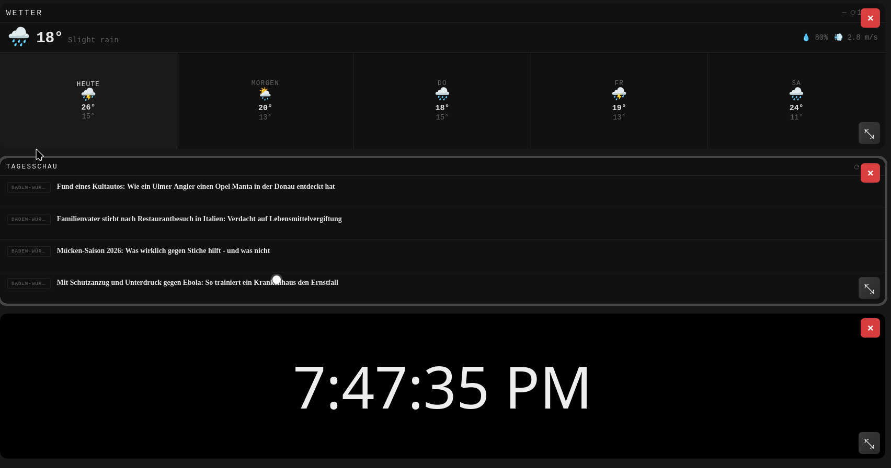
<p class="bildtitel">Live-Ansicht — aktiver Cursor auf dem Widget-Grid</p>

</div>
</div>

<!--
Hier erklärt Sebastian das Grid-System im Detail.
Screenshot zeigt die reale App mit aktivem Cursor (weißer Punkt).
-->

---

<!-- _class: lead -->

# 2.2 · Gestensteuerung

## Berührungslose Bedienung für den Alltag

---

## Warum keine Maus — warum Gesten?

<div class="zwei-spalten">
<div>

**Das Problem:**

- Wandmontiert → keine Tastatur oder Maus in Reichweite
- Kontext: Badezimmer, Flur, Küche → Hygiene, nasse Hände

</div>
<div>

**Die Lösung:**

- Kamera erkennt Handbewegungen vor dem Spiegel
- Komplett **berührungslos** aus 50–80 cm Abstand
- Keine Hardware-Eingabegeräte notwendig
- Ergänzung: Sprachsteuerung *(in Entwicklung)*

</div>
</div>

<div class="highlight">

Gestensteuerung ist kein Add-on — sie ist die einzig sinnvolle Eingabemethode für einen wandmontierten Spiegel.

</div>

<!--
Warum-Folie knapp halten, 30-45 Sek.
-->

---

## Die vier Eingabemethoden

<div class="zwei-spalten">
<div>

**↔ Wischen** *(Swipe)*
Offene Handfläche horizontal wischen
→ Navigiert zum nächsten / vorherigen Widget

<br/>

**⭕ Kreis**
Kreisbewegung beschreiben, Hand am Ende öffnen
→ Bestätigt eine Aktion / öffnet Menü

</div>
<div>

**🖱 Cursor + Halten**
Zeigefinger bewegt den Cursor — 1 Sekunde auf einem Button halten
→ Löst Klick aus (Löschen, Größe ändern, Menü)

<br/>

**✊ Pinch-to-Move**
Daumen + Zeigefinger zusammen = Widget greifen
Hand bewegen = Widget folgt, Finger öffnen = ablegen
→ Drag & Drop für das Widget-Grid

</div>
</div>

<br/>

> *Frühere Ansätze wie Push-Klick-Gesten oder Zwei-Hand-Zoom wurden verworfen — Cursor-Hold löst dasselbe eleganter.*

---

## Gesten nach Kontext

<div style="display:grid;grid-template-columns:1fr 1fr;gap:14px;font-size:0.9em">
<div class="karte">

**📷 Kamera-Vorschau** *(Startbildschirm)*

Beim Start zeigt die App die Kamera-Vorschau im Vollbild.

↔ Wischen nach links — zum Widget-Grid wechseln

</div>
<div class="karte">

**🏠 Widget-Grid (Normalmodus)**

⭕ Kreis — Edit-Modus aktivieren

🖱 Cursor halten — Buttons & Menüs klicken

</div>
<div class="karte">

**✏️ Edit-Modus**

✊ Pinch — Widget greifen & verschieben

✊ Pinch auf leerem Feld — Widget-Shop öffnen

🖱 Cursor halten — Widget löschen · Größe ändern

⭕ Kreis — Edit-Modus beenden

</div>
<div class="karte">

**🛒 Widget-Shop**

↔ Wischen — Widgets durchblättern

🖱 Cursor halten — Widget auswählen & hinzufügen

</div>
</div>

<!--
Kontext-basierte Darstellung statt leerer Tabellen-Zellen.
Kreis ist ausschließlich für Edit-Modus ein/aus.
-->

---

## Gestensteuerung — Ablauf

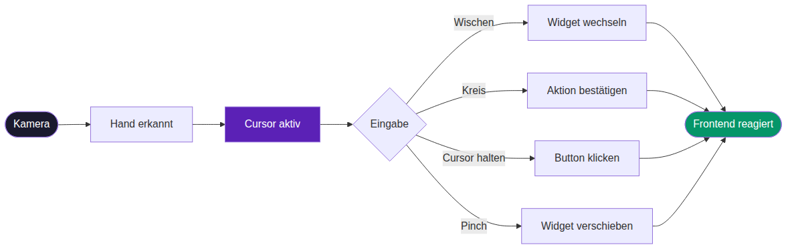

<!--
Kamera → Erkennung → Cursor als Interface-Punkt → vier mögliche Aktionen → Frontend
-->

---

## Pinch-to-Move — Schritt für Schritt

<br/>

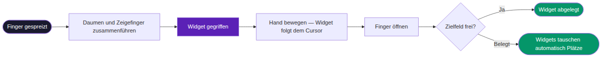

<!--
Automatische Tausch-Logik betonen: kein "kein Platz"-Fehler, sondern intelligentes Swap.
-->

---

## Pinch-to-Move — live in Aktion

<div class="zwei-bilder">
<div>

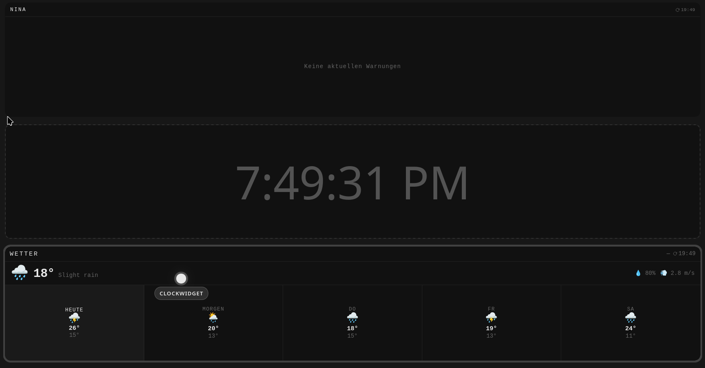
<p class="bildtitel">Widget wird mit Pinch gegriffen und verschoben</p>

</div>
<div>

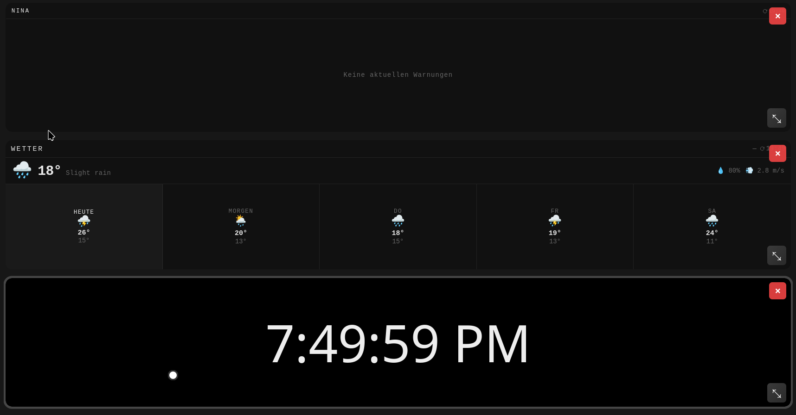
<p class="bildtitel">Clock- und Wetter-Widget haben automatisch die Plätze getauscht</p>

</div>
</div>

<!--
Die zwei Screenshots zusammen zeigen den Swap-Prozess in Aktion.
Linkes Bild: Widget wird per Pinch-Geste bewegt (CLOCKWIDGET-Label sichtbar).
Rechtes Bild: Nach dem Ablegen haben beide Widgets die Plätze getauscht.
-->

---

<!-- _class: lead -->

# 3 · Technische Umsetzung

## Architektur, Design-Entscheidungen & Implementierung

---

## 3.1 · System-Architektur — Überblick

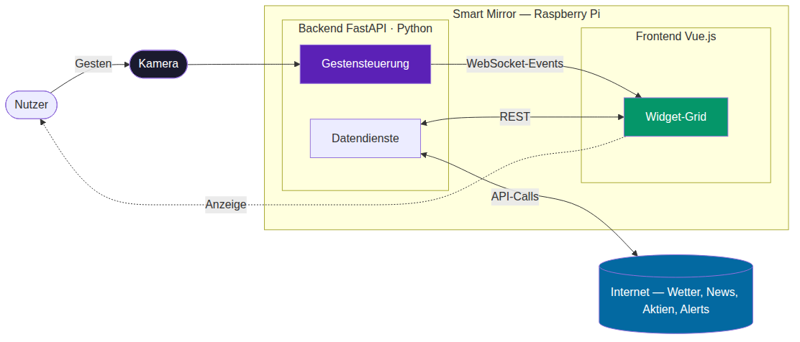

<!--
Web-APIs (Wetter, News etc.) werden vom Backend abgefragt, nicht direkt vom Frontend.
Raspberry Pi ist die Hardware-Plattform, die alles hostet.
-->

---

## 3.1 · Zentrale Design-Entscheidungen

<div class="zwei-spalten">
<div>

### Modularer Monolith

Alle Backend-Services laufen **in einem Prozess** — keine Microservices.

- Kein Netzwerk-Overhead zwischen Services
- Ein einziges Deployment auf dem Raspberry Pi
- Klare Layer-Grenzen trotzdem vorhanden: `API → Services → Repositories → DB`
- Richtige Wahl für 3-köpfiges Team und diesen Projekt-Scope

</div>
<div>

### Event-System via WebSocket

Ein einziger `/ws`-Endpunkt für alle Echtzeit-Events:

- Erkannte Geste → Frontend
- UI-Aktionen (Widget wechseln, greifen, ablegen)

### Frontend: Composable & Registry

Jedes Widget ist eigenständig registriert — neue Widgets lassen sich **ohne Änderung am Core-System** hinzufügen.

</div>
</div>

---

## Tech-Stack auf einen Blick

| Bereich | Technologie | Einsatz |
|---------|-------------|---------|
| Backend-Framework | FastAPI · Python 3.12 | REST-API + WebSocket |
| Hand-Tracking | MediaPipe (Google) | 21 Landmarks pro Hand |
| Datenbank | SQLite | Konfiguration, Cache, Sessions |
| Konfiguration | Pydantic BaseSettings | 150+ typsichere Parameter |
| Realtime | asyncio · WebSocket | Event-Broadcasting |
| Frontend | Vue.js · Vite · Tailwind CSS | Widget-Grid, Cursor-Overlay |
| Hardware-Plattform | Raspberry Pi | Kamera + Hosting |

---

<!-- _class: lead -->

# 3.2 · Backend

## Architektur & Gestensubsystem

---

## Backend — Schichtarchitektur

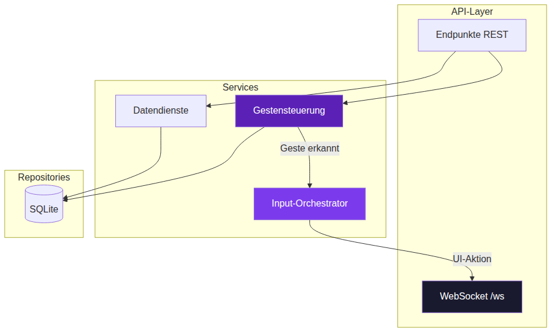

<div class="highlight">

**Datenfluss:** Kamera → Gesture-Service → Input-Orchestrator → WebSocket → Frontend

</div>

<!--
Schichten kurz von oben nach unten erklären.
Input-Orchestrator: Mapping-Layer "Gesture X → UI-Aktion Y".
-->

---

## Gestensubsystem — Aufbau & Verantwortlichkeiten

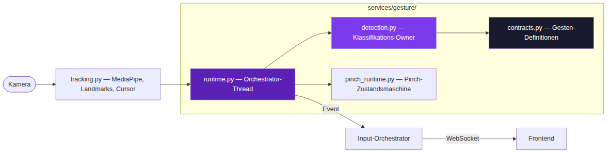

**Klare Ownership:** `detection.py` klassifiziert — `runtime.py` orchestriert nur. Keine gemischten Verantwortlichkeiten.

<!--
detection.py: EINZIGER Ort, der entscheidet welche Geste es ist.
contracts.py = Single Source of Truth: jede Geste hat genau einen Contract.
-->

---

## MediaPipe Hand-Tracking — so sieht das System die Hand

<div class="drei-bilder">
<div>

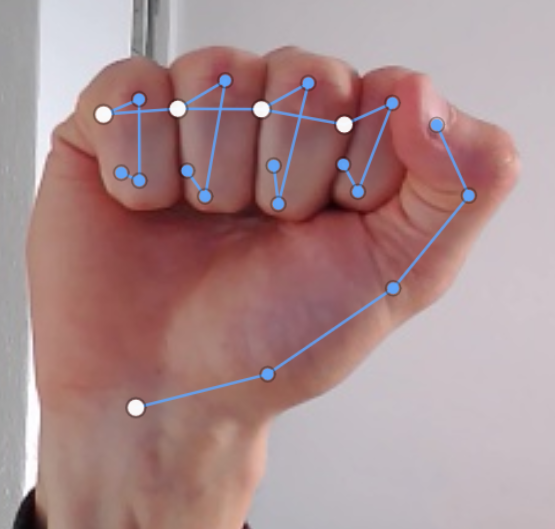
<p class="bildtitel">Faust — Startpose für die Kreis-Geste</p>

</div>
<div>

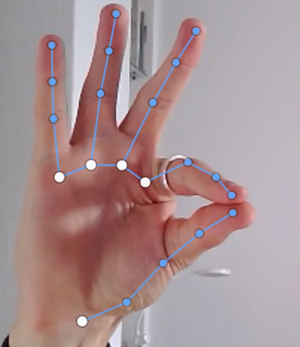
<p class="bildtitel">Pinch — Daumen + Zeigefinger zusammen</p>

</div>
<div>

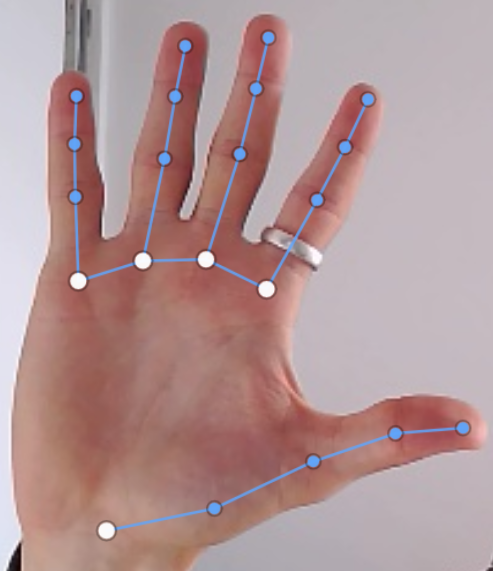
<p class="bildtitel">Offene Handfläche — Startpose für Wischen</p>

</div>
</div>

<br/>

MediaPipe erkennt **21 Landmarks** pro Hand in Echtzeit — Basis für alle Gesten-Klassifikationen.

<!--
Zeigen, was das System "sieht": 21 Punkte auf der Hand.
Weiße Punkte = Palm-Landmarks, blaue Punkte = Finger-Joints.
-->

---

## 3.3 · Frontend-Architektur

<div class="zwei-spalten">
<div>

### Aufbau: Vue 3 + TypeScript

Klare Schichttrennung — jede Schicht hat eine Verantwortung:

- **Komponenten** — Darstellung (UI)
- **Composables** (`use...`) — Geschäftslogik, wiederverwendbar, testbar
- **Services** — Datenzugriff & externe APIs

**Grid & Layout:** 4×4 Grid-System · Drag & Drop · variable Widget-Größen · automatische Layout-Speicherung

</div>
<div>

### Composables — Logik aus der UI ausgelagert

Logik in eigenständigen `use...`-Dateien:
- `useWidgetManager` — Widget-Zustand & Positionen
- `useHandTracking` — Gesten-Events vom Backend
- `useModuleShop` — Widget-Bibliothek

**Vorteil:** Schlanke Komponenten · Zustände zentral verwaltet · einfacher zu testen

</div>
</div>

<!--
Folie 1: Architektur-Überblick + Composables als Kern-Prinzip.
Grid-Info kurz erwähnen, Screenshot haben das schon gezeigt.
-->

---

## 3.3 · Das Widget-System — Erweiterbarkeit by Design

<div class="zwei-spalten">
<div>

### Registry Pattern + Factory

```ts
// widgetRegistry.ts
const modules = import.meta.glob(
  '../components/widgets/*.vue',
  { eager: true }
)
```

Widgets werden **automatisch erkannt** — kein manuelles Eintragen nötig. `getWidgetComponent(name)` lädt die passende Komponente dynamisch.

Singleton-Zustand in `useWidgetManager` stellt sicher, dass alle Komponenten dasselbe Widget-Layout sehen.

</div>
<div>

### Neues Widget in 3 Schritten

```
1. Neue .vue-Datei anlegen
2. Template + Logik + Styling implementieren
3. Im Widget-Ordner speichern
```

**Fertig.** Das System erkennt und registriert das Widget automatisch — ohne Änderung am Core.

<div class="highlight">

Der Smart Mirror ist dadurch flexibel erweiterbar: jede neue Funktion ist ein eigenständiges Modul.

</div>

</div>
</div>

<!--
Folie 2: Registry + Factory zusammen, Widget-Erstellung als praktischer Payoff.
Das ist die konkrete Konsequenz aller Architektur-Entscheidungen.
-->

---

# 4 · Hardware — Image-Build-Pipeline

<br/>

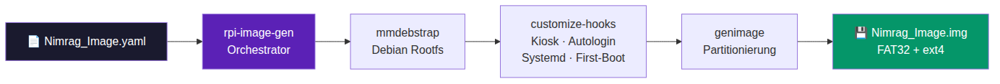

<br/>

<div class="zwei-spalten">
<div>

**Vom Code zum fertigen Spiegel-Image**

Eine einzige YAML-Datei treibt den gesamten Build und erzeugt ein einzelnes `.img`-File — direkt auf SD-Karte flashbar.

**First-Boot-Setup** führt beim ersten Hochfahren aus:
- `npm install` + `pip install`
- Datenbankmigrationen
- Systemd-Services aktivieren

</div>
<div>

**Hardware-Komponenten**

- Raspberry Pi (Herzstück)
- Zwei-Wege-Spiegel + Display + Rahmen
- USB-Kamera für Gestensteuerung
- LED-Strip (TP-Link Tapo + MOSFET)

</div>
</div>

<!--
Jannik erklärt den Hardware-Aufbau und die Build-Pipeline.
Das Image läuft direkt auf dem Pi — kein manuelles Setup nötig.
-->

---

# 5 · Qualität — Tests & CI/CD

<div class="zwei-spalten">
<div>

### Automatisierte Tests

- **pytest** mit Coverage-Report (`coverage.xml`)
- Backend-Tests: Endpunkte, Services, Repositories
- Linting: **black** (Formatierung) + **flake8** (Stil & Fehler)
- Alle Tests laufen isoliert mit Test-SQLite-Datenbank

</div>
<div>

### CI/CD Pipeline (GitHub Actions)

```
Push / Pull Request
    ↓
① Lint & Format-Check
② Backend Tests + Coverage
③ Frontend Build
④ Quality Gates
    ↓ (nur main-Branch)
⑤ Deploy-Artefakt
```

</div>
</div>

<div class="highlight">

Pipeline blockiert Merges bei fehlgeschlagenen Tests oder Lint-Fehlern — Qualitätssicherung ist verpflichtend, nicht optional.

</div>

---

# 6 · Projektmanagement

<div class="zwei-spalten">
<div>

### Vorgehen

- Agile Entwicklung in Sprints
- Feature-Branches + Pull Requests
- Code Reviews vor Merges in `dev` und `main`
- `main` = stabile Version, `dev` = Integration

</div>
<div>

### Aufgabenverteilung

| Bereich | Verantwortung |
|---------|--------------|
| Backend & Gestensteuerung | Louis |
| Frontend & Widget-UI | Sebastian |
| Hardware | Jannik |
| Gemeinsam | Architektur, Reviews |

</div>
</div>

---

# 7 · Ausblick & nächste Schritte

<div class="zwei-spalten">
<div>

### Offen / In Entwicklung

- Sprachsteuerung (Deutsch) — Integration fast abgeschlossen
- Kalibrierung der Gesten per Nutzer-Profil
- Deployment-Pipeline für Raspberry Pi finalisieren
- LED-Steuerung via Smart-Home-Integration

</div>
<div>

### Mögliche Erweiterungen

- Weitere Widget-Typen (Kalender, Smart-Home)
- Nutzerprofile & Personalisierung
- Verbesserte Gestengenauigkeit via DTW-Kalibrierung
- Mobile Companion-App

</div>
</div>

<br/>

<div class="highlight">

**Jetzt zeigen wir das System live — alle Gesten in Aktion.**

</div>

---

<!-- _class: lead -->

# Live-Demo

## Nimrag in Aktion

<br/>

*Swipe · Circle · Pinch-to-Move · Cursor-Hold*

<br/>

---

<!-- _class: lead -->

# Danke für eure Aufmerksamkeit

## Fragen?

<br/>

*Nimrag Smart Mirror · Software Engineering 2026*
