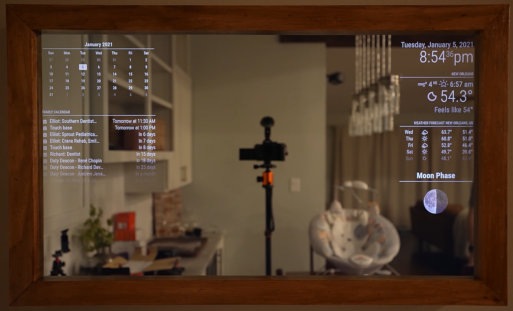
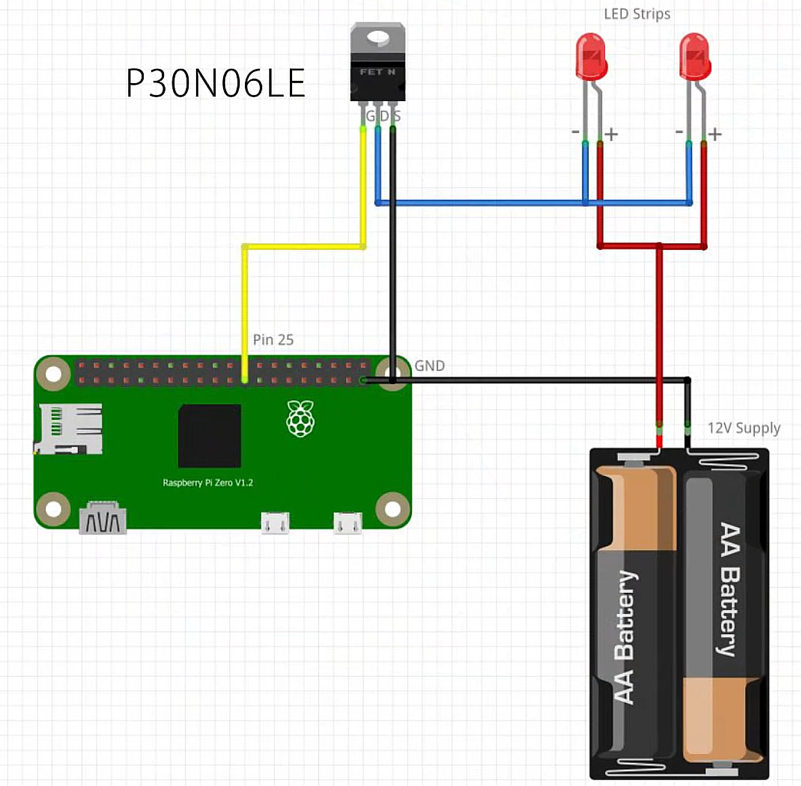
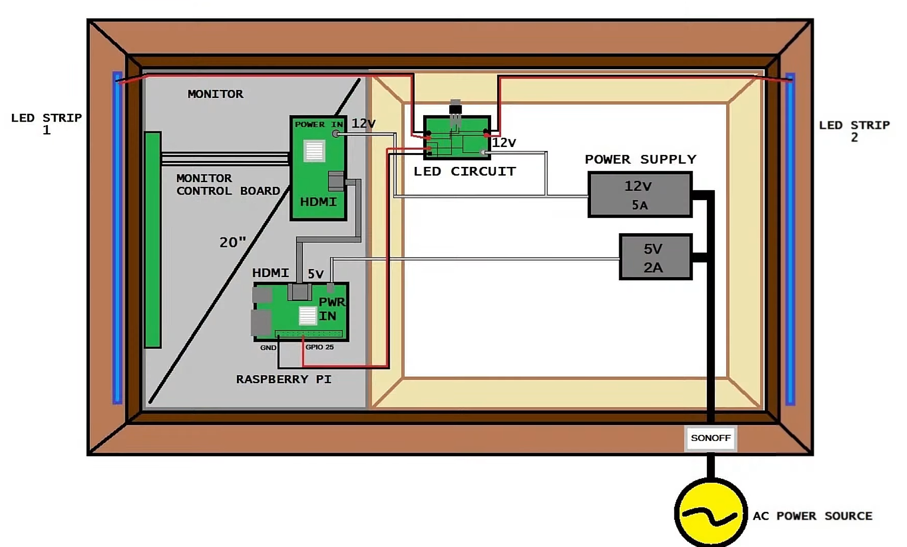
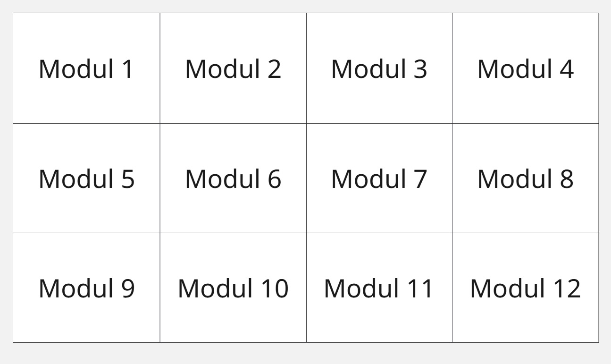
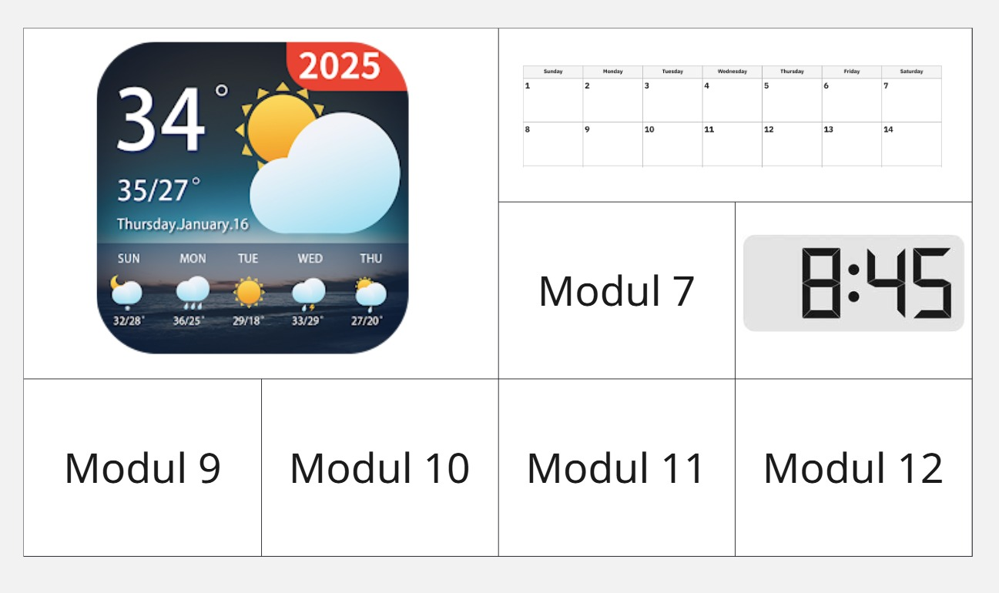

# Smart Mirror – Projekt „Nimrag“

## Software-Entscheidung

### Option 1: Eigene Software
**Anforderungen:**
- Eigenes HUD
- Eigenes Modul-System
- Eigene Hardwareanbindung

**Bemerkung:**
- Es ist technisch möglich und bietet maximale Flexibilität.

### Option 2: MagicMirror²
**Systemanforderungen:**
- Raspberry Pi 2, 3, 4 oder 5
- Neueste vollständige Version von Raspberry Pi OS
- Desktop-Umgebung zur Ausführung von Electron
- Internetverbindung erforderlich
- Optionale Steuerung über Smartphone denkbar

---

## Hardware-Anforderungen

### Grundausstattung
- Fernseher + Wandhalterung *(bereits vorhanden)*
- Raspberry Pi (Modell 2, 3, 4 oder 5)
- Holzrahmen zur Verkleidung des Fernsehers
- Zwei-Wege-Spiegel:
  - [Supreme Tech Acryl See-Through Spiegel](https://www.amazon.de/Supreme-Tech-x18-Acryl-See-Through-Spiegel/dp/B07XTRCTQL)
  - Maße sollten zum Fernseher passen

### Zubehör für Raspberry Pi
- Micro HDMI zu HDMI Kabel:
  - [Amazon-Link](https://www.amazon.de/dp/B0BP29QTJ6)
- Stromkabel für den Pi
- Gehäuse für den Pi

---

## Beispiel eines fertigen Smart Mirrors

**Features des gezeigten Smart Mirrors:**
- Kalenderansicht mit anstehenden Terminen
- Aktuelle Uhrzeit und Datum
- Wetterinformationen mit mehrtägiger Vorhersage
- Mondphasen-Anzeige
- Eleganter dunkler Rahmen
- Klare, gut lesbare Benutzeroberfläche

Dieses Beispiel zeigt die typischen Module eines MagicMirror² Systems in einem ansprechenden Layout. Der Spiegel fügt sich natürlich in den Wohnraum ein und bietet alle wichtigen Informationen auf einen Blick.

---

## LED Setup & Elektronik

### Erforderliche Komponenten

**LED-Beleuchtung:**
- **LED Strip** (schneidbar, RGB): [TP-Link Tapo LED-Streifen](https://www.amazon.de/TP-Link-Tapo-schneidbar-kompatibel-energiesparend/dp/B098FJ6LXB)
  - Ermöglicht Hintergrundbeleuchtung des Spiegels
  - Schneidbar für individuelle Anpassung
  - Smart-Home-Kompatibilität

**Elektronische Steuerung:**
- **N-Channel MOSFET**: [Amazon-Link](https://www.amazon.com/gp/product/B07CTF1JVD)
  - Zur Steuerung der LED-Streifen über den Raspberry Pi
  - Ermöglicht PWM-Kontrolle für Helligkeitsregelung
  
- **Sonoff Smart Switch**: [Amazon-Link](https://www.amazon.com/gp/product/B07KP8THFG)
  - Ein/Ausschalten des gesamten Spiegels
  - Smart-Home-Integration
  - Fernsteuerung möglich

**Verkabelung & Prototyping:**
- **Steckplatine + Kabel-Set**: [Amazon-Link](https://www.amazon.com/dp/B08Y59P6D1)
  - Für Prototyping und Verkabelung
  - Jumperkabel verschiedener Längen
  - Breadboard für Testschaltungen

**Stromversorgung:**
- **Mehrfachsteckdose** (3 Anschlüsse ausreichend)
  - 1x Raspberry Pi
  - 1x LED-Beleuchtung
  - 1x Reserve/Zubehör

---

## Allgemeines Layout

---

## Mögliche Module & Features

Basierend auf [diesem YouTube-Tutorial](https://www.youtube.com/watch?v=q7wqm8h3PnA) sind folgende Module implementierbar:

### Standard-Module
- **Karten/Navigation** - Verkehrslage und Routenplanung
- **Notizen** - Erinnerungen und To-Do-Listen
- **Wetter** - Aktuelle Bedingungen und Vorhersage
- **Kalender** - Termine und Ereignisse
- **Uhrzeit** - Digitale Zeitanzeige
- **Raumtemperatur/Sensordaten** - Umgebungsüberwachung -> erstmal Dummy Daten

### Erweiterte Module
- **Musik** - Wiedergabesteuerung und Informationen
- **Smart Home Integration** - Gerätesteuerung
- **Nachrichten** - RSS-Feeds und Updates

### Mögliche Mockups

**Mockup 1 - Grundlayout:**

**Mockup 2 - Mit Beispielen:**

---

## Überlegungen
- Die Wahl zwischen eigener Software und MagicMirror² hängt stark von den gewünschten Funktionen und dem Grad der Individualisierung ab.
- Hardware ist größtenteils vorhanden oder leicht beschaffbar.
- Eine Smartphone-Steuerung wäre ein spannendes Zusatzfeature.

## Zuklärende Fragen
- Können wir für den Spiegel eine vorhandene Grundsoftware verwenden, worauf wir dann Modulbasiert selber eigene Sachen schreiben
- Vetikale Ausrichtung oder Horizontale
- Eventueller Surface Monitor