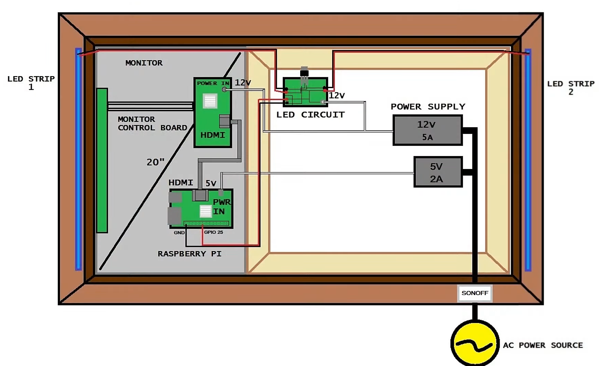
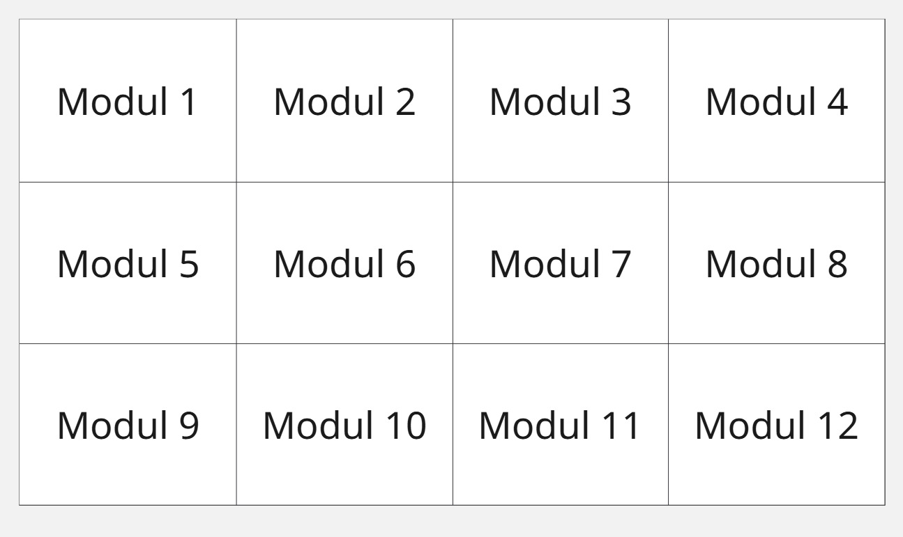
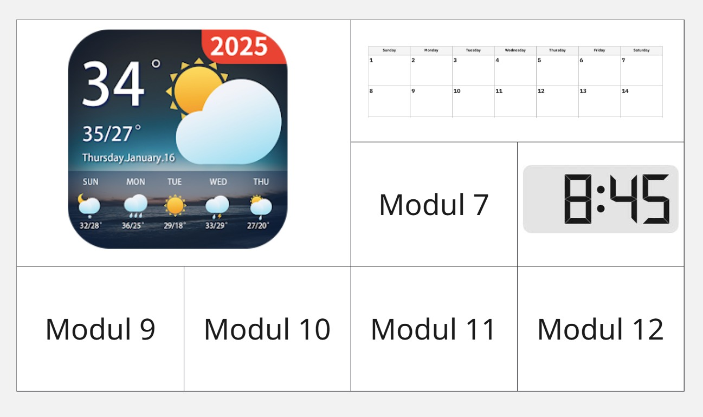
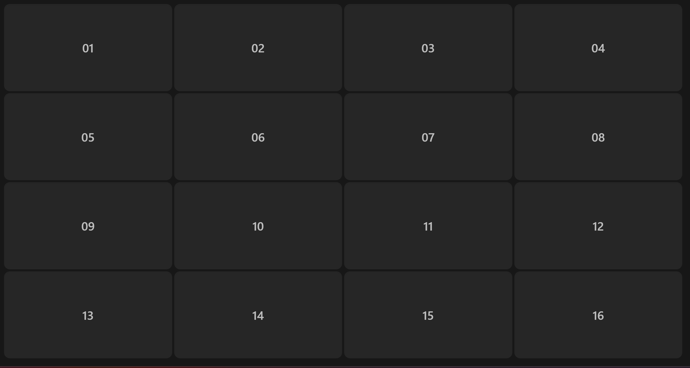

# Smart Mirror – Projekt „Nimrag"

## Software-Entscheidung

Das Team hat sich für eine **vollständig eigene Software-Lösung** entschieden (keine MagicMirror²-Basis), um maximale Flexibilität und eigene Architekturentscheidungen zu ermöglichen.

**Eigene Software – Umgesetzte Architektur:**
- **Frontend:** Vue 3 + TypeScript + Vite (Grid-basiertes Widget-System mit Drag & Drop)
- **Backend:** Python 3.12 + FastAPI + uvicorn (REST-API + WebSocket-Realtime-Hub)
- **Kommunikation:** Event-driven Architecture via WebSocket (`/ws`) und MQTT
- **Gestensteuerung:** MediaPipe Hand Landmarker (Offline-Modell)
- **Sprachsteuerung:** Whisper-basierter Audio-Service
- **Datenbank:** SQLite via SQLAlchemy

---

## Hardware-Anforderungen

### Grundausstattung
- Fernseher + Wandhalterung *(bereits vorhanden)*
- **Raspberry Pi** (Modell 2, 3, 4 oder 5)
- Holzrahmen zur Verkleidung des Fernsehers
- Zwei-Wege-Spiegel:
  - [Supreme Tech Acryl See-Through Spiegel](https://www.amazon.de/Supreme-Tech-x18-Acryl-See-Through-Spiegel/dp/B07XTRCTQL) – **€50.48**
  - Maße sollten zum Fernseher passen

### Zubehör für Raspberry Pi
- Micro HDMI zu HDMI Kabel:
  - [Amazon-Link](https://www.amazon.de/dp/B0BP29QTJ6) – **€9.79**
- Stromkabel für den Pi
- Gehäuse für den Pi

---

## Beispiel eines fertigen Smart Mirrors

**Features des gezeigten Smart Mirrors:**
- Kalenderansicht mit anstehenden Terminen
- Aktuelle Uhrzeit und Datum
- Wetterinformationen mit mehrtägiger Vorhersage
- Mondphasen-Anzeige
- Eleganter dunkler Rahmen
- Klare, gut lesbare Benutzeroberfläche

---

## LED Setup & Elektronik

### Erforderliche Komponenten

**LED-Beleuchtung:**
- **LED Strip** (schneidbar, RGB): [TP-Link Tapo LED-Streifen](https://www.amazon.de/TP-Link-Tapo-schneidbar-kompatibel-energiesparend/dp/B098FJ6LXB) – **€14.99**
  - Hintergrundbeleuchtung des Spiegels
  - Schneidbar für individuelle Anpassung
  - Smart-Home-Kompatibilität

**Elektronische Steuerung:**
- **N-Channel MOSFET**: [Amazon-Link](https://www.amazon.com/gp/product/B07CTF1JVD) – **€6.43**
  - Steuerung des LED-Streifens über Raspberry Pi GPIO
  - PWM-Kontrolle für Helligkeitsregelung

- **Sonoff Smart Switch**: [Amazon-Link](https://www.amazon.com/gp/product/B07KP8THFG) – **€11.79**
  - Ein/Ausschalten des gesamten Spiegels
  - Smart-Home-Integration via MQTT

**Verkabelung & Prototyping:**
- **Steckplatine + Kabel-Set**: [Amazon-Link](https://www.amazon.com/dp/B08Y59P6D1) – **€9.19**
  - Breadboard für Testschaltungen und Jumperkabel

**Stromversorgung:**
- Mehrfachsteckdose (3 Anschlüsse): Raspberry Pi + LED + Reserve

---

## Allgemeines Layout

---

## Umgesetzte Module & Features

### Implementierte Widgets

| Widget | API-Key | Beschreibung |
|---|---|---|
| **Uhr** | Nein | Analog/Digital umschaltbar |
| **Wetter** | OpenWeatherMap | Aktuelle Bedingungen & Vorhersage |
| **News (Tagesschau)** | Nein | Nachrichten nach Ressort & Region |
| **Markt** | Twelve Data | Aktien- und Kryptokurse |
| **Spotify** | Spotify OAuth | Aktuelle Wiedergabe & Steuerung |
| **NINA-Warnungen** | Nein (ARS-Code) | Amtliche Katastrophenschutzmeldungen |
| **Kamera** | Nein | Live-Webcam-Preview |
| **Zufälliges Meme** | Nein | Zufälliges Bild aus dem Meme-Pool |
| **Nutzlose Fakten** | Nein | Täglicher Fun-Fact |
| **Frage des Tages** | Nein | Tägliche Trivia-Frage |
| **Corporate Bullshit** | Nein | Stündlich generierter Corporate-Satz |

### Steuerungsarten

- **Gestensteuerung** – MediaPipe-basierte Handerkennung (Wischen, Pinch, Push)
- **Sprachsteuerung** – Whisper-basierter Audio-Service
- **Web-Interface** – Grid-Editor mit Drag & Drop, Größenanpassung, LocalStorage-Persistenz
- **Smartphone-Konfiguration** – Einstellungen über das Web-Frontend erreichbar

### Frontend-Architektur

- Grid-basiertes Widget-System (GridBoard, ModuleManager, ModuleShop)
- Widget-Shop per `E`-Taste öffnbar
- Widgets per Drag & Drop platzierbar und in der Größe skalierbar
- Widget-Zustände und -Positionen werden per LocalStorage gespeichert

---

## Mockups

**Mockup 1 – Grundlayout:**

**Mockup 2 – Mit Beispielen:**

**Aktuelles Frontend:**

