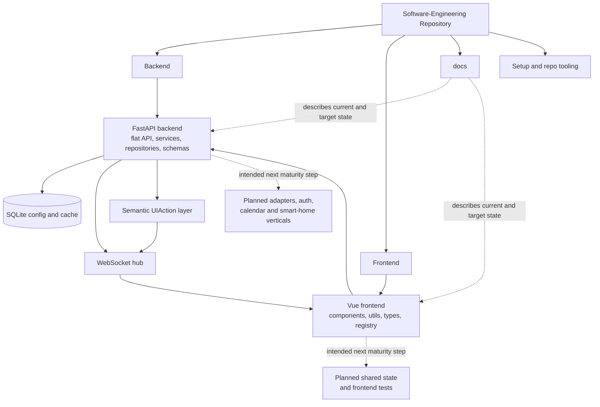

# Repository Architecture Analysis

## Scope And Metric Basis

- Snapshot date: 2026-04-28
- Metrics exclude documentation, media, caches, virtual environments, generated build output, databases and the analysis files themselves.
- Productive application source is measured separately from tests.

## Overall Metrics

| Scope | Files | Lines | Interpretation |
| --- | ---: | ---: | --- |
| Application and project source | 88 | 24639 | Current repository snapshot excluding archive, generated output and architecture-analysis files |
| Backend source | 29 | 3679 | FastAPI app, flat API layer, repositories, schemas and services |
| Frontend source | 24 | 2624 | Vue UI, typed clients, widget registry, helper and type layers |
| Backend tests | 7 | 1336 | Stable backend verification base |

### Largest Implementation Hotspots

| File | Lines | Why it matters |
| --- | ---: | --- |
| `Backend/src/services/gestures.py` | 685 | Gesture runtime facade, semantic action publication and orchestration entry point |
| `Frontend/nimrag-frontend/src/components/manager/ModuleManager.vue` | 465 | Central UI-action controller for focus, shop and ArrangeMode |
| `Backend/src/services/voice.py` | 449 | Largest non-gesture backend service, still an integration hotspot |
| `Frontend/nimrag-frontend/src/utils/layout.ts` | 363 | Placement-based layout normalization, focus and move or resize rules |
| `Backend/src/services/gestures_tracking.py` | 335 | MediaPipe tracking, depth-bearing observations and multi-hand capture |

## Root Structure Mapping

| Root entry | Current role | Critical view |
| --- | --- | --- |
| `Backend/` | Productive backend, tests and Python runtime | Clear backend boundary, but local environments inside the repo still require disciplined exclusion from metrics and reviews |
| `Frontend/` | Vue application with its own package setup | Frontend boundary is clear and now less component-heavy, but tests and shared state architecture are still immature |
| `docs/` | Active scope, current-state, target-architecture and planning docs | Strong active core, but archived material must stay visibly historical |
| `pics/` | Support material only | Outside the runtime architecture |
| `setup.js` and root `package.json` | Setup and repo-level tooling | Useful for onboarding, but not part of the application architecture |
| `CNAME` | Deployment support artifact | Operational detail only |

## System Reading From The Current Code

The repository now shows a more coherent modular-monolith trajectory than before. The backend exposes a flat API package, keeps domain logic in services and repositories, and now publishes both raw gesture events and modality-neutral UI actions. The frontend still renders through data and a widget registry, but it now also owns a placement-based interaction layer with explicit focus state, widget selection and ArrangeMode. Layout transformation, module-shop mechanics and the hardware widget's integration logic have moved into dedicated `utils/` and `types/` files.

The delivery depth is still uneven, just in a more explicit way. Weather, configuration, gesture runtime and a first hardware control surface are real. Calendar and smart home are still placeholders. Frontend realtime is no longer confined to the hardware widget; the central module manager now also consumes it for gesture-driven UI control, but there is still no shared state or composable layer above the low-level clients.

## Target Architecture And Missing Intended Elements

The documented target remains a modular monolith, and the current code already contains its backbone:

- Vue SPA frontend with widget registry and typed API access
- FastAPI backend with flat API package, service layer and repository layer
- SQLite persistence for configuration and cache
- REST plus active WebSocket push for selected runtime updates and semantic UI actions
- source-tree architecture analyses colocated with the code they describe

The main intended but still missing elements are:

- a shared frontend state or composable layer above low-level clients and helpers
- frontend tests and end-to-end verification
- real calendar and smart-home verticals instead of route placeholders
- explicit backend adapter boundaries for GPIO, MQTT, calendar and voice providers
- authentication, authorization and production-grade secret handling

## Feature Extension Sketches

The next sensible growth path is evolutionary rather than structural.

- calendar should become the next real vertical slice: adapter, repository or cache path, typed schema and a read-only widget first
- smart-home should follow as a device-state and command slice, reusing MQTT only where a real device path exists
- the current gesture-driven layout manager should move into tested composables or state modules before additional interaction modes are added
- frontend verification should start with layout-persistence, focus and ArrangeMode helpers, then broaden to widget-registry and hardware-widget integration tests

## Critical Assessment

The repository-level structure is now materially better aligned with the code than before, but it is still not operationally mature.

- The backend refactor removed one structural distraction by flattening the API package and splitting the gesture runtime into clearer responsibilities.
- The frontend refactor reduced the worst component concentration, but the application still lacks a stable shared state layer and automated tests.
- The most important remaining risk is no longer folder confusion, but uneven domain completeness: implemented weather, config and gesture-driven UI flows sit beside placeholder calendar and smart-home routes.
- The active documentation can now describe the code more truthfully, but it still needs disciplined maintenance whenever placeholder domains become real.

## Architecture Diagram

## Navigation

- Backend root analysis: `Backend/src/backendArch.md`
- Frontend root analysis: `Frontend/nimrag-frontend/src/frontendArch.md`
