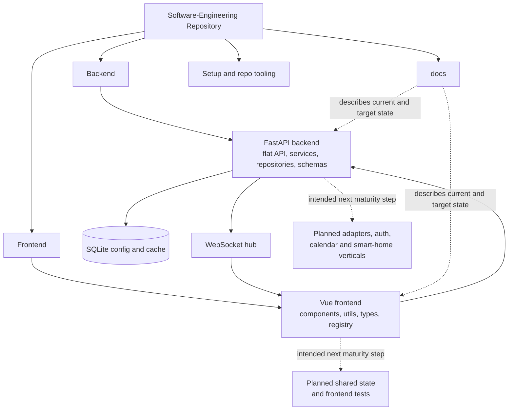

# Repository Architecture Analysis

## Scope And Metric Basis

- Snapshot date: 2026-04-14
- Metrics exclude documentation, media, caches, virtual environments, generated build output, databases and the analysis files themselves.
- Productive application source is measured separately from tests.

## Overall Metrics

| Scope | Files | Lines | Interpretation |
| --- | ---: | ---: | --- |
| Application source | 48 | 4533 | Current backend and frontend implementation after the API and UI refactor |
| Backend source | 28 | 2430 | FastAPI app, flat API layer, repositories, schemas and services |
| Frontend source | 20 | 2103 | Vue UI, typed clients, widget registry, helper and type layers |
| Backend tests | 7 | 1336 | Stable backend verification base |

### Largest Implementation Hotspots

| File | Lines | Why it matters |
| --- | ---: | --- |
| `Frontend/nimrag-frontend/src/components/manager/ModuleShop.vue` | 485 | Largest remaining interaction-heavy frontend component |
| `Backend/src/services/gestures.py` | 416 | Gesture runtime facade and orchestration entry point |
| `Backend/src/services/gestures_tracking.py` | 296 | MediaPipe tracking, hand landmarks and trajectory acquisition |
| `Backend/src/services/gestures_detection.py` | 247 | Normalized gesture feature extraction and candidate scoring |
| `Frontend/nimrag-frontend/src/utils/hardwareWidget.ts` | 234 | Extracted hardware-widget integration logic and realtime handling |

## Root Structure Mapping

| Root entry | Current role | Critical view |
| --- | --- | --- |
| `Backend/` | Productive backend, tests and Python runtime | Clear backend boundary, but local environments inside the repo still require disciplined exclusion from metrics and reviews |
| `Frontend/` | Vue application with its own package setup | Frontend boundary is clear and now less component-heavy, but tests and shared state architecture are still immature |
| `docs/` | Active scope, current-state, target-architecture and planning docs | Strong active core, but archived material must stay visibly historical |
| `pics/` | Support material only | Outside the runtime architecture |
| `setup.js` and root `package.json` | Setup and repo-level tooling | Useful for onboarding, but not part of the application architecture |
| `CNAME` | Deployment support artifact | Operational detail only |

## System Reading From The Current Code

The repository now shows a more coherent modular-monolith trajectory than before. The backend exposes a flat API package, keeps domain logic in services and repositories, and still validates its main paths with tests. The frontend still renders through data and a widget registry, but it no longer keeps every helper inline in the biggest components. Layout transformation, module-shop mechanics and the hardware widget's integration logic have moved into dedicated `utils/` and `types/` files.

The delivery depth is still uneven, just in a more explicit way. Weather, configuration, gesture runtime and a first hardware control surface are real. Calendar and smart home are still placeholders. Frontend realtime is now used in the hardware widget, but not yet elevated into a broader shared state or domain-level consumer model.

## Target Architecture And Missing Intended Elements

The documented target remains a modular monolith, and the current code already contains its backbone:

- Vue SPA frontend with widget registry and typed API access
- FastAPI backend with flat API package, service layer and repository layer
- SQLite persistence for configuration and cache
- REST plus active WebSocket push for selected runtime updates
- source-tree architecture analyses colocated with the code they describe

The main intended but still missing elements are:

- a shared frontend state or composable layer above low-level clients and helpers
- frontend tests and end-to-end verification
- real calendar and smart-home verticals instead of route placeholders
- explicit backend adapter boundaries for GPIO, MQTT, calendar and voice providers
- authentication, authorization and production-grade secret handling

## Feature Extension Sketches

The next sensible growth path is evolutionary rather than structural.

- calendar should become the next real vertical slice: adapter, repository/cache path, typed schema and a read-only widget first
- smart-home should follow as a device-state and command slice, reusing MQTT only where a real device path exists
- the hardware widget should evolve into a small command center for gesture, LED, voice and system status rather than becoming a generic dumping ground
- frontend verification should start with widget-registry, layout-persistence and hardware-widget integration tests before broader UI expansion

## Critical Assessment

The repository-level structure is now materially better aligned with the code than before, but it is still not operationally mature.

- The backend refactor removed one structural distraction by flattening the API package and splitting the gesture runtime into clearer responsibilities.
- The frontend refactor reduced the worst component concentration, but the application still lacks a stable shared state layer and automated tests.
- The most important remaining risk is no longer folder confusion, but uneven domain completeness: implemented weather/config/gesture flows sit beside placeholder calendar and smart-home routes.
- The active documentation can now describe the code more truthfully, but it still needs disciplined maintenance whenever placeholder domains become real.

## Architecture Diagram

## Navigation

- Backend root analysis: `Backend/src/backendArch.md`
- Frontend root analysis: `Frontend/nimrag-frontend/src/frontendArch.md`
